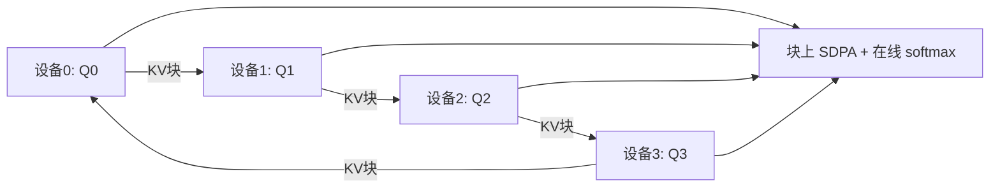

# Ring Attention

    
把序列沿设备环切开，块上做精确的自注意力与前馈；传递 KV 块的通信藏进计算里，上下文可以随设备数近乎线性地涨，而不近似注意力。

    <footer>—— Liu, Zaharia, Abbeel, Ring Attention with Blockwise Transformers for Near-Infinite Context, 2023</footer>

单卡显存放不下超长上下文的激活与 KV。先前的记忆高效 Transformer（分块注意力、重计算）把单卡长度推高了一截，但仍受一张加速器内存上限束缚。Liu、Zaharia、Abbeel 的 Ring Attention 把 [块状 Transformer](/llm/context-parallel) 铺到多设备上：每台设备持有一段查询，键值块沿环传递；在算当前 KV 块与本地 $Q$ 的注意力时，同时把本块发给下一家、收下一家的下一块。通信与计算重叠后，理想情况下不增加墙钟，序列长度可随设备数 $P$ 增长，注意力仍是精确的 softmax，不是稀疏或核近似。论文报告相对此前记忆高效方法可训超过 500 倍长的序列，并展示上亿 token 量级、不近似注意力的可行性。本篇写环形块注意力这一算法贡献，系统里的 Ulysses All-to-All 对照见序列/上下文并行专文。

## 问题

SDPA 的激活与 KV 随 $s$ 线性（重计算后）到二次（若物化分数）。FlashAttention 把单卡上的分数矩阵赶出 HBM，但整段 $Q,K,V$ 仍要在某台设备上。上下文并行若用 All-to-All 把头和序列维对换，每步通信体积是整段序列的投影，长 $s$ 时带宽打满且难以与计算重叠成「零开销」。需要的性质是：(1) 每卡只存 $s/P$ 的 token；(2) 全局注意力数学上等于单机 SDPA；(3) KV 移动的时间被块上的注意力与 FFN 盖住；(4) 不引入低秩/稀疏近似。

块状计算（Blockwise Parallel Transformers）已经能在单卡上按块算注意力和 FFN，峰值内存与块大小有关。缺的是把「外层循环的块」分布到不同设备，并用环形拓扑代替一次性 All-to-All。「Near-infinite」指长度随 $P$ 缩放、单卡内存不再是硬上限，不是信息可以无损无穷存储。$P$ 台设备的总 HBM 仍是有限的。

## 方法

### 环上的块注意力

$P$ 台设备排成环。设备 $i$ 固定持有查询块 $Q_i$（以及对应的残差、前馈输入）。键值块 $K_j,V_j$ 沿环移动：第 $r$ 轮，设备 $i$ 用当前 visor 里的 $(K,V)$ 与 $Q_i$ 做一块注意力，用在线 softmax 累加分子、分母与行最大值；同时把当前 $(K,V)$ 发给 $i+1$，从 $i-1$ 接收下一块。$P$ 轮后每个 $Q_i$ 见过全部键，因果掩码按全局下标把未来块或块内未来位置打掉。这与单机 Flash 的分块归约相同，只是块来自网络而不是本地 HBM。

### 通信隐藏

关键工程是：一块注意力（加一块 FFN）的计算时间 $\ge$ 传一块 $K,V$ 的时间。块太小，计算盖不住 PCIe/NVLink/ICl 延迟；块太大，单卡又放不下。论文在 A100/TPU、8 到 1024 设备的范围里取大约数千 token 的块，使重叠成立。环是点对点、每步只传邻接，比 All-to-All 的同步更适合与计算流水。前馈也按块做，进一步增加可重叠的计算量，这是「Blockwise Transformers」写进标题的原因——只重叠注意力、FFN 仍对整段 $s/P$ 一次性爆发，隐藏窗口会不够。

### 精确性与负载

在线 softmax 保证数值上等价于全局 softmax（在浮点归约误差内），不是近似注意力。因果下三角导致环上负载不均：持有序列尾部的设备，合法键少，算得快，等环。后续工程常用 zigzag / striped 切分把因果三角形均开；原文强调的是环形重叠本身。反向沿环反向传梯度块，同样要重叠，实现比前向更脆。重叠失败时 Ring Attention 退化成「很贵的序列并行」：每轮干等 KV。调块大小与绑定位于同一 NVLink 域，比改公式更重要。

## 机制

数学对象仍是 [SDPA](/llm/sdpa)。分布式只改变 $K,V$ 的驻留与遍历顺序。在线 softmax 的三项 $(m,\ell,O)$ 在块间合并，与 FlashAttention 的块归约同一代数：先比行最大，再按 $e^{m_{\mathrm{old}}-m_{\mathrm{new}}}$ 缩放旧分子。因此「精确」有明确含义：忽略浮点，输出等于把整段 $K,V$ 放在一台机器上的注意力。

复杂度：总 FLOP 仍是 $O(s^2 d)$，只是摊到 $P$ 台设备上，每台 $O(s^2 d/P)$。墙钟在完美重叠时约等于单卡算自己那份的时间，外加无法隐藏的尾部同步。内存每卡 $O(sd/P)$ 量级的激活/KV 块。这与把注意力改成线性是不同的交易：Ring Attention 买的是**分布式内存**，不是渐近 FLOP。上亿长度的展示依赖极大的 $P$，电费与集群调度是真实约束。

与 Megatron 序列并行不同：后者切的是 Norm/Dropout 的激活，注意力仍在张量并行组内按头本地算。Ring Attention 切的是注意力可见的序列维本身。与 Ulysses 不同：Ulysses 用 All-to-All 换头，通信图案是全集；环是稀疏邻接、体积按块。

## 边界与工程取舍

解码逐步生成时，每步 $Q$ 只有一个 token，块计算盖不住 KV 环传，Ring Attention 的隐藏假设被破坏。超长 decode 更常见的是分页 KV、多机 KV 池，而不是每步转一圈 KV——那正是 [DistAttention](/llm/distattention) 要避开「传 KV」的原因。Ring Attention 的主场是训练与超长 prefill。

因果负载不均、跨机延迟、反向重叠，是落地时的三大坑。块大小必须联合调：太小重叠失败，太大单卡 OOM。跨数据中心的环几乎一定失败，需要机内 NVLink / 超节点内的高带宽。不要在 8k 长度的单机任务上启用：Flash 单卡已经很快，环只有开销。

论文的「500× 更长」相对的是当时单机记忆高效上限，不是相对今日 128k 预训练配方。作为上下文并行的一种实现，它已被多种框架吸收；使用时仍要验证掩码全局下标、在线 softmax 合并、以及通信流是否真在计算流背后。总计算量不降。若目标是减少 FLOP，应改算法（线性、SSM、局部窗）。Ring Attention 只解决「放得下并算得完精确注意力」。

## 小结

- Ring Attention 沿设备环分片序列，块上做精确 SDPA，KV 块点对点传递。
- 通信与块注意力/FFN 重叠，使长度随设备数扩展，单卡内存不再是上限。
- 在线 softmax 保证与全局注意力等价；不引入稀疏或核近似。
- 总 FLOP 仍二次，买的是分布式内存与可重叠的带宽。
- 主场是训练与超长 prefill；逐步 decode 时计算盖不住环传。
- 块大小、因果负载均衡、反向通信是工程成败点。
- 出处：Liu, Zaharia, Abbeel, *Ring Attention with Blockwise Transformers for Near-Infinite Context*, 2023。
