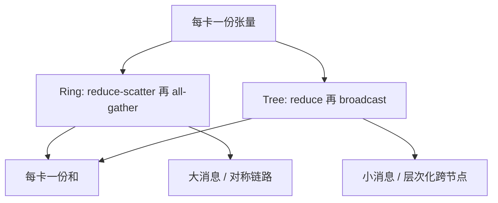

# Ring / Tree allreduce

同一条 All-Reduce，可以沿环把体积摊成 $2(N-1)$ 步小块，也可以沿树把延迟收成对数跳。选哪张图，取决于消息有多大、拓扑有多对称。

<footer>—— 对照带宽最优环算法与 NCCL 的 Ring / Tree；集群侧总图见预训练通信</footer>

[端侧投机](/llm/on-device-speculative) 把延迟墙收在单机草稿。本课打开新课「通信与集群」：多卡一步里真正同步的，是梯度或分片参数，原语几乎总是 All-Reduce。[预训练通信](/llm/pretrain-comm) 已经把库、[NVLink](/llm/nvlink)、跨节点三层画在一张图上；缺口是 **算法本身**：环与树搬的字节不同、对拓扑的对称性要求不同。后课默认你会：All-Reduce 可以拆成环上的流水，也可以拆成树上的归约加广播，有效带宽不是网卡标称。

## 问题

$N$ 张卡各持一份同形张量，要得到逐元素求和（或平均）。朴素做法是每张卡把整份发给根再广播回来，根的注入带宽是 $N-1$ 倍体积，立刻成为墙。数据并行的梯度 All-Reduce 每步都要做这一次，体积等于参数量；张量并行的层内 All-Reduce 更短、更频繁。问题不是「要不要同步」，而是：**同步的调度把带宽瓶颈放在谁身上**。

环的承诺是带宽最优：每张卡只跟左右邻居说话，每条边负载相同。树的承诺是延迟更短：跳数 $O(\log N)$，但根附近的边更忙，小消息时启动开销主导。NCCL 在同一进程组里两种都会用，按消息大小切换。[NVLink](/llm/nvlink) 域内环很香，因为链路对称；跨节点若环绕过订阅不足的轨，最慢那一跳拖住整步。

Patarasuk 与 Yuan 给出过带宽最优 All-Reduce 的下界：每卡至少要发出并收回约 $2\frac{N-1}{N}$ 倍本地体积。环达到这个下界；树在大消息上通常达不到，除非层次化到「每节点一份」。

## 方法

环 All-Reduce 标准分解是：先做 **reduce-scatter**（每卡留下 $1/N$ 的归约结果），再做 **all-gather**（把各片拼回全量）。实现上把张量切成 $N$ 块，沿环同时转：第 $k$ 步，卡 $i$ 把当前块发给 $i+1$，并与从 $i-1$ 收到的块做本地归约。两轮各 $N-1$ 步之后，每卡持有完整和。流水使链路几乎一直满；代价是步数随 $N$ 线性涨，小消息时 $\alpha$ 项打死。

树 All-Reduce 是归约树加广播树（可以是同一棵，也可以是双二叉树）。跳数对数，适合延迟区。跨节点常见层次化：节点内先用 [NVLink](/llm/nvlink) 收成每节点一份，再在节点间走树或环，最后节点内展开。这样跨节点体积从「每 GPU 一份」变成「每节点一份」，正是 [预训练通信](/llm/pretrain-comm) 写过的层次化，本课只把它钉在「树负责跨节点段、环负责域内段」这一分工上。

NCCL 还可以把一次调用切成若干 chunk，环与树同时跑在不同 chunk 上（或先树后环）。用户几乎不手写环；要手写时，见引擎课里的自定义 allreduce，那是服务侧短消息的特化，训练梯度同步仍以库为准。

## 机制

时间粗写成 $T \approx (k-1)\alpha + \frac{k-1}{k}n\beta$ 一类，环的 $k=N$，树的 $k$ 与度数、是否双树有关。$\alpha$ 是启动延迟，$\beta$ 是字节的倒数带宽，$n$ 是本地字节。大 $n$ 时第二项主导，环的边负载均匀，busbw 接近链路的 $\frac{N-1}{N}$ 效率；小 $n$ 时第一项主导，树少跳更赢。这就是后课带宽模型要定量的对象——本课先建立「两种 $k$」。

环假设邻居之间有足够点对点带宽。NVLink 域、NVSwitch 平坦域满足；跨机柜若环的逻辑邻居落在同一条拥挤的叶子上行，逻辑环变成物理热点。树假设中间节点吃得下瞬时入度；层次化把入度关在节点内高带宽域，正是为了不让树的根长在百 Gb/s 网卡上。

「Ring 一定更快」是错的。8 卡 NVLink 上几 MB 的梯度，环几乎总是对的；64 卡以太网、几十字节的控制同步，树或折中更对。看 `nccl-tests` 的 busbw–size 曲线，不要只看算法名字。

## 边界与工程取舍

不要在不对称拓扑上强行单环：PCIe 与 NVLink 混用的节点，环会周期性地掉到慢边上。不要把营销里的「NVLink 全互连」当成跨柜也成立——柜外仍是网卡，All-Reduce 必须层次化。In-network 归约（如某些 InfiniBand SHARP）是第三张图：交换机做加，树的中间计算不占用 GPU；有则用，没有则回到主机侧环/树，不要假设每一代交换机都会加。

数值上，环是分段加，顺序与树不同，浮点和不完全结合律。BF16 / FP8 梯度通信时，这会变成可复现性差异，不是 bug。需要比特级一致时，固定算法与 chunk 大小，或在较高精度里归约。

## 小结

- All-Reduce 的环实现达到带宽下界，步数随 $N$ 线性；树实现跳数对数，适合延迟区。
- 大消息、对称链路用环；小消息、跨节点用层次化树。
- 环在物理上要求邻居带宽均匀；逻辑环画错轨，最慢边即 step time。
- 后课把 All-Reduce 拆成 reduce-scatter 与 all-gather，供 ZeRO 直接调用。
- 出处：带宽最优环的经典分析；NCCL 公开的 Ring / Tree 算法选择；层次化见 [预训练通信](/llm/pretrain-comm)。
