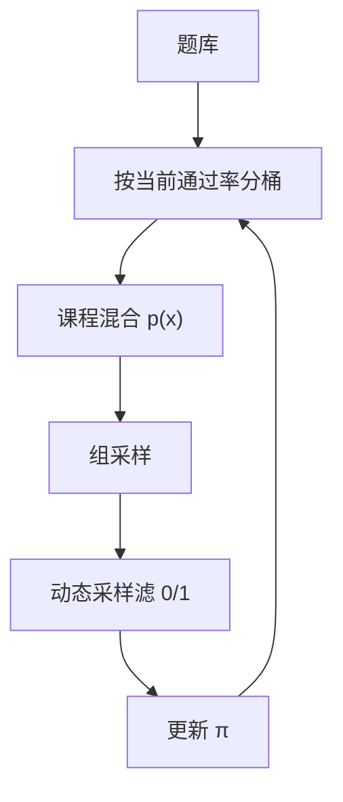

# 难度课程

先让相对优势存在，再把题变难：课程改的是提示分布，不是学习率表。

<footer>—— 对照 MATH 的难度分级；Open-Reasoner-Zero / 竞赛题课程；动态采样按通过率过滤的即时课程</footer>

[上一课](/llm/rl-sampling-temperature)用温度制造组内分叉。题太难时，升温也全错；太易则全对。缺口是：**提示分布本身要随策略能力移动，使组内经常落在 0–1 之间。** 本课写预设难度课程，并对照 [动态采样](/llm/dynamic-sampling-rl) 的在线过滤。接到 [GRPO](/llm/grpo) 与 [可验证奖励](/llm/verifiable-reward)。

## 问题

MATH 有 1–5 级，竞赛题有年份与分区。从 5 级开训，G 条全 0，无梯度。只训 1 级，策略不会迁移到竞赛。课程：按准确率或人工级，把 $p(x)$ 从易调到难。Kimi k1.5、若干开源数学 RL 配方都描述过由易到难或按通过率混合。这与 SFT 的 instruction curriculum 不同：RL 的信号是相对对错，课程的目标是**保持中间通过率**，不是先模仿简单示范。

动态采样是瞬时过滤；课程是先验混合。两者叠加：课程保证池子里有边界题，动态采样再丢掉当前全 0/1。只有动态、池子全是地狱题，会采不满。只有课程、不动态，后期易题仍浪费。

### 难度标签会过期

人工「5 级」对基座难，对训了十万步的策略可能已是 1 级。课程应按**当前策略的通过率**重打标签，而不是永远信题面星级。否则名为课程，实为固定混合。

不要用 RM 分数当难度。RM 爱长、爱格式，会把啰嗦题标成难。可验证域用经验通过率。

## 方法

离线：按基座 pass@G 分桶，训练按时间提高难题比例。在线：周期性用当前 $\pi$ 估通过率，重分桶。混合不要阶跃切掉易题——遗忘已会的格式与简单技巧。保留一小份易题当锚。代码域按测例数或算法标签分桶，同样用通过率校准。

评测集冻结、不进课程重标，防止把评测题训穿。课程只作用于训练提示。

## 机制

中间通过率使 $\mathrm{std}(\{r_i\})$ 经常非零，优势有信号。课程比盲目加大 $G$ 便宜：加大 $G$ 在全错题上只是多浪费生成。副作用是分布偏移：训练提示的难度轮廓 ≠ 评测，需要在各桶都报准确率，避免只在课程重心上好看。

突然注入超难题会造成熵塌：模型学会「这题放弃，写最短错误格式」。应缓增。

## 边界与工程取舍

开放偏好没有通过率，难度难定义，本课主场仍是数学 / 代码。多目标时「难」可能是更不安全的提示，课程会与安全硬门冲突，应分通道。下一课精度不匹配：课程与温度都对齐了，数值误差仍能把 $\pi_{\mathrm{beh}}$ 弄错。

## 小结

- 难度课程调节提示分布，目标是维持中间通过率，让组相对优势存在。
- 星级会过期，应用当前策略通过率重标。
- 与动态采样互补：一个改池，一个滤组。
- 评测集冻结；各难度桶分别报告。
- 出处：Hendrycks MATH 分级；开源推理 RL 配方的由易到难混合；Yu 等动态采样作对照。
