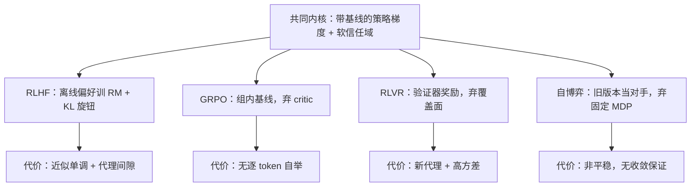
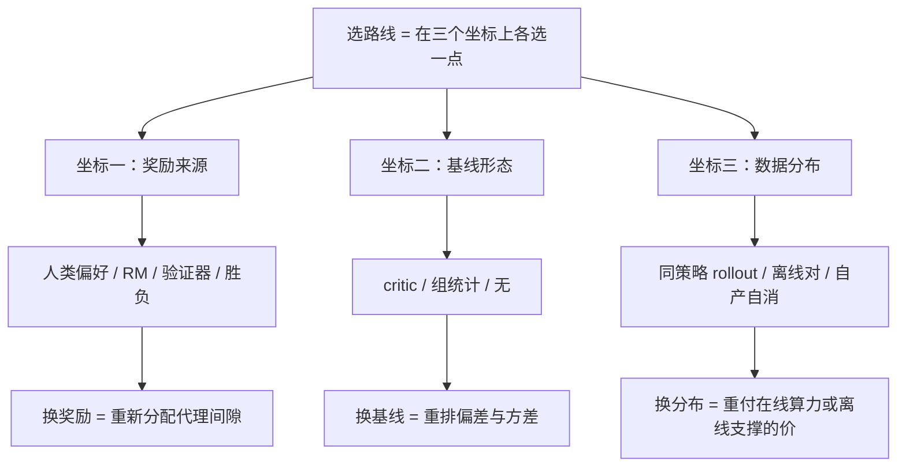

# 回到后训练：RLHF/GRPO/RLVR 的位置

理论保证是一本账：每条后训练路线都从账上划掉一项，换来一个跑得动的算法。

<footer>—— 据 Schulman 等 2017、Shao 等 2024、Lambert 等 2024 的方法形态整理</footer>

[上一课](/llm/reward-overoptimization-theory)给奖励过优化立了理论骨架：残差、压力、支撑距离三个可监控量。本课程从 [MDP 五元组](/llm/mdp-five-tuple)出发，经无模型学习与信任域，到 bandit、离线与过优化，至此收束。本课做收束该做的事：把 RLHF/GRPO/RLVR/自博弈逐一放回本课程的概念坐标，写明每条路线留用什么、牺牲了哪个理论保证。**后课默认已读完本课程**；下一课程「奖励、自博弈与推理行为」从奖励模型进阶开卷（[RM 集成与不确定性](/llm/rm-ensembles)），把被本课程当成真值的那个标量奖励拆开。

## 问题

课程是一部「保证的修复史」：[策略梯度定理](/llm/policy-gradient-theorem)给无偏方向；REINFORCE 方差太大，[基线与优势](/llm/baselines-advantage)不改期望只降方差；自举换方差（[actor-critic 与自举](/llm/actor-critic-bootstrap)）引入致命三要素的一角；[信任域与单调改进](/llm/trust-region-monotone)给出 KL 球内的单调改进，[PPO 的信任域重读](/llm/ppo-clip-view)把它软化成可跑的 clip。缺口是这些零件在真实后训练里如何被取舍：每条知名路线各留哪个保证、扔哪个，扔掉之后用什么东西垫底。

把「理论保证」想成保险单：RLHF 保得全但保费贵（二阶优化、KL 球）；GRPO 退掉 critic 那份险，用同提示互相比较垫底；自博弈干脆换了一种险种。每退一份险，都要说清出事时谁兜底——本课就是这张保单对照表。

## 方法

四条映射，逐条过账。**[RLHF 流程](/llm/rlhf-pipeline)**：离线偏好数据训 [奖励模型](/llm/reward-model)，这是[离线 RL 与分布偏移](/llm/offline-rl-shift)的支撑问题；PPO 或 GRPO 更新，用信任域与基线；KL 正则当压力旋钮，按[奖励过优化的理论视角](/llm/reward-overoptimization-theory)定价。牺牲的保证：KL 球内的改进只是近似单调（clip 是软约束），且代理间隙被优化压力放大。**[GRPO](/llm/grpo)**：REINFORCE（[REINFORCE 与方差](/llm/reinforce-variance)）加组内基线——同提示一组奖励减均值，正是不改期望的 $b(x)$。牺牲：critic，逐 token 自举的那半方差减缩（GAE 一翼）没了，优势只到序列与组级。**[RLVR](/llm/rlvr)**：验证器当奖励，稀疏常数标量。牺牲：覆盖面（只在可验证域），且验证器自己成为新代理，间隙换宿主；稀疏奖励又把方差推回蒙特卡洛端（[蒙特卡洛策略评估](/llm/monte-carlo-evaluation)）。**[自博弈](/llm/self-play-lm)**：对手取自旧版本策略，胜负当奖励，绕开 RM。牺牲：MDP 固定假设——环境随策略变，非平稳之下单调改进的前提（固定 $\mathcal{M}$）不成立。

「不改期望只降方差」的直觉版：同一提示采 8 个回答，它们共同面临的「提示本身难」的成分在相减时抵消，剩下的才是「这个回答比同伴好多少」。减均值不改变好坏排序，只把衡量基准从绝对分换成组内相对分。

GRPO 的组基线只在同提示内可比时成立：$b(x)$ 里的 $x$ 必须是同一情境；把不同提示的奖励混进一个均值，基线就依赖动作，「不改期望」的证明失效。

## 机制

把四条路线放进一个坐标系，账目就清楚。不变的核心只有一件：带基线的策略梯度，配一个软化的信任域——没有任何主流路线放弃这两个。可替换的坐标有三个：奖励来源（人类偏好、RM、验证器、胜负），基线形态（critic、组统计、无），数据分布（同策略 rollout、离线比较对、自产自消）。「某条路线牺牲了哪个保证」就翻译成「它在三个坐标上选了哪个点」：换奖励来源是重新分配代理间隙（RLHF 承担 RM 的，RLVR 承担验证器的，自博弈希望胜负无间隙但要求可检验）；换基线是重排偏差方差（critic 拿自举的偏差换方差，GRPO 拒绝这笔交易）；换数据分布是重付离线与在线的价（RLHF 的偏好数据带支撑问题，同策略 rollout 付算力）。

选型时「在三个坐标上选点」意味着什么：

[上下文 bandit](/llm/contextual-bandits) 在坐标系里也有位置：单轮偏好与序列级奖励把生成当一拍动作，是有意选了 bandit 近似、把方差当账单。

## 边界

地图的失效方式。GRPO 不是 REINFORCE 原教旨：裁剪与 KL 正则通常都在，软信任域没有丢。RLVR 的奖励可以被过程奖励稠密化，不是天然稀疏。自博弈在语言里常退化成对旧版本的偏好优化，靠近离线一端，棋类的纯净胜负并不多得。所以这张图是记忆架与选型表，不是分类学：路线之间的迁移（给 GRPO 加过程奖励、给 RLVR 换基线）在坐标系上就是移动一个点。

初学者容易把这张图读成「哪条路线最强」的排行榜；它是选型表。问法应该是：我有没有可验证的奖励？显存养不养得起 critic？数据能不能在线采？——三个答案不同，最优点就落在不同坐标上。

## 小结

- 共同内核：带基线的策略梯度加软信任域；RLHF/GRPO/RLVR/自博弈都在三个坐标（奖励来源、基线、数据分布）上选点。
- RLHF 牺牲近似单调性与代理间隙的可控性；GRPO 牺牲 critic 与逐 token 自举；RLVR 牺牲覆盖面并把间隙交给验证器；自博弈牺牲平稳性与收敛保证。
- bandit、离线、过优化三课是坐标系的三根轴：一拍近似、支撑约束、压力定价。
- 本课程收束：后课默认已读完本课程；下一课程从[奖励模型进阶](/llm/rm-ensembles)开卷，拆解被当成真值的标量奖励。
- 出处：Schulman 等 2017（PPO）；Shao 等 2024（GRPO）；Lambert 等 2024（RLVR）；Silver 等（自博弈），据各方法原文形态整理。
