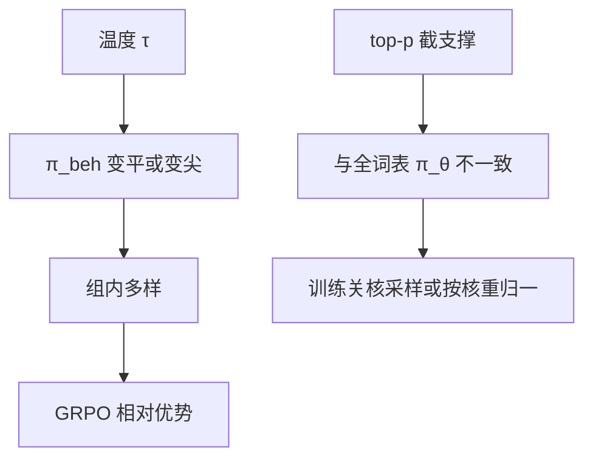

# 采样温度与探索

训练期温度是环境动力学的一部分：它改的是 π_beh，不是后处理装饰。

<footer>—— 对照 DAPO 评测温度 1.0；R1 / GRPO 用组采样吃温度带来的多样；解码课里的温度对推理另文</footer>

[上一课](/llm/rollout-weight-sync)保证权重一致。生成还要选温度、top-$p$。缺口是：**这些解码超参改变 rollout 分布，等于改环境；训练与评测不一致，曲线对不上。** 本课写 RL 训练期的温度。熵正则鼓励局部随机；温度是采样时对 logits 的全局缩放，两者相关不等价。

## 问题

策略网络输出的是 $\pi_\theta(\cdot\mid s)$。温度为 $\tau$ 的采样来自 $\pi_\theta^{1/\tau}$ 再归一化（对 logits 除 $\tau$）。$\tau\gt 1$ 展平分布，组内更易分叉，[GRPO](/llm/grpo) 更有相对信号；$\tau\lt 1$ 接近 greedy，组内复制，动态采样狂丢组。DAPO 评测 AIME 用温度 1.0、top-$p=0.7$。许多助手服务默认 $\tau=0.7$。用服务温度做训练，探索不足；用训练温度做产品，用户看见胡言。

top-$p$ / top-$k$ 把支撑截断，IS 的 $\pi_\theta$ 若在全词表上算，与真正 $\pi_{\mathrm{beh}}$ 不一致。要么训练前向也施加同一截断，要么训练期关掉核采样，只留温度。

### 温度不是熵系数

$\alpha H$ 在训练目标里推高熵；$\tau$ 在数据收集时改变样本。只加 $\alpha$ 而 $\tau\to 0$，仍采不到高熵区域。只升温而 clip 对称，罕见 token 仍抬不起来。探索预算要三处一起声明：$\tau$、clip、$\alpha$。

评测 pass@$k$ 依赖温度。报 avg@32 必须写 $\tau$。与训练 $\tau$ 不同时，那是另一项实验。

## 方法

训练默认 $\tau=1$，使采样分布等于网络定义的 $\pi$，IS 干净。需要更多分叉时升到 $1.1$–$1.3$ 并盯语言崩坏。核采样：训练期优先关；若开，logprob 按核内重新归一化存储。评测协议单独成表。课程式：前期 $\tau$ 高找策略，后期降 $\tau$ 榨贪婪准确率——必须在金标上验证，否则只是过拟合训练采样器。

与 [无 KL](/llm/kl-free-rl) 叠加时，高 $\tau$ 没有参考拉回，更易胡言，靠过长过滤与重复检测托底。

## 机制

$\tau$ 改变的是动作分布的温度，不改变奖励。高 $\tau$ 提高碰到对的链的机会，也提高格式破坏。可验证抽取失败率随 $\tau$ 上升，是预期，不是 bug。应先 SFT 锁格式，再升温。这与可验证奖励课的「先低温度巩固抽取」一致，本课把它接到 GRPO 组方差。

同一 $\tau$，长链后期熵本就低（模型很确定下一个词）。全程固定 $\tau$ 不等于全程同等探索。

## 边界与工程取舍

产品若必须低 $\tau$，训练后期应有一段匹配产品解码的微调，否则 train-serve gap。那与后课精度不匹配是两类 gap：一类是解码，一类是数值。难度课程（下一课）会调节题，不调节 $\tau$；两者都在控制「有效探索」，不要同时盲扫。评测 pass@$k$ 与训练 $\tau$ 必须写在同一张实验卡上。

训练默认 τ=1 使采样分布等于网络 π；核采样若开，存储的 logπ 必须按核重归一，否则 IS 从第一枚 token 就偏。

## 小结

- 训练温度定义 $\pi_{\mathrm{beh}}$；默认 1.0 与网络 $\pi$ 一致。
- 核采样截支撑会破坏 IS，训练期宜关。
- $\tau$、clip、熵项共同组成探索预算，不能只拧一个。
- 评测温度必须写入协议；与服务温度对齐是单独阶段。
- 出处：Yu 等 DAPO 评测设置；Shao 等 GRPO 组采样；Ouyang 等对解码与训练一致性的工程要求。
