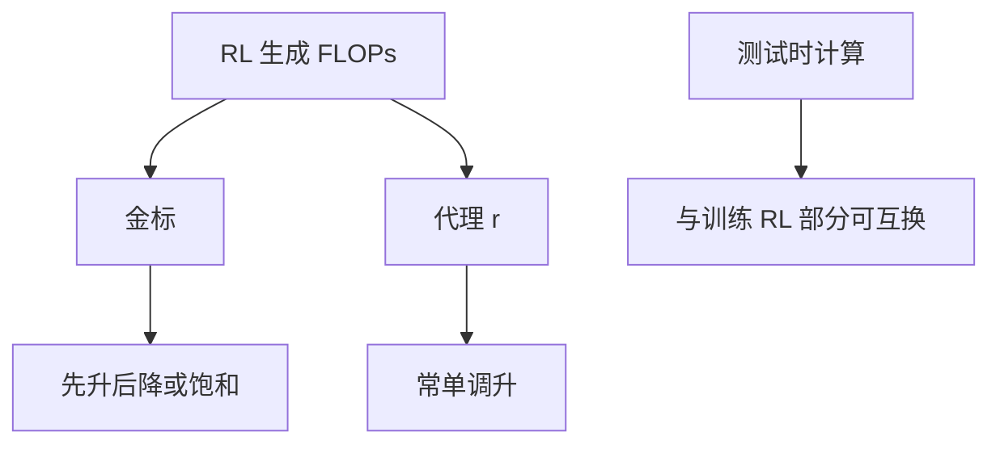

# RL 缩放律

预训练有损失–算力曲线；RL 的曲线画的是优化强度对金标，并且经常先升后降。

<footer>—— Gao 等奖励模型过优化的标度；OpenAI o1 / DeepSeek-R1 把更多 RL 算力换成推理时行为；Kimi k1.5 的报告</footer>

[上一课](/llm/tool-integrated-rl)把环境变复杂。本单元最后一问：再堆 RL 算力是否总换来能力。缺口是：**预训练缩放律不能直接抄到 RL——代理奖励会 Goodhart，墙钟还被生成长度吃掉。** Gao、Schulman、Hilton 给了 RM 过优化随优化步与 RM 规模的经验律。o1、R1、k1.5 给出另一条：可验证 RL 算力 ↔ 推理表现。本课对照两条，接到下一单元「想多久」。

## 问题

Kaplan / Hoffmann 律预测预训练损失。RL 没有平稳的交叉熵：目标是 $\mathbb{E}[R]$，$R$ 还在变（策略分布移、RM 过期）。能画的是：横轴 RL FLOPs 或步数，纵轴金标（AIME、隐藏测例、人类）。偏好 RM 上，Gao 曲线拐点随 RM 参数量推迟。可验证域拐点来自校验器洞与熵塌，形状不同，仍可能降。

另一轴是推理时计算：同一套权，多想一会儿（预算、并行采样）也能涨分。训练 RL 与测试时计算可互换到何种程度，是 o1 类系统的核心产品问题，下一单元展开。本课只钉训练侧缩放。

### 不要把代理 $r$ 当损失

预训练诚实画 val loss。RL 若画代理奖励，缩放律会永远上升。金标与墙钟必须进图。DAPO 用 AIME avg@32，并报步数相对 R1-Zero 配方减半，这才是可比较的缩放点。

组大小 $G$、长度、是否动态采样改变「一步」的 FLOPs。横轴要用 token 或焦耳，不要用未定义的 step。

## 方法

实验卡：基座规模、RL 提示数、生成 token 总数、是否 KL、奖励类型。画金标 vs 生成 token。扫：更多步 vs 更大 $G$ vs 更长 $L$。经验：可验证域在熵未塌时单调一段时间；偏好域更早拐。RM 规模与策略规模的相对关系按 Gao：策略相对 RM 过强则更快过优化。

与 [无 KL](/llm/kl-free-rl)：去掉 KL 让同一 FLOPs 走得更远，拐点可能更早，应用金标而不是「走得远」当成功。

## 机制

可验证 RL 的边际来自覆盖更多会分叉的题与更长搜索。边际递减：题库耗尽、熵塌、长度费用。偏好 RL 的边际被过优化截断。蒸馏（后课）把 RL 得到的长链行为用 SFT 交给小模型，是另一种缩放：一次 RL，多次学生。

R1-Zero 从基座直接 RL，缩放的是「无 SFT 冷启动」的探索；R1 加冷启动，曲线不可与 Zero 混横轴。

## 边界与工程取舍

没有公开的类 Hoffmann 的 RL 最优分配公式。实践是：可验证轴堆 RL 直到金标饱和或费用墙；偏好轴早停。同一 FLOPs 花在更大 $G$ 还是更长 $L$，边际不同，要分开发而不是合成一个「RL 步数」。下一单元从训练算力转到**一次推理想多久**，那是测试时缩放，与本课互补。

横轴用生成 token 或焦耳，不要用未定义的 step。同一算力花在 G 还是 L 上要分开画，拐点看金标不是代理 r。

## 小结

- RL 缩放必须画金标 vs 真实生成算力；代理 $r$ 会假永远涨。
- 偏好域拐点见 Gao；可验证域受熵、题库、长度限制。
- 一步的 FLOPs 随 $G$ 与 $L$ 变，横轴要定义。
- 测试时计算是另一条轴，下一单元。
- 出处：Gao, Schulman, Hilton；OpenAI o1；DeepSeek-AI R1；Kimi k1.5；Kaplan/Hoffmann 仅作预训练对照。
