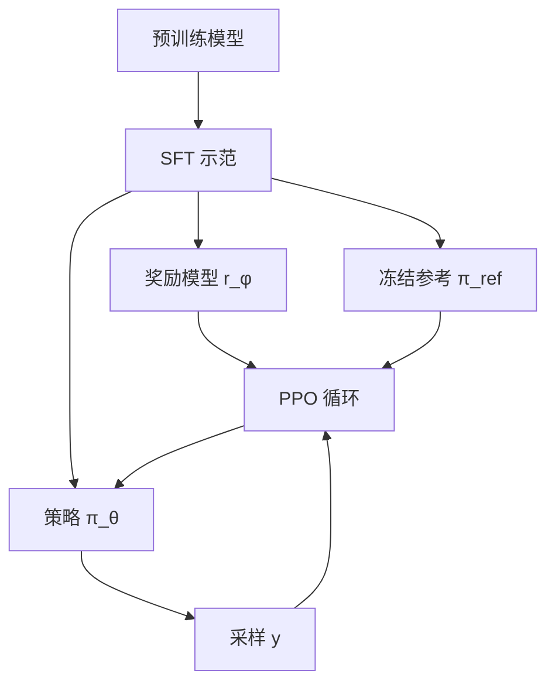

# RLHF 流程

先用示范把模型拉进可接受的语言区域，再从人类偏好学一个奖励，最后用强化学习在奖励上升的同时用 KL 拴住参考策略。

<footer>—— Ouyang et al., Training language models to follow instructions with human feedback, NeurIPS 2022；偏好学习接到 Christiano et al., NeurIPS 2017</footer>

Christiano 等人把「难以写进标量函数的目标」收成人类两两比较，再学奖励、用 RL 优化策略。Ouyang 等人把这套偏好 RL 接到指令微调后的语言模型上，构成后来被广泛称作 RLHF 的三阶段流水线：监督微调（SFT）、奖励模型（RM）、近端策略优化（PPO）。它不是单一损失，而是三条数据与四个模型角色的工序：策略、参考、奖励、价值。后续的 [GRPO](/llm/grpo)、[RLOO](/llm/rloo)、直接偏好方法，都是在改第三段怎么走，很少取消「先有示范与偏好」这一事实。

## 问题

预训练语言模型会补全互联网，不会自动「按用户意图、在安全边界内」作答。只做 SFT，模型模仿标注员写过的回答，覆盖有限，也学不会在多个合理回答之间按人类偏好排序。只做偏好分类，又没有把分类器接到生成策略上的优化器。Christiano 的设定是：人类无法逐步打分机器人的每个关节，但能比较两段行为谁更好；Ouyang 的设定是：标注员可以写示范、也可以对同一提示的两个模型回答打序，但无法为每个 token 写奖励。

要把偏好变成可生成的行为，必须把比较数据收成对完整作答的标量，再在 token 级策略上做强化学习。中间会经过一个显式奖励模型——这是经典 RLHF 与后来「跳过 RM、直接吃偏好对」的分界。本篇只写带 RM 的流程。

### 三个数据面不能混成一张表

示范数据：提示加一条人类（或教师）回答，供 SFT。比较数据：同一提示下两条回答加序关系，供 RM。RL 提示：只有 $x$，回答由当前策略采样，供 PPO。把比较里的胜方再当 SFT，是 [拒绝采样](/llm/rejection-sampling-rft)，不是第三阶段。把示范直接当奖励 1、其余当 0，会毁掉 RM 的成对信息。流水线首先是数据协议，其次才是 PPO 公式。

InstructGPT 论文里的人类数据分标注员写的示范与标注员给的比较，来源与协议不同。不要写成「RLHF 只用点赞点踩」。比较是相对的，绝对分数标定是额外的工程，原文并不依赖用户界面上的五星。

## 方法

阶段一：在示范上做因果 LM，得到 $\pi_{\mathrm{SFT}}$。它既是聊天模型的起点，也是后面 KL 的参考锚 $\pi_{\mathrm{ref}}$（实现上常把参考冻结为 SFT）。阶段二：对成对数据 $(x,y_w,y_l)$ 训奖励模型，典型为 Bradley-Terry：

$$
p(y_w \succ y_l\mid x)=\sigma\bigl(r_\phi(x,y_w)-r_\phi(x,y_l)\bigr)
$$

$r_\phi$ 通常是在 SFT 初始化的标量头，对完整序列打分。阶段三：策略 $\pi_\theta$ 从 $\pi_{\mathrm{SFT}}$ 出发，对 RL 提示采样 $y$，用 $r_\phi$ 打分，减去对参考的 KL，再以 PPO 更新；同时训一个价值函数估优势。详见 [PPO 实现](/llm/ppo-llm) 与 [KL 与价值](/llm/ppo-kl-value)。

### 第四个角色：价值函数

PPO 是 actor-critic：策略之外还要 $V_\psi$，在每个 token 上估计期望回报，用来构造优势、降低方差。它与 RM 不是同一个头：RM 给序列奖励（再拆成逐步），$V$ 拟合「从当前前缀往后还能拿多少」。两者初始化都可以来自 SFT，但优化目标不同，崩溃模式也不同，见 [Actor-Critic 稳定性](/llm/ac-stability)。工程上这是 RLHF 相对 SFT 最重的一块：多一份与策略同规模的 critic 常驻反向。

## 机制

SFT 把策略的支持集拉到「像助手的语言」，否则随机预训练模型的采样对标注员不可比，RM 学的是乱码上的偏好，没有意义。RM 把离散的比较变成可微的标量场；策略沿这个场上升时，会找到 RM 的漏洞（奖励黑客）——所以要用 $\mathrm{KL}(\pi_\theta\|\pi_{\mathrm{ref}})$ 把策略钉在 SFT 邻域。KL 不是审美，是承认 RM 只在参考分布附近被校准。

PPO 的近端约束限制每步策略更新幅度，避免一次更新跑出 RM 的可信区。采样必须来自当前 $\pi_\theta$（或近端旧策略再重要性加权），因此第三阶段是在线生成，和 [离线蒸馏](/llm/online-offline-distill) 的冻数据不同。奖励通常在序列结束才由 RM 给出，中间 token 的稠密信号主要来自逐步 KL 项；稀疏终点奖励正是 critic 存在的理由。

Ouyang 等人强调：RLHF 优化的是标注员（及后来的用户）偏好的代理，不是「真」对齐。代理在比较协议、标注员池、提示集上都会偏。换一群标注员，RM 与策略都要重做，不是改一个 β 能修。

## 边界与工程取舍

### 第三阶段最贵，也最先被替换

PPO 需要策略、参考、RM、critic 四份前向，生成长、占 KV，超参多。许多后续工作保留 SFT+偏好，改掉 PPO：拒绝采样微调只用 RM 选胜方再 SFT；GRPO / RLOO 去掉 critic；直接偏好优化跳过显式 RM。这些是对第三段的替换，不是宣布前两段作废。没有比较数据时，可验证奖励（数学对错）可以代替 RM，那是 R1 一类流水线，仍有「参考 + 策略梯度」，只是奖励改成规则。

RM 过强会让策略学会讨好打分头：冗长、谄媚、表面安全。KL 过强则策略不敢离开 SFT，RL 段等于没跑。β、裁剪范围、生成温度、批内提示多样性都要一起扫，孤立报「PPO 无效」没有信息。产品上应把 SFT 检查点当回归锚：RL 之后既要比 RM 分，也要比指令遵循与安全回归，不能只看奖励曲线。

Christiano 2017 的主体是模拟控制与 Atari 一类轨迹，比较的是片段行为；Ouyang 2022 比较的是完整自然语言作答。迁移过来的是「偏好 → 奖励 → RL」的骨架，不是控制里的动作频率或折扣公式原样照搬。

## 小结

- 经典 RLHF 是 SFT → 成对偏好训 RM → PPO，参考策略拴 KL。
- 示范、比较、RL 提示是三种数据，不能混用协议。
- 价值函数是 PPO 的 critic，与 RM 分工不同，也是后续无 critic 方法想砍掉的成本。
- RM 只在参考邻域可信，故 KL 与近端更新是流程的一部分，不是可选装饰。
- 出处：Christiano et al., NeurIPS 2017；Ouyang et al., NeurIPS 2022。PPO 算法见 Schulman et al., 2017。
