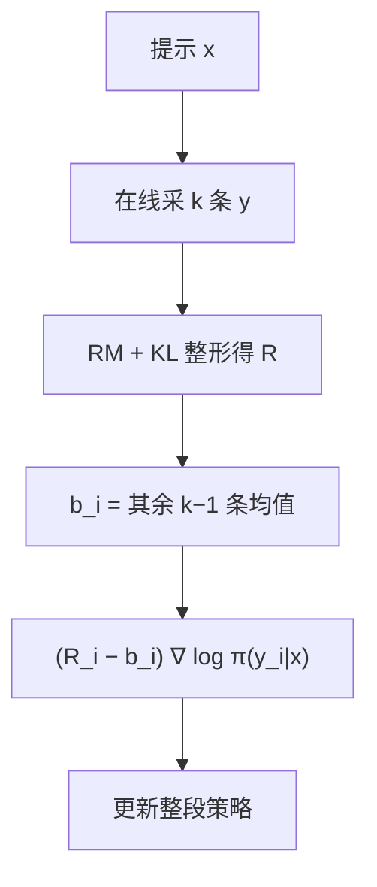

# RLOO 原文

    
PPO 在 RLHF 里被当成默认锤子；奖励只打在整段完成上时，把整段当成一个动作，用 REINFORCE 加留一法基线，往往更简单也更强。

    <footer>—— Ahmadian 等，Back to Basics: Revisiting REINFORCE-Style Optimization for Learning from Human Feedback in LLMs，ACL 2024</footer>

InstructGPT 以来，RLHF 的强化学习段几乎被写成 [PPO](/llm/schulman-ppo)：token 当动作、前缀当状态、GAE、裁剪、价值头。Ahmadian 等人问：这些配件是为高方差、逐步奖励的深度强化学习准备的，而偏好奖励只在完整生成结束时出现，策略又已经过预训练与 SFT，动作分布高度集中。他们拆开 PPO，发现在 Anthropic HH 与 TL;DR、Llama 与 Pythia 上，带移动平均基线的朴素 REINFORCE 已经稳定优于 PPO；再把同一提示的 $k$ 条在线样本做成 REINFORCE Leave-One-Out（RLOO，估计器来自 Kool 等 2019），进一步超过 PPO、[DPO](/llm/dpo) 与 RAFT。本篇按 ACL 2024 原文写主张与公式；短述见 [RLOO](/llm/rloo)。

## 问题

PPO 把生成建成逐步 MDP：除 EOS 外的 token 奖励只有 KL 项，终点才有 RM 分，再用 GAE 把信用分配回中间状态。作者认为这一建模在 RLHF 里常常是空的——没有真实的逐步奖励，价值函数是在拟合一个人为拆开的过程。低 $\lambda$ 的 GAE 用价值自举降方差、引入偏差，在他们的消融里反而不如 $\lambda=1$ 的整段回报。裁剪与损失归一化去掉之后，表现也不崩溃。结论写成：PPO 对预训练语言模型过重。

他们采用上下文老虎机视角：提示是状态，整段 $y$ 是一个动作，优化 KL 整形后的序列奖励

$$
R(x,y)=r_\phi(x,y)-\beta\log\frac{\pi_\theta(y\mid x)}{\pi_{\mathrm{ref}}(y\mid x)}.
$$

REINFORCE 给出 $\mathbb{E}[(R-b)\nabla\log\pi_\theta(y\mid x)]$。$b$ 不依赖当前这条 $y$ 的随机性时，估计仍无偏。移动平均 $b_{\mathrm{MA}}$ 用历史上的奖励，便宜但跨提示、跨训练阶段会错位。留一法用同一提示上其它 $k-1$ 条的均值当 $b$，提示条件化、逐步重估，代价是每提示多生成。

### PPO 的动机在 RLHF 里弱在哪

经典控制里策略随机、逐步有奖励、需要强正则压方差。SFT 之后的 LLM 下一步只在极少 token 上有质量，搜索空间名义上是词表的长度次方，实际上被先验削掉。作者把这当作减少方差控制、去掉 critic 的理由。这是经验主张，绑定他们的模型尺度与任务，不是「PPO 在任何 LLM 上多余」的定理。文中 PPO 对 REINFORCE 的败北幅度按设定在约 3% 到 20% 的胜率区间，具体以论文表为准。

RLOO 估计器不是这篇论文发明的。Kool, van Hoof, Welling，*Buy 4 REINFORCE Samples, Get a Baseline for Free!*（2019）把它写在一般策略梯度里。Ahmadian 等人的贡献是论证它适合 LLM 偏好学习，并与 PPO/DPO/RAFT 做系统比较。

## 方法

对每个 $x$ 从当前 $\pi_\theta$ 采 $y^{(1)},\ldots,y^{(k)}$，得分 $R^{(i)}$。RLOO 梯度为

$$
\frac1k\sum_{i=1}^{k}\Biggl(R(y^{(i)},x)-\frac1{k-1}\sum_{j\neq i}R(y^{(j)},x)\Biggr)\nabla\log\pi_\theta(y^{(i)}\mid x).
$$

第 $i$ 条的基线不含 $R^{(i)}$，无偏。向量化等价于 $\frac{k}{k-1}(R^{(i)}-\bar R)$。整段一个对数似然、一个优势，不按 token 拆 GAE。实验还包含只有 $b_{\mathrm{MA}}$ 的单样本 REINFORCE。对比方法：PPO（token 级 clip + GAE）、DPO（离线成对）、RAFT（同预算下取最高分做 SFT）。数据集：HH 与 TL;DR。模型：Llama 与 Pythia 系列。作者报告 RLOO 全面高于这些基线；在相同采样预算下，$k=2$ 的 RLOO 可接近或超过 $k=4$ 的 RAFT，即负例被利用而不只模仿冠军。他们对流畅度、多样性、标注噪声与 KL 系数做了多维分析，称 RLOO 对噪声和 $\beta$ 更稳健。

### 与 PPO、RAFT、DPO 并排

PPO：逐步比率与 critic，实现重，超参多。作者消融显示去掉 clip 与若干归一化后性能不降，支持「配件不是 RLHF 的必要复杂度」。RAFT：同组只强化赢家，采样信息的 $k-1$ 条被丢。RLOO 每条都进梯度，冠军与亚军的相对差被保留。DPO：离线对，无在线探索；在他们的在线 RM 设定下弱于 RLOO。这不否证 DPO 在无 RM、纯离线预算下的价值，只说明「有在线奖励时简单策略梯度够用」。

## 机制

### 留一法为何比移动平均更贴 RLHF

$b_{\mathrm{MA}}$ 混合不同提示的难度：简单提示的高分会抬高基线，使难题上的合格回答变成负优势。留一法的基线是「这道题上其它随机完成的平均」，难度对齐。$k=2$ 时基线就是另一条的 $R$，优势是两条之差，很像成对比较，但两条都来自当前策略，且两条都更新。$k$ 增大，基线方差下降，接近条件期望 $\mathbb{E}[R\mid x]$，仍不含自身，故仍无偏。含自身的组均值（[GRPO 原文](/llm/grpo-paper) 常用）在 $k$ 小时把 $R_i$ 漏进 $b_i$，引入偏差； $k$ 大时两者接近。DeepSeekMath 用 std 再缩放，RLOO 原文用减法保留绝对量纲，跨 batch 的学习率要对 $R$ 的尺度敏感。

整段动作把 $\nabla\log\pi(y\mid x)$ 写成 token 对数梯度之和乘同一优势，信用在序列上均匀。这正是作者放弃逐步 MDP 的点：他们实验认为不必对中间 token 学 $V$。若真正有逐步过程奖励，这一结论不适用，应回到 GAE 或过程监督 GRPO。

KL 整形写在序列 $R$ 里，与 GRPO 把 KL 放进损失是不同实现。比较两条曲线时要看 $\beta$ 惩罚的是同一对象。原文强调 RLOO 对 $\beta$ 更不脆，仍须扫，不是可以去掉 KL。

### 「建模部分完成是不必要的」这句话的范围

论文用实验支持：在偏好 RM 只打整段的设定下，老虎机 REINFORCE 不弱于 token-MDP PPO。范围不包括：逐步人类反馈、过程奖励、需要价值函数做方差规约的超长推理。也不包括「因此 GAE 在数学 RL 里永远有害」——那是另一篇工作的设定。引用时应带上 HH / TL;DR 与他们使用的 Llama、Pythia 尺度。

## 边界与工程取舍

RLOO 把 critic 显存换成 $k$ 路生成。$k=1$ 没有留一，只能退回 $b_{\mathrm{MA}}$。在线 RM 必须与策略一起部署，离线 DPO 那条「两份前向」的省法不成立。无偏基线不自动无噪： $k$ 小、RM 噪时，另一条的 $R$ 会把优势打飞。作者报告相对 RAFT 对噪声更稳健，仍不是无噪声。

不要把后起的「RLOOTrainer 里再加 PPO epoch 与优势标准化」全部算进 ACL 原文。原文主张的是简单 REINFORCE 风格；库实现为了稳定可能加回 clip，那是工程分叉。与 GRPO 的关系：同属无 critic 组采样；GRPO 来自数学 RL、含 clip 与 std、KL 在损失里；RLOO 来自「回到 REINFORCE」、留一均值、序列级动作。选谁先看奖励是否已标准化、以及想不想要无偏基线。

胜率数字是相对他们训练的 RM 或裁判协议，不是 Arena 通用排名。文中「REINFORCE 胜过 PPO 3.2%–20.3%」是跨数据集–基座配对的区间，单次复现应报告具体配对，不要只引区间。

### 何时不必上 RLOO

不能在线采样或没有 RM，用离线成对方法。已经为逐步过程奖励建了 critic，PPO/GAE 的建模不再「空」。$k$ 只能为 1 时，留一法不存在。需要组内 z 分数对齐跨题量纲、且 $G$ 很大，GRPO 的标准化可能更省学习率扫描。不要因为名字里有 REINFORCE 就从随机初始化开训——原文策略从 SFT 出发。

## 小结

- Ahmadian 等主张：RLHF 的序列级奖励使 token-MDP PPO 过重，简单 REINFORCE 即可。
- RLOO 用同一提示上其它 $k-1$ 条奖励的均值当无偏基线，估计器来自 Kool 等 2019。
- 整段视为一个动作，优势乘整条 $\nabla\log\pi(y\mid x)$；KL 写在序列奖励里。
- 在 HH、TL;DR 与 Llama/Pythia 上，报告优于 PPO、DPO、RAFT；对噪声与 $\beta$ 更稳。
- 去掉 PPO 的 clip 等配件在他们的消融里不降性能，不能直接外推到所有 LLM RL。
- $k=1$ 不是 RLOO；过程奖励设定不在原文范围内。
- 出处：Ahmadian, Cremer, Gallé, Fadaee, Kreutzer, Pietquin, Üstün, Hooker，*Back to Basics: Revisiting REINFORCE-Style Optimization for Learning from Human Feedback in LLMs*，ACL 2024，arXiv:2402.14740。
