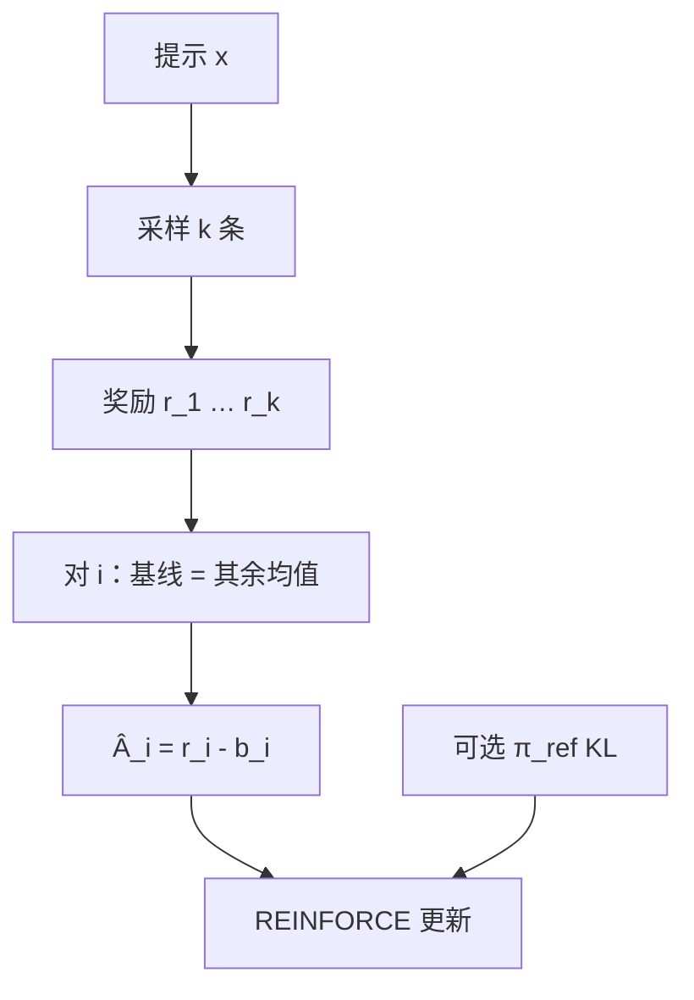

# RLOO

同一提示上的其他样本，可以当这一条的基线：留一法让 REINFORCE 不必再养一个价值网络。

<footer>—— Ahmadian et al., Back to Basics: Revisiting REINFORCE-Style Optimization for Learning from Human Feedback in LLMs, ACL 2024</footer>

Ahmadian 等人把 LLM 对齐从复杂的 PPO 栈拉回带基线的 REINFORCE，并论证：在人类反馈设定里，简单策略梯度配上恰当基线，可以与 PPO 竞争，还少掉 critic 的成本与不稳。RLOO（REINFORCE Leave-One-Out）是其中的实现要点：对每个提示采 $k$ 条完成，估计第 $i$ 条优势时，基线取其余 $k-1$ 条奖励的均值，而不是一个学出来的 $V(s)$。它与 [GRPO](/llm/grpo) 同属「无 critic、组内对照」，差别主要在基线统计量（留一均值，对是否再除组内标准差）以及论文强调的「回到 REINFORCE」而不是「PPO 减掉价值头」。

## 问题

Ouyang 等人的 RLHF 默认 PPO + 价值函数，工程上变成四模型。Ahmadian 等人问：在偏好奖励已经是序列级标量、动作是 token 的设定下，近端裁剪与 GAE 是否仍是必要复杂度？若奖励噪声主要来自「同题不同完成的运气」，那么同题上的其他完成就是免费的对照——这正是留一法基线长期存在于多样本 REINFORCE 里的理由。

需要满足的无偏条件是：基线不依赖当前动作对应的那条轨迹的奖励（或适当处理依赖），以免减基线时引入偏置。留一法用「别人的分」估「我这条该减多少」，第 $i$ 条的 $r_i$ 不进自己的基线，比「含自己的组均值」更干净。GRPO 常用含自身的 mean/std，在 $G$ 大时差别小，$G$ 小时留一更不易把自身奖励漏进基线。

### 多样本是前提

$k=1$ 没有「其他样本」，RLOO 无法定义，必须退回学出来的 $V$ 或全局移动平均一类弱基线。因此 RLOO 的系统成本从 critic 显存转到生成条数，与 GRPO 相同。能否负担 $k\ge 2$（实践中往往更大）决定了方法是否适用。提示极长、只能 $k=1$ 时，不要口头上叫 RLOO。

留一法基线是统计技巧，不是新的奖励模型。偏好仍来自 RM 或人类协议；RLOO 只改如何把 $r$ 变成 $\hat A$。换标注协议仍要重做 RM，与 Christiano / Ouyang 的数据面相同。

## 方法

对 $x$ 采 $y_1,\ldots,y_k$，得分 $r_1,\ldots,r_k$。第 $i$ 条

$$
b_i = \frac{1}{k-1}\sum_{j\neq i} r_j,\qquad \hat A_i = r_i - b_i
$$

然后对轨迹上的 token 做 REINFORCE：$\nabla \ell \approx \sum_t \hat A_i \nabla \log\pi_\theta(a_t\mid s_t)$（实现上可逐步赋同一 $\hat A_i$，或配合折扣）。可以加对 $\pi_{\mathrm{ref}}$ 的 KL，以保留 RLHF 的参考锚。Ahmadian 等人比较了 PPO 与这类 REINFORCE 变体在指令跟随上的表现，结论是：在他们的设定里，简单方法足够，critic 不是必须。具体分数以论文表格为准，不要外推成「所有任务 REINFORCE 优于 PPO」。

### 与 GRPO 并排看

两者都是组采样、无 $V$。GRPO：含组均值（及标准差）的标准化、常配 PPO 式 clip、在 DeepSeek 数学与 R1 上与规则奖励绑定。RLOO：留一均值、论文叙事是 HF 对齐里的 REINFORCE 复兴。$k$ 大时 $\mathrm{mean}_{j\neq i} \approx \mathrm{mean}_{\mathrm{all}}$，两条曲线接近。$k$ 小、奖励尺度跨组变化大时：GRPO 的除标准差能把不同题的量纲拉齐；RLOO 的减法保留绝对量纲，跨 batch 的学习率更敏感。选谁先看奖励是否已标准化、以及想不想要 clip。

## 机制

REINFORCE 的方差来自「整条轨迹一个运气分」。减去与动作无关的基线不改变期望梯度，但能减方差。留一法用同条件（同一 $x$）下的独立样本估期望奖励 $\mathbb{E}[r\mid x]$，比跨题的全局平均更贴 $V(x)$ 的真值——它不试图估逐步 $V(s_t)$，只估「这道题平均能拿多少」，对结果监督足够。逐步信用仍没有：中间 token 共享 $\hat A_i$，与 GRPO 的结果监督同一局限。

相对 [RFT](/llm/rejection-sampling-rft)：RLOO 给低分样本负优势，会压低它们的概率；RFT 把它们丢进废纸篓，不主动抑制。因此 RLOO 仍是在线 RL，需要反复用当前 $\pi$ 采样；RFT 可以冻一批胜者 SFT 多 epoch。探索与稳定性的账不同。

重要性采样与 clip 不是 RLOO 的定义部分。若在旧策略轨迹上多 epoch 更新，应补重要性比率，否则变成离策略 REINFORCE。Ahmadian 强调简单；实现若开始堆 clip、GAE、价值头，就应改回叫 PPO。

## 边界与工程取舍

### 回到基础不是零超参

$k$、温度、KL 的 β、奖励标准化、是否对长度归一，仍然决定成败。去掉 critic 只去掉一类失败模式（价值过拟合），换来生成倍数与留一估计在 $k$ 小时的噪声。开放域 RM 黑客不会因为留一法消失：组内相对地「更黑客」仍得正 $\hat A$。可验证域更干净，与 GRPO 相同。

不要把 RLOO 写成 R1 的算法。R1 写明的是 GRPO。文献锚是 Ahmadian 等 ACL 2024 这篇 *Back to Basics*。更早的留一基线出现在多样本 REINFORCE 的经典用法里，RLOO 是把它接到语言模型人类反馈的工程与实证，而不是第一次发明留一法。

接到 [RLHF 流程](/llm/rlhf-pipeline) 时，RLOO 替换的是第三段怎么做策略梯度，不是取消 SFT 与偏好数据。没有比较或可验证奖励，留一法没有可减的 $r$。有奖励之后，仍要用参考策略的 KL 决定能离开 SFT 多远——Ahmadian 等人讨论的是优化器简化，不是宣布参考锚可以扔掉。实现上应把 $k$、β、奖励标准化写成与 PPO 实验同一套记录，否则「回到基础」会变成不可比的另一条曲线。

若组内 $k-1$ 条奖励方差极大，一条极端高分会让其余所有 $b_i$ 抬高，其余样本变成大负优势，训练被离群点劫持。应对 $r$ 做稳健统计或裁剪，这与是否叫 GRPO 无关。

训练日志里应同时报组内奖励极差、接受或答对率、以及 KL 分位数。只报平均奖励，会把「整组一起变长、分数一起涨」误读成优势估计在工作；留一法在那种情况下 $\hat A$ 接近零，真正拉动曲线的可能是奖励漂移而不是相对对照。

## 小结

- RLOO 用同提示其余完成的平均奖励作留一基线，对 REINFORCE 降方差，不训 critic。
- $k=1$ 无法做；成本在多采样，不在价值头。
- 与 GRPO 同属组内对照；留一 vs 含自身的标准化、以及是否 clip，是可测差异。
- 仍是结果监督，假推理与 RM 黑客不会自动消失。
- 出处：Ahmadian et al., *Back to Basics: Revisiting REINFORCE-Style Optimization for Learning from Human Feedback in LLMs*, ACL 2024。RLHF 骨架见 Ouyang et al.；组相对的大规模推理 RL 见 DeepSeekMath / R1 的 GRPO。
