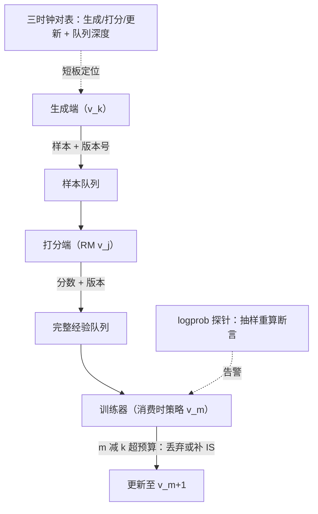

# 异步 RL 的系统调试

同步系统坏了会报错，异步系统坏了会「看起来还在跑」——调试异步 RL，就是给三个各走各的时钟装上对表的仪表。

<footer>—— 据 AReaL（arXiv:2505.24298）的 staleness 控制与异步训练运维实践整理</footer>

[上一课](/llm/rlsys-multiturn-env)让环境有了状态与超时，批内节奏不再整齐——异化从这里由选项变成需求：生成、打分、更新三段并行起来。本课不重讲异步架构（[异步 rollout 架构](/llm/async-rollout-arch)已有专课），写它坏掉时怎么查：一套让版本偏差、静默离策略与资源空转现形的调试方法。

## 问题

异步的收益是填空闲，代价是「样本属于哪个版本」从编译期事实变成运行期问题。生成端在 $v_k$ 上出样本时，训练器可能已更新到 $v_{k+2}$；打分端可能还挂着旧 RM。这本身有解——版本号加重要性权重——但有解的前提是先知道错没错。异步 bug 的特点是静默：loss 继续降、奖励继续涨，唯一的异常藏在交叉指标里，等金标评测发现时，几周的卡已经烧完。调试的缺口因此有两个：让错「响」起来（断言与探针），让慢「可见」（三时钟对表）。

## 方法

调试分正确性与性能两册。正确性册三条。全链版本标记：样本、打分请求、缓冲条目、更新步都带版本号，任何跨版本读取留痕。logprob 探针：每步随机抽一小部分样本，用其声称的版本重算行为 logprob 并断言一致——这一条同时抓权重漏同步、模板漂移、缓存错列三类静默错。staleness 预算：允许的最大版本落后写进配置（AReaL 的解耦控制把 staleness 当一阶超参），超预算样本要么丢弃、要么补截断 IS 权重（[截断重要性采样](/llm/truncated-importance-sampling)）。性能册看三只表：生成墙钟、打分墙钟、更新墙钟，附各自的队列深度与 GPU 空闲率；短板在哪段、队列淤积在哪，对一次表就有结论。检查点走异步落盘（[异步检查点](/llm/async-checkpointing)），别让存档打断节奏。

探针的成本账：每步抽百分之一左右的样本重算 logprob，开销增加约一个百分点，却把「权重漏同步」这类几周量级的静默损失变成分钟级告警——性价比最高的保险，没有之一。

## 机制

异步 RL 的正确性可以压成一条不变量：任何进入梯度的样本，其行为 logprob、奖励、优势都必须与一个明确的版本三元组绑定，且该绑定可被独立复算。同步系统里这条不变量靠栅栏免费获得；异步系统里要靠版本号加探针显式维护。staleness 则是新鲜度与利用率的汇率：允许更旧的样本，生成端利用率上升、批更大更稳，但 IS 权重方差与策略滞后上升（[AReaL 异步强化学习](/llm/areal-async-rl)的机制面）——它是超参，不是实现细节，调它要过消融流程。三时钟对表的机制价值在于把「系统慢」从体感变成归因：生成慢查批波浪与前缀缓存，打分慢查 RM 池扩缩，更新慢查梯度累积与存档阻塞。

## 边界

调试手段不修复算法层的离策略偏差：探针只能保证「账本正确」，旧样本的偏差仍要靠 IS 修正或 staleness 预算来压。异步下的可复现性天然受损（调度顺序非确定），能做到的是种子、版本号与配置全留痕，让事故可重放而非逐位复现。探针的覆盖率与开销是权衡：抽样断言有漏报尾部，最终仍需金标评测兜底。

## 小结

- 异步把「样本属于哪个版本」变成运行期问题：全链版本标记是不变量的载体。
- logprob 探针（抽样重算加断言）同时抓漏同步、模板漂移、缓存错列，是最便宜的静默错误保险。
- staleness 是超参不是实现细节：预算法定最大落后，超限丢弃或补截断 IS。
- 三时钟对表（生成/打分/更新加队列深度）把「慢」变成可归因；存档走异步不打断节奏。
- 出处：AReaL，arXiv:2505.24298；Espeholt 等 IMPALA/V-trace；据 verl、slime 运维实践整理。
