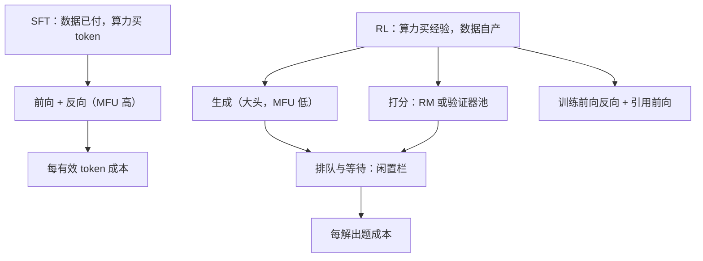
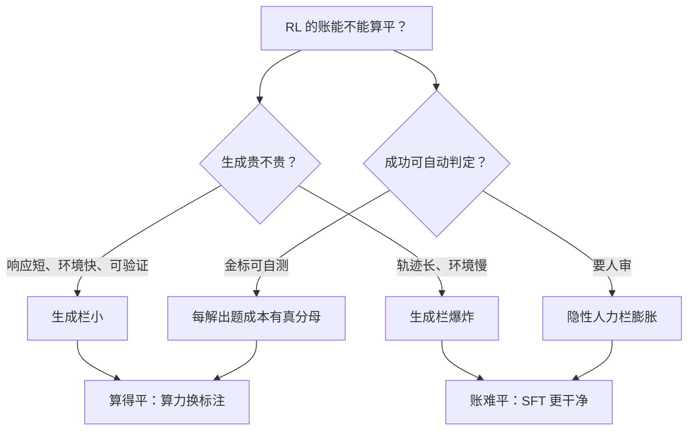

# 成本：RL 相对 SFT

SFT 按 token 买算力，RL 按解出的题买算力——两本账的单位不同，混着比只会得出想要的结论。

<footer>—— 据 Yao 等 DeepSpeed-Chat 2023 与 HybridFlow 的成本结构整理</footer>

[上一课](/llm/rlsys-eval-in-loop)给循环装上了守门的评测，本课算钱：把 RL 训练与 SFT 的成本放上同一张桌。样本效率的算法面在 [SFT 对 RL 的数据效率](/llm/sft-vs-rl-efficiency)讲过，本课只算工程账：同样的卡、同样的时间，两种训练各自买到什么，RL 的钱花在哪几栏、哪几栏是浪费。

## 问题

SFT 的成本结构简单：预收集的 token 流水线式过前向反向，MFU 高且平稳，每 token 价格基本恒定。RL 的成本结构复杂：生成（自回归、长尾、低 MFU）加打分（又一个推理负载）加引用前向加训练前向反向，四段之间有排队与等待；生成段的成本还随训练漂移——模型变强后响应变长，每一步更贵。缺口是把「RL 贵在哪、值不值」从印象变成账本：哪些段占大头、哪些开销可以压、什么条件下 RL 的账能算平。答不出这三问的团队，通常是在用 SFT 的直觉给 RL 排预算，然后被生成段的账单吓到。

直觉类比：SFT 像「按食材付钱的包餐」，菜单价固定、厨房不停火；RL 像「按钓上来的鱼付钱」，鱼竿（生成）大部分时间在等鱼咬钩，还要雇品鉴师（RM）验货——账要按「每条鱼」记，不能按「甩竿次数」记。

## 方法

记账单位先对齐：SFT 记「每有效 token 成本」，RL 记「每解出题成本」——分母不是生成的 token 数，而是金标判定的成功数。成本分四栏记。生成栏：rollout 墙钟，通常占大头；优化靠引擎吞吐、组内共享前缀、长度预算与早停，响应长度是成本上升的先行指标（接[长度预算与截断](/llm/length-budget-rl)）。打分栏：RM 或验证器池的吞吐与超时，接打分服务课的降级配置。训练栏：与 SFT 同构，但样本少、批次小，MFU 偏低。闲置栏：三段衔接的空转，共置与异步就是为了压它（[Rollout 与训练资源复用](/llm/rollout-resource-sharing)）。再记隐性两栏：消融与失败的试错成本（RL 对超参与实现细节更敏感，同一结论要跑更多次），以及奖励工程的人力成本——SFT 的标注费在 RL 里换形成环境、RM 与监控的建设费，不是消失。

同一块 GPU 上，SFT 的 MFU 常数倍于 RL 的全程平均：RL 的墙钟大头是生成与等待，不是矩阵乘。框架论文报告的加速倍数（如 HybridFlow 的 1.53×–20.57×）都是对「闲置栏」的压缩——比较前先看对方的基线把闲置压到了什么程度。

数字实例：长度翻倍、成功率减半时，「解出题数」除以二、「生成 token」乘二，每解出题成本大约变成四倍——这就是边界里「翻两番」的来历，也是响应长度被叫作成本先行指标的原因。

## 机制

RL 的账在什么条件下算平：当生成便宜（响应短、环境快、可验证）且成功信号可作分母时，RL 用算力置换标注——SFT 每条数据都付过人费，RL 的经验自产，边际数据成本接近零；当任务恰好「训练时可自测、部署时才见分晓」，RL 买到的能力增量很难用更多 SFT 数据买到（[推理 RL 闭环](/llm/reasoning-rl-loop)的闭环逻辑）。反过来，环境慢、轨迹长、奖励要人审时，三栏成本同时膨胀，账就难平。缩放视角下这笔账是动态的：[RL 缩放律](/llm/rl-scaling-laws)回答「多买一倍算力买到多少」，本课回答「现在这倍算力怎么花得省」——两问合起来才是预算决策。

为什么重要：引用「RL 比 SFT 贵 $N$ 倍」时不带长度与成功率条件，预算会错一个数量级。签预算前先在自己任务上量三个数：平均响应长度、金标成功率、生成墙钟占比——三个数齐了，账本才有可比性。

## 边界

成本模型对序列长度与成功率都敏感：长度翻倍、成功率减半，每解出题成本约翻两番——引用任何「RL 比 SFT 贵几倍」的结论都要带上这两个条件。加速比对基线实现极其敏感，跨论文的倍数不可直接比。人力成本很少出现在框架论文的账里，却常常是预算的真实边界；把它显式记账，是 RL 预算评估与 SFT 预算评估最大的不同。

## 小结

- 记账单位对齐：SFT 记每有效 token，RL 记每解出题；分母用金标成功数，不是生成 token 量。
- RL 四栏账：生成大头、打分、训练（MFU 偏低）、闲置；共置与异步压的是闲置栏。
- 隐性两栏：消融试错与奖励工程人力——标注成本换形，不消失。
- RL 账算平的条件：生成便宜、环境快、成功可自测；否则 SFT 的账更干净。
- 出处：Yao 等，DeepSpeed-Chat，2023；Sheng 等，HybridFlow，EuroSys 2025；据各框架成本报告整理。
