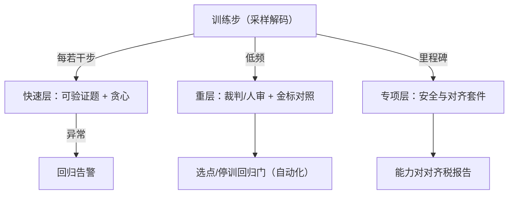
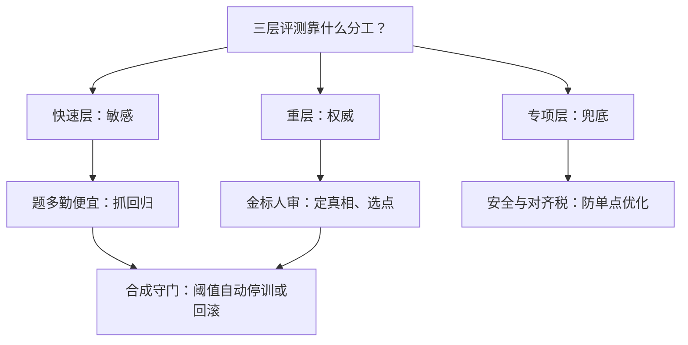

# 评测在环

训练奖励告诉你模型在优化什么，评测告诉你它变成了什么——把后者搬进环里，代价是要为它分配卡与纪律。

<footer>—— 据 Cobbe 等 2021 的 held-out 纪律与对齐评测实践整理</footer>

[上一课](/llm/rlsys-hacking-monitor)的交叉对照要靠独立金标活着；金标从哪来、多久量一次、由谁守门，是本课的内容：评测在环。训练循环里周期性跑一套受控评测，用它的曲线做选点、停训与回归门。它与[对齐评测收束](/llm/aeval-map)的差别在视角：那边讲怎么测得准，这边讲怎么让测量以固定节奏喂进训练决策。

## 问题

评测在环有三个系统问题。预算：评测与训练抢同一批卡，测得越勤越贵，训练吞吐被摊薄；测得太稀，回归发现得太晚。卫生：评测提示一旦混进训练分布，曲线只报喜——污染在 RL 里尤其隐蔽，因为训练提示本就有相当部分来自内部题库与自采。稳定性：RL 训练用高温采样，评测要用确定解码，解码参数、模板、停止条件的任何漂移都会伪装成能力变化。三个问题共享一个答案：评测要被当成有版本、有预算、有 owner 的生产资产来运营。

直觉类比：评测在环像体检中心的定期抽血——训练是日常锻炼，快速层是每次锻炼后的心率（勤、便宜、粗），重层是季度全套化验（贵、准、定结论）。只看心率会漏病，只做化验追不上节奏，所以三层都要有。

## 方法

三层评测栈。快速层：固定几百到几千条可验证题，贪心解码，答案匹配，每若干步一次，分钟级，管回归检测。重层：跨域混合题加 LLM 裁判或人审，低频（每天或每几百步），管金标对照与检查点选点。专项层：安全与对齐套件（[对齐评测收束](/llm/aeval-map)、[对齐税的测量](/llm/aeval-alignment-tax)），里程碑触发，管「为了分数牺牲了什么」。工程纪律四条。题库单向闸门：提示进入评测集后从训练采样池摘除，操作留痕。解码配置与模型配置一起版本化：曲线只许同配置比较。检查点按评测选而不用训练奖励选：训练奖励高只说明代理被优化。回归门自动化：重层分数掉过阈值自动停训或回滚，把「要不要停」从会上挪进代码。

为什么重要：题库闸门漏一条，优化器就会把它当捷径反复刷——评测分数虚高、回归检测失灵，而且污染不可逆（题一进训练分布就再也「测不准」了）。这是整套评测公信力里最不能省的一道闸。

评测用贪心（或固定种子的低温采样），训练探索用高温采样：同一检查点的两条曲线天然不可比。把配置哈希印在监控曲线旁边，是防止把温度改动误读成能力变化的最便宜手段。

## 机制

评测在环能当守门人，靠三层信号的正交：快速层敏感（题多、勤、便宜，抓回归），重层权威（金标与人审，定真相），专项层兜底（安全与对齐税，防单点优化）。频率与成本的机制账：设训练步墙钟为 $T$，快速层成本占比控制在个位数百分点，其灵敏度足以把「连续两档掉分」当回归信号；重层低频但每次都是决策事件（选点、停训），必须可复现——裁判模型版本、提示模板、解码参数全部冻结。这把评测集变成生产资产：它有版本、有变更日志、有 owner，与训练数据管理同级；[RM 评测基准与排行榜](/llm/rm-benchmarks)讨论的公信力问题，在内部评测上同样成立——评测的权威来自它不被训练环接触。

数字实例：每几十步就在同一套题上选一次检查点，一万步下来等于做了几百次「选择」，选中高分的那个点带着可观的运气成分——这就是终评要换新题的原因：选点用的题已经被你的选择过程 Goodhart 过了。

## 边界

在环评测不替代最终离线评测：选点过拟合的风险随评测次数上升——在同一套题上选了几十个检查点后，「评测分数」本身也在被 Goodhart，终评要换新题与 held-out 人审。快速层的题会随时间泄漏（写进论文、撞上公开题库），要定期轮换。评测与训练共享集群时，评测负载的抖动会反噬训练节奏，需要配额与优先级，这也是预算纪律的一部分。

## 小结

- 三层栈：快速可验证层管回归、重层管金标与选点、专项层管安全与对齐税；频率与权威性成反比。
- 题库单向闸门：进评测即出训练池，日志留痕；题库定期轮换防泄漏。
- 解码配置与模型配置同版本化，曲线只许同配置比较；检查点按评测选，不按训练奖励选。
- 回归门自动化：阈值触发停训或回滚；终评换新题与 held-out 人审防选点过拟合。
- 出处：Cobbe 等 2021（GSM8K 的 held-out 纪律）；据对齐评测与内部金标实践整理。
