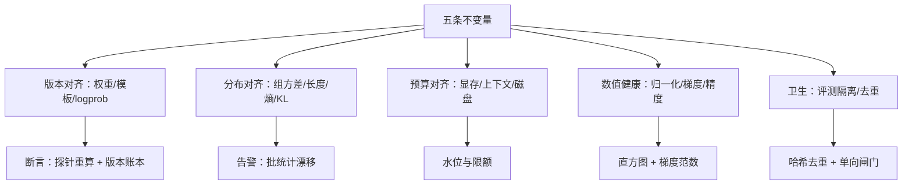

# 失败模式清单

RL 系统的失败分两种：会崩的与不会崩的。后者 loss 照降、奖励照涨，等你发现时账单已经出完。

<footer>—— 据 verl、OpenRLHF 等开源框架的公开 issue 与运维记录整理</footer>

[上一课](/llm/rlsys-cost-vs-sft)把账算清，本课把「钱怎么白烧的」编成目录，每条按症状、根因、探测、处置四列登记。前面各课已零散处理过这些失败（静默离策略、黑客、空转），本课把残件收进一本能照着巡检的册子——它也是生产事故复盘的输入格式。

## 问题

RL 训练的失败大多不抛异常。权重漏同步时，训练继续、曲线照涨，只是学到的与你以为的不是同一个策略；行为 logprob 错列时，重要性权重悄悄失真；评测题混进训练池时，守门人先被收买。这些失败的共同结构是「不变量被破坏而仪表不报」。所以清单不该按组件组织（引擎、RM、训练器），该按不变量组织——每条失败是某个不变量的一种破坏方式，每条探测是对应的一根断言。

## 方法

按五条不变量列类。版本对齐类：权重漏同步（LoRA 合并漏层、MoE 专家漏更新）、训练与生成的对话模板漂移、行为 logprob 错列——探测用 logprob 探针与版本账本（[rollout 引擎与权重同步](/llm/rollout-weight-sync)）。分布对齐类：零方差组占比飙升（白采）、长度分布漂移、熵坍缩、KL 失控——探测用批统计与漂移告警，处置靠动态采样与过滤（[动态采样](/llm/dynamic-sampling-rl)、[过长过滤](/llm/overlong-filtering)）。预算对齐类：长响应峰值把 KV 顶爆（按均值而非峰值预留）、上下文吃满（观测截断缺失）、检查点磁盘写满——探测用限额与水位告警。数值类：奖励归一化的 running 统计被离群奖励炸掉，后续批次优势尺度全歪（[奖励归一化与白化](/llm/reward-whitening)）、梯度爆发、低精度下溢——探测用直方图与梯度范数。卫生类：评测题泄漏进训练池、金标流程被污染、提示与训练集重复——探测用哈希去重与单向闸门登记。

清单的使用方式是巡检不是救火：每类不变量配一条便宜的常态断言（探针、哈希、水位）。事故发生时按「哪个不变量最先失守」回溯，比按「最近改了什么代码」回溯快得多。

## 机制

清单背后的机制认识是「响亮错误便宜，静默错误昂贵」。崩溃（显存、NaN）当步即知，损失是一次重启；静默错误（漏同步、污染、统计炸掉）以正确性的名义继续烧卡几周，损失不可逆。工程投资的重心因此按期望损失排：给静默失败配断言，比给响亮失败配自动重试更有价值。清单还有一个机制用途：新系统上线——换框架、换并行布局、换推理引擎——把五类不变量的断言当验收测试跑一遍，迁移事故几乎全部落在这五类里。

## 边界

清单覆盖系统层失败，不覆盖算法层失败（发散、奖励设计错误、任务不可学）——后者表现为「一切正常但学不到东西」，靠评测与消融诊断。断言有覆盖与开销的权衡，抽样断言有漏报尾部，最终仍需金标评测兜底。清单是活的文档：每起事故回填新条目，否则它只是昨天的失败史。

## 小结

- 失败按不变量组织：版本、分布、预算、数值、卫生五类，每类配一条常态断言。
- 静默错误是主要期望损失：探针、哈希、水位比自动重试更值得投资。
- 长尾长度与离群奖励分别炸显存与归一化统计：按峰值预留、按直方图监控。
- 换框架、布局或引擎时把清单当验收测试跑；事故后回填条目保持清单活着。
- 出处：据 verl、OpenRLHF、slime 等开源框架的公开 issue 与运维实践整理。
