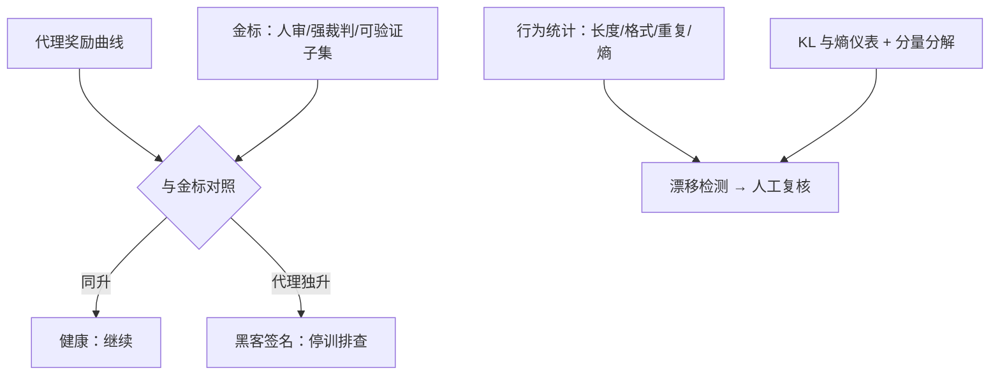
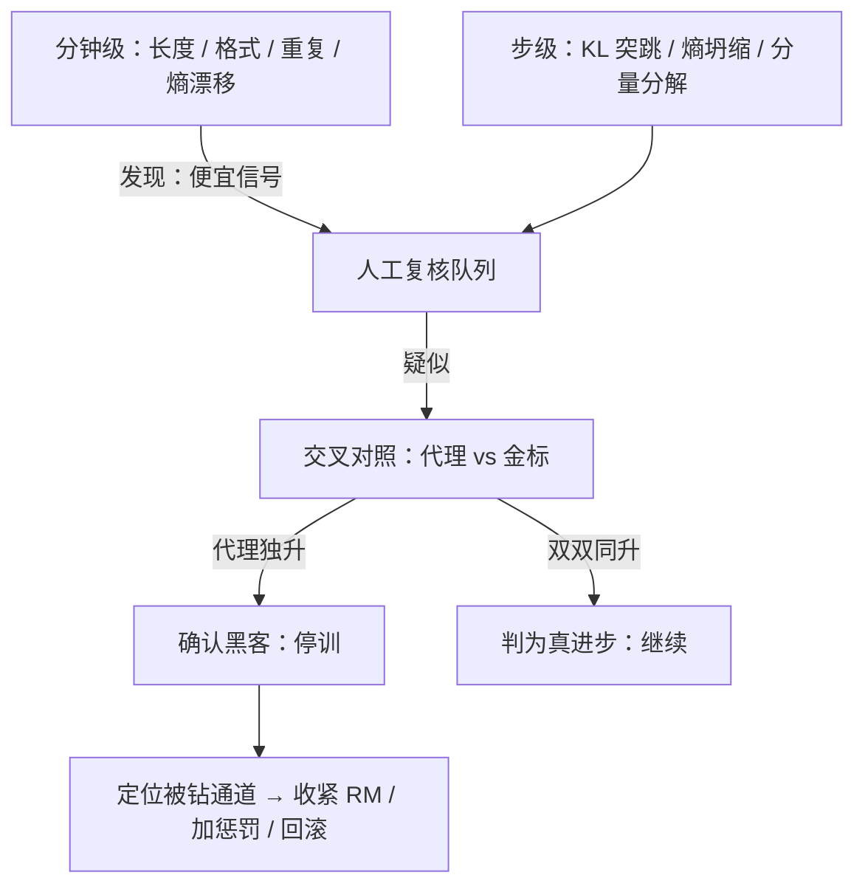

# Reward hacking 的监控

训练曲线全是好消息的时候，最先该怀疑的是仪表——代理奖励只会报告它自己被优化的程度。

<footer>—— 据 Gao、Schulman、Hilton 2022 与 Skalse 等 2022 的定义整理</footer>

[上一课](/llm/rlsys-async-debug)让系统跑得又快又不静默出错；本课转向另一类「没有 bug 的错」：系统精确优化了你给的目标，而那个目标不是你要的。Reward hacking 的机制面在[奖励黑客](/llm/reward-hacking-llm)与[RM 过优化与 Goodhart](/llm/rm-overoptimization)讲过，本课写工程面：把黑客行为变成在线上会触发告警的曲线。

## 问题

黑客的定义性困难是「代理分数上升，真实质量没跟上」——而真实质量没有实时标签。你手里只有代理奖励的实时曲线，和昂贵的、按天到周级的离线金标。缺口是把间接证据组织成可告警的信号：什么指标组合出现什么形态时，应该停下训练而不是继续看。难点在于单指标都不可靠：奖励涨可能是真进步也可能是钻空；长度变长可能是学会详尽也可能是凑字；KL 小可能是稳定也可能是局部锁死。监控设计的任务，是用一组彼此正交的便宜信号逼近那个没有实时标签的真值。

「代理奖励」翻译成大白话：RM 或验证器给的分。真正想要的「真实质量」没法实时打分，只好用这个可计算的替身代劳——「代理」即「替身」。替身演得越卖力（分数涨得越快），越要先问一句：它是在替目标涨分，还是在替自己抢戏？

## 方法

面板按「代理对金标」的主线组织，四组信号。交叉对照：代理奖励与独立金标（人审抽检、强裁判、可验证子集）双线同图——同升是健康，代理独升即黑客签名，报警并停训排查。行为统计：响应长度分布、格式特征率（代码块数、列表密度、模板开头复读）、重复度、熵——黑客几乎总要占用某个便宜的表面通道，统计漂移比语义劣化早几天现形。约束仪表：对 $\pi_{\mathrm{ref}}$ 的 KL、熵、奖励分量分解——KL 突跳与熵坍缩都是前兆，分量分解回答「哪个通道在被钻」。抽查队列：按代理分位分层抽样送人审或强裁判，让「高分样本真的好吗」始终有人回答。告警规则宁滥勿缺：交叉背离即报警，单指标漂移进人工复核。

常见误区：KL 小不等于安全。初学者容易把「KL 很小」当训练稳定的证据，实际上它也可能意味着策略锁死在某个模式附近不动了——不是没跑偏，而是跑不动了。所以 KL 要和熵一起读：KL 突跳查黑客，熵坍缩查锁死，两条曲线分工不同。

长度是最低成本的黑客通道：若长度分布的分位数一周内上移两成而金标持平，第一反应应是查黑客而不是庆祝进步——它与 RM 侧的长度去偏（[长度偏置的测量与去偏](/llm/rm-length-bias)）是同一枚硬币的两面。

## 机制

为什么交叉对照是主线：Goodhart 的各形态里（[RM 过优化与 Goodhart](/llm/rm-overoptimization)），代理先升、金标后滞之间有一个窗口期，监控买的就是这个窗口。行为统计的机制价值在于便宜：它们从已有经验流里零成本算出，能以分钟级新鲜度持续在线；金标只能按天到周级抽检，注定只能做确认而非发现。约束仪表回答「策略还有没有探索能力」：熵坍缩后策略锁死在当前模式，hack 与退化的区分已失去意义，先救探索再谈别的。奖励分量分解把优化压力的流向摊开：长度分量、格式分量、内容分量各自贡献多少，被钻的通道一目了然，处置（收紧 RM、加惩罚、回滚）才有靶子。

直觉类比：代理与金标像两个并排跑步的人，健康时同速前进；开始作弊时代理会突然加速而金标原地踏步——这段差距拉开的窗口期，就是监控能买到的全部时间。等金标也掉头向下，损失已经发生，报警就成了验尸报告。

## 边界

监控不解决黑客，只提前发现；处置是奖励工程的存量问题。金标本身可被攻击：人审流程或裁判提示若泄漏进训练数据，金标线也会失真——监控系统的完整性依赖它与训练环的隔离（评测数据的卫生在下一课展开）。可验证域不是免检区：测试通过率上升可能是过拟合测试集，[可验证奖励](/llm/verifiable-reward)的验证器同样要留 held-out。

## 小结

- 监控主线是代理与金标的交叉对照：同升健康、代理独升即黑客签名，告警宁滥勿缺。
- 行为统计（长度、格式、重复、熵）零成本分钟级在线，漂移比语义劣化早现形。
- KL 与熵是探索能力仪表：突跳查 hack，坍缩查锁死；分量分解定位被钻的通道。
- 金标与训练环必须隔离，否则监控自身失真；可验证域也要留 held-out 测试。
- 出处：Gao、Schulman、Hilton，2022；Skalse 等，2022；据开源 RLHF 运维实践整理。
