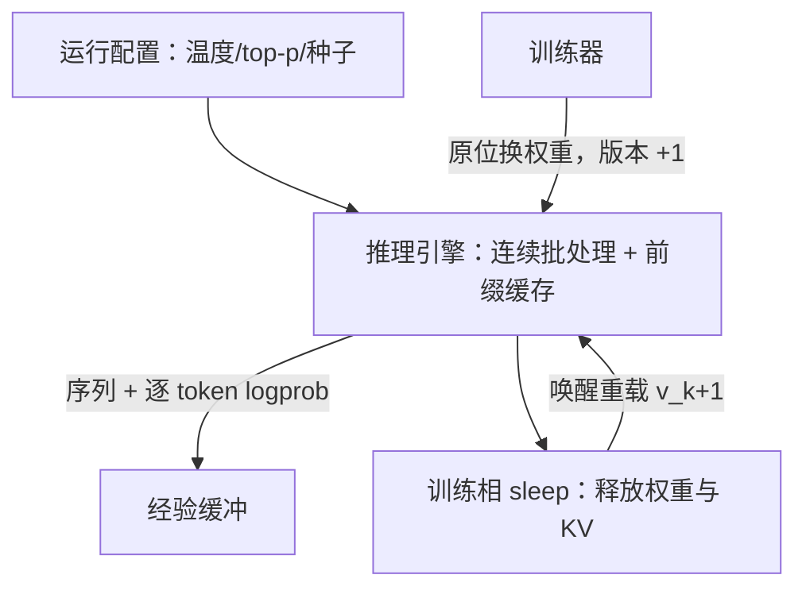

# 推理引擎在 RL 循环里

推理引擎为在线服务的首 token 延迟而生，RL 训练要的是离线批生成的吞吐与可复现——同一个引擎，两套诉求，接错就两头吃亏。

<footer>—— 据 Kwon 等 vLLM（SOSP 2023）与 verl、slime 的接入形态整理</footer>

[上一课](/llm/rlsys-replay-batching)把经验组成了更新批次，而批次上游的吞吐取决于生成端。本课下到引擎层：vLLM、SGLang 这类推理引擎坐进 RL 循环当 rollout 后端。服务的三大件——连续批处理、PagedAttention、前缀缓存——原样搬进来用，但 RL 换了一组 SLO：没有等在屏幕前的用户，却有一份必须精确返回的行为 logprob，和一批必须对齐版本的权重。

## 问题

服务默认与 RL 需求在四处打架。采样参数：服务里是产品体验（温度低点、回答稳点），RL 里是算法的探索策略，$\tau$ 与 top-$p$ 直接决定熵与组内方差，按服务直觉调参会把探索调没。logprob：服务端是可选项，RL 必须逐 token 返回采样时的 logprob，引擎内部的批重组与调度优化不得改变它。权重更新：服务假定权重终身不变，RL 每隔几步整体换权重，换完之后 KV 与前缀缓存全部作废。显存：引擎为 KV cache 留满显存，训练相需要这份显存还回去。四处都是接口语义问题，不是性能微调。

## 方法

四个对应。采样：把 $\tau$、top-$p$、随机种子写进运行配置而不是请求参数，批内固定、跨实验只动这一个旋钮（[采样温度与探索](/llm/rl-sampling-temperature)是它的算法面）。logprob：请求级打开 logprobs 选项，随序列落盘进经验缓冲；验收加一条断言——训练器随机抽样本，用声称的版本离线重算 logprob 与缓存比对。权重：走引擎的原位更新接口（collective 广播或重切分），换完递增版本号，协议见 [rollout 引擎与权重同步](/llm/rollout-weight-sync)。显存：sleep 类接口让引擎在训练相释放权重与 KV，生成相唤醒重载，峰值显存从「两份权重加两份状态」降为两相取最大（[Rollout 与训练资源复用](/llm/rollout-resource-sharing)）。前缀缓存对 RL 意外友好：同提示组内 $G$ 个响应共享前缀，命中率天然高。长度与停止是请求语义的一部分：`max_tokens` 与 stop 要在引擎层强制（[长度预算与截断](/llm/length-budget-rl)），不靠模型自觉。

验收推理引擎接入的最小断言集：固定种子下同请求可复现；返回 logprob 与离线重算一致（容小数值差）；换权重后旧前缀缓存确已失效（用「改权重后答案应变化」的探针请求验证）。三条任一不过，训练静默出错。

## 机制

引擎在 RL 循环里的价值要按「每 token 生成成本加版本切换开销」联合计价。连续批处理与分页 KV 压前者：组内并发生成把 $G$ 个响应塞进同一批波浪，KV 按页分配避免按最大长度预留。sleep 与原位换权重压后者：若换权重走「导出文件再重载」，一次几十秒，几千次迭代累计不可接受；原位 collective 更新把切换压到秒级。两者的交互有一个隐蔽点：引擎的内部重排与 chunked prefill 不改变给定前缀的条件分布，但浮点求和顺序会带来数值级差异——logprob 断言要设小的数值容差，不能要求逐位相等，也不能不设断言。

## 边界

引擎层不改变采样分布的数学：温度与 top-p 仍是算法的一部分，引擎只是忠实执行。服务的 SLO（首 token 延迟、公平排队）在 RL 里大多无意义，但连续批处理仍值得保留——它管理的是显存碎片与波浪调度，不是用户延迟。换引擎不是无损替换：采样实现与调度细节的差异足以改变探索行为，跨引擎对比要重跑基线。

## 小结

- 推理引擎进 RL 循环，SLO 从用户延迟换成吞吐、logprob 精确性与版本对齐。
- 采样参数是算法超参：进配置、固定种子、单旋钮改动；别按服务直觉调。
- 行为 logprob 逐 token 返回并缓存，配离线重算断言；权重走原位更新，版本号递增。
- sleep 与唤醒控制显存峰值；前缀缓存对组内共享前缀天然友好，换权重后必须验证缓存失效。
- 出处：Kwon 等，vLLM，SOSP 2023；Sheng 等，HybridFlow，EuroSys 2025；据 verl、slime 实现整理。
