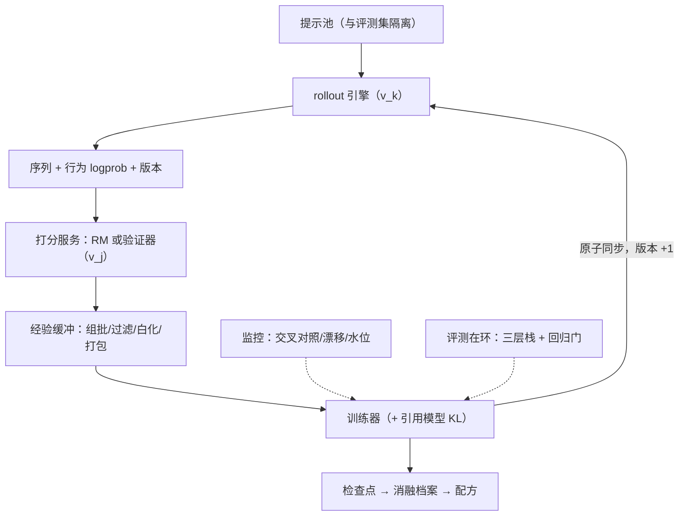
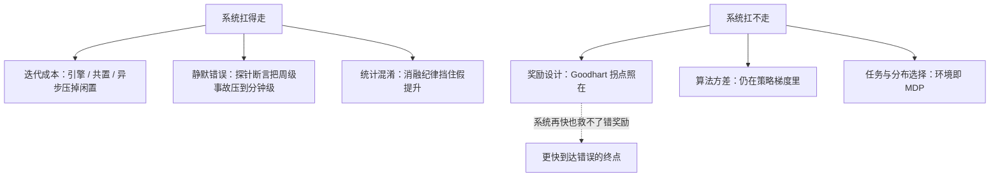

# RL 训练系统收束

把一台 RL 训练机拆开，只剩两条不变量：样本永远知道自己出自哪个版本，仪表永远独立于被监控的对象。

<footer>—— 据 Sheng 等 HybridFlow（EuroSys 2025）与开源框架文档整理</footer>

[上一课](/llm/rlsys-production-ablation)用消融纪律把结论钉在可比的地基上，本课程到此收束。三个单元走过的路：架构（[rollout 引擎的架构](/llm/rlsys-rollout-arch)、[奖励模型的服务化](/llm/rlsys-reward-serving)、[引用模型与 KL 的管理](/llm/rlsys-refmodel-kl)）；工程（[经验回放与批处理](/llm/rlsys-replay-batching)、[推理引擎在 RL 循环里](/llm/rlsys-inference-in-loop)、[多轮 RL 的环境工程](/llm/rlsys-multiturn-env)、[异步 RL 的系统调试](/llm/rlsys-async-debug)）；监控与生产（[Reward hacking 的监控](/llm/rlsys-hacking-monitor)、[评测在环](/llm/rlsys-eval-in-loop)、[成本：RL 相对 SFT](/llm/rlsys-cost-vs-sft)、[失败模式清单](/llm/rlsys-failure-catalog)、[生产案例与消融管理](/llm/rlsys-production-ablation)）。本课把零件装回整机，并给算法课程交一份分账清单：系统替你扛了什么，没扛什么。

## 问题

收束课的问题是：十三课能不能压缩成更少的命题？如果每课是一个零件说明书，收束课要给出整机的原理图——哪些是承载一切的不变量，哪些是可替换的实现选择，哪些账单永远要有人付。压缩的判据是：删掉一条命题后，机器会在哪类事故里坏，就把它归到哪一类。

## 方法

整机原理图一条主线、三条不变量。主线是数据流：提示池喂 [rollout 引擎的架构](/llm/rlsys-rollout-arch)生成经验（序列加行为 logprob 加版本号），[奖励模型的服务化](/llm/rlsys-reward-serving)补分数列，[经验回放与批处理](/llm/rlsys-replay-batching)组批过滤，训练器更新，权重经同步回生成端。不变量一，版本对齐：行为 logprob、奖励、KL 的分母都绑定明确版本，[异步 RL 的系统调试](/llm/rlsys-async-debug)的探针守着它。不变量二，仪表独立：金标与监控不进训练环，[评测在环](/llm/rlsys-eval-in-loop)的卫生闸门守着它。不变量三，预算显式：显存、上下文、staleness、卡时都要写成配置与水位，[失败模式清单](/llm/rlsys-failure-catalog)的水位告警守着它们。[引用模型与 KL 的管理](/llm/rlsys-refmodel-kl)站在算法与系统的接缝上：跑道多宽是算法决定，跑道刻进显存与调度是系统执行。

直觉类比：把系统想成一条流水线，版本号就是每件半成品上挂的工单——无论它流到打分、组批还是更新的工位，工单都注明出自哪版模具。丢了工单的流水线照样转，只是没人说得清成品是谁做的，出了错也没法追责。

判据的用法：删掉「版本对齐」，坏法是静默离策略（[截断重要性采样](/llm/truncated-importance-sampling)救得回一半）；删掉「仪表独立」，坏法是守门人被收买；删掉「预算显式」，坏法是长尾一步顶爆显存。三类坏法对应三类断言，这就是清单的由来。

## 机制

系统与算法的分账。系统扛走的：迭代成本——引擎、共置与异步把闲置压掉；静默错误——探针、断言与清单把几周量级的事故压到分钟级；统计混淆——消融纪律把假提升挡在门外。系统扛不走的：奖励设计，[RM 过优化与 Goodhart](/llm/rm-overoptimization) 的拐点不因系统变快而消失；算法方差，[REINFORCE 与方差](/llm/reinforce-variance) 的账仍在策略梯度里；任务与分布的选择——环境即 MDP，[多轮 RL 的环境工程](/llm/rlsys-multiturn-env)里那句「环境设计就是奖励设计」是本课程与算法课程之间的双向桥。

「引用模型 KL」翻译成大白话：KL 是一把尺子，量当前策略和出发时的参考模型差了多远。跑道比喻就是为它画的——预算多宽（允许走多远）是算法的决定，把尺子插进显存与调度里按时测、别忘测，是系统的执行。

开源系统（[verl 与 HybridFlow](/llm/verl-hybridflow)、[OpenRLHF](/llm/openrlhf)、[slime 轻量 RL 框架](/llm/slime-rl)）把零件做成了可安装的形态，但配方——隐旋钮取值、卫生闸门、监控面板——仍然只有自己能建。

常见误区：初学者容易以为「系统够快就能弥补算法问题」——方向错了，快只放大速度、不纠正方向。奖励设计错了，系统越快、烧卡越多、离目标越远。系统承诺的是「又快又不出静默故障」，从不承诺「学对东西」。

## 边界

本课程的边界即 RL 训练系统的边界：它假设奖励可定义（RM、验证器或人审），假设算力买得到经验。奖励写不成的域（无金标、人审太贵）与经验太贵的域（环境慢、轨迹长）里，这台机器的账算不平——那是算法与产品的问题，不是系统的问题。反向的告诫同样成立：系统再好也救不了错的奖励，只会让你更快地到达错误的终点。本课程到此收束，机器交回给写配方的人。

## 小结

- 一条主线：生成 → 打分 → 组批 → 更新 → 同步回生成端；版本号全程随行。
- 三条不变量：版本对齐、仪表独立、预算显式；探针、卫生闸门、水位是各自的守卫。
- 分账：系统扛迭代成本、静默错误与统计混淆；扛不走奖励设计、算法方差与任务选择。
- 环境设计就是奖励设计：系统课程与算法课程在这句话上对接。
- 本课程收束：机器可安装，配方需自建；出处口径为 HybridFlow（EuroSys 2025）与 verl、OpenRLHF、slime 的文档实现。
