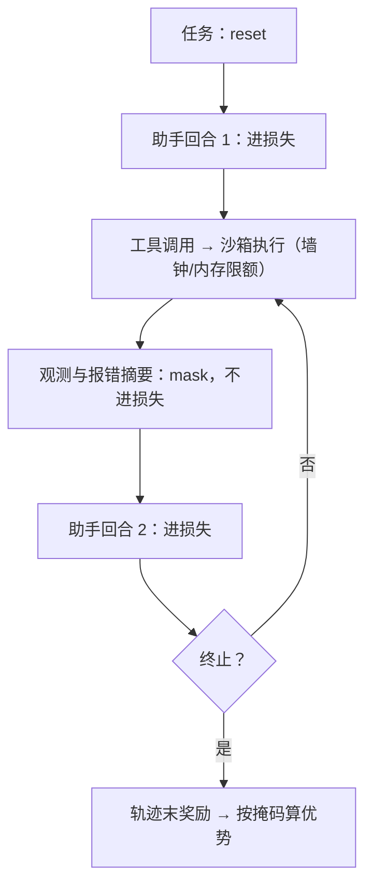
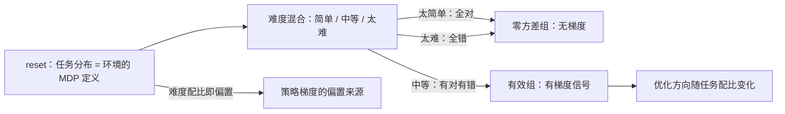

# 多轮 RL 的环境工程

单轮 RL 的环境是提示词；多轮的环境是一个有状态、会超时、偶尔崩溃的进程——工程量从采样器挪到了环境侧。

<footer>—— 据 Nakano 等 WebGPT 2021 与工具整合、代码 RL 环境的公开工程实践整理</footer>

[上一课](/llm/rlsys-inference-in-loop)把推理引擎接进循环，生成端能稳定吐单轮经验。本课把「一问一答」升级成「多轮交互」：模型要调工具、读观测、再决策，环境从静态提示变成有状态的服务。推理 RL 的前沿（工具整合、代码修复、网页操作）都长在这层工程上，[推理 RL 闭环](/llm/reasoning-rl-loop)里它是产能瓶颈。

## 问题

多轮把三件事复杂化了。轨迹结构：一次经验是「助手—工具—观测」交替的长序列，哪些 token 进损失？工具返回与系统注入的文本不是模型的行为，算进策略梯度等于教模型模仿工具输出。信用分配：奖励只在轨迹末端（测试通过、任务完成），中间回合没有直接信号，轨迹越长自方差越大。环境吞吐：沙箱里跑测试要秒到分钟级且彼此不均，最慢的环境决定批次完成时间，训练器永远在等最慢的样本。

直觉类比：环境池像并排水龙头往同一个桶里注水，批次完成时间取决于最慢那根管子。九个环境 5 秒完成、一个要 90 秒，GPU 照样空等 85 秒——所以沙箱限额（墙钟、内存上限）不是防滥用的小配置，而是保吞吐的生命线。

## 方法

环境抽象成 reset/step 接口：step 的动作是助手回合，返回观测、是否终止、可选的中间奖励。

「reset/step」是从游戏借来的老接口：reset 开一局新任务，step 把模型的一个动作（这里是整个助手回合）交给环境，换回观测和「完没完」。相当于给沙箱装一个标准插座——不管里面跑的是终端、浏览器还是测试套件，训练器只认这两个按钮。

四条工程决定。掩码：损失只在助手生成的 token 上计算，工具输出与观测全部 mask 掉，mask 列作为经验的一列随样本走。工具调用走结构化通道：函数名与参数的协议要可解析，解析失败的调用按环境规则计分或截断（[工具整合推理 RL](/llm/tool-integrated-rl)）。沙箱限额：每个环境实例有墙钟、内存与网络上限，超时返回错误观测让模型学会绕开，而不是挂死整批。断点续跑：环境状态可序列化，轨迹可以暂停（等工具、等新权重）再续，跨版本拼接必须带版本标记（[异步 rollout 架构](/llm/async-rollout-arch)的 partial rollout 在环境层的落点）。

数字实例看掩码省了什么：一条 10 轮轨迹共 8000 token，助手自己写的只有 3000，工具输出与观测占 5000。掩码就是给这 5000 个位置记零——不进损失、不算优势，但照常进上下文供注意力读取。若无掩码，梯度会按着头教模型「背诵」工具的输出。

代码 RL 环境的两条硬账：测试套件的墙钟上限决定批次节奏，几分钟的测试会把你压到一天几步；失败测试的报错全文直接进上下文，几个回合就能把窗口吃满——观测要截成摘要，预算写进配置（见[长度预算与截断](/llm/length-budget-rl)）。

## 机制

掩码与奖励放置共同定义了「策略认为自己控制什么」。梯度只在掩码内流动，所以 mask 是因果边界的声明：工具与观测属于环境，如同 MDP 的转移函数，不该被优化。奖励挂在最后一个助手 token（或按 [token 级奖励塑形](/llm/token-level-reward)摊到助手 token），优势以轨迹为单位估计。环境有状态之后，「同分布采样」也要重审：reset 的任务分布就是环境的 MDP 定义，任务难度与分布偏置直接成为策略梯度估计的偏置来源——环境设计就是奖励设计，这句话在多轮里才显出全部分量。

## 边界

环境工程不解决信用分配：末端奖励下的长轨迹方差仍靠组基线与优势估计压制，中间奖励是可选的塑形而非免费午餐（塑形有偏）。沙箱既是安全边界也是测量边界：模型可能学会「让测试变绿」而不是「让代码正确」——[奖励黑客](/llm/reward-hacking-llm)的环境版。环境池的可用性是新单点，其吞吐上限直接给出训练吞吐上限；代码修复类环境（[代码 RL 与 SWE 环境](/llm/swe-rl-env)）把这笔账推到极限。

## 小结

- 环境抽象为 reset/step；任务分布即 MDP 定义，环境设计就是奖励设计。
- loss mask 只保留助手 token：工具与观测是环境，不是行为。
- 沙箱限额（墙钟、内存、网络）防挂死；观测进上下文前截成摘要并计入预算。
- 轨迹可暂停续跑，跨版本拼接必须带版本标记；环境池吞吐是训练吞吐的上界。
- 出处：Nakano 等，WebGPT，2021；据工具整合与 SWE 环境的公开工程实践整理。
