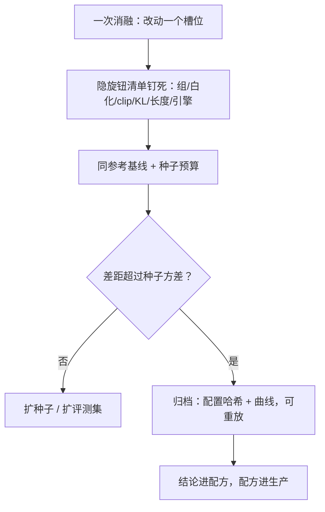

# 生产案例与消融管理

RL 的实现细节就是算法：白化开关、clip 上界、KL 形式，每一个都足以翻转结论——消融不钉死它们，等于在流沙上比高低。

<footer>—— 据 Henderson 等 2018 与 Dr. GRPO、DAPO 的实现敏感性分析整理</footer>

[上一课](/llm/rlsys-failure-catalog)给了巡检清单，系统不坏了，剩下的问题变成科学管理：一次改动到底有没有效？本课写 RL 训练的消融纪律与生产案例的组织。实现细节对结论的颠覆性——白化做不做、长度归一化的批评（[Dr. GRPO](/llm/dr-grpo)）、clip 上界放宽（[PPO 的 clip 上界](/llm/ppo-clip-higher)）——算法课讲过，本课讲流程面：怎么让「我的改动带来了提升」这句话经得起问。

## 问题

RL 消融的方差环境比监督训练恶劣。评测集小、训练曲线抖、随机种子之间的差距可以吞掉多数「改进」；同一框架的不同版本、不同推理引擎的默认值就足以改变结论。缺口是流程性的：当两个人各跑一次「改进版对基线」，结论相反时，怎么裁决？没有共享基线与钉死隐旋钮的纪律，团队会在不可比的数字上空转——对内是消融档案没法积累，对外是复现报告无从写起。

## 方法

消融纪律五条。一次一变量：温度、数据、算法、系统配置分开动，一次改动一个槽位。共享基线：所有消融对照同一个冻结的参考运行（同代码哈希、同数据版本、同种子组），不与「我记得的上次」比。种子预算：先跑两个种子，差距小于种子间方差就扩种子或扩评测集，不宣布结论。隐旋钮清单钉死：组大小、优势白化开关与层、clip 上界、KL 形式与系数、长度惩罚、丢弃规则、引擎与采样实现版本——每份消融报告必须附这张表的取值。归档即产出：每次运行留下配置哈希、数据版本、代码提交、引擎版本与完整曲线，可重放优先于可复现。生产案例同理：开源框架（[verl 与 HybridFlow](/llm/verl-hybridflow)、[OpenRLHF](/llm/openrlhf)、[slime 轻量 RL 框架](/llm/slime-rl)）的默认配置各自代表一组选择，采用前把默认值 diff 一遍，把「框架默认」显式写进自己的配方。

把两个框架的同一名义算法配置 diff 一遍，通常能数出五六个行为自由度：组大小、白化、clip 上界、KL 形式、长度处理、采样实现。Henderson 等 2018 的教训原样成立：未报告的实现细节足以解释互相矛盾的结论。

## 机制

消融管理的机制目标是压住三类混淆。实现混淆：名义算法相同而实现不同——白化、KL、clip 的细节正是 [Dr. GRPO](/llm/dr-grpo) 一类工作证明能翻转结论的自由度，钉死清单等于固定混淆源。统计混淆：种子与评测噪声，靠种子预算与差距判据管理。时间混淆：基线跑在旧引擎旧数据上、新改动跑在新栈上——参考运行必须与新消融同栈重跑，不能引用历史数字。生产案例与消融共用这套账本：一份内部复现报告的可信度，取决于隐旋钮清单是否完整，而不取决于结论是否符合预期。

## 边界

消融纪律有成本：种子预算与同栈重跑让每个结论更贵。小团队可行的折衷是分层置信：系统级改动（引擎、并行）走完整流程，算法级微调走短流程但标注置信等级。跨团队复用结论时，隐旋钮清单是交接物的一部分——没有它，别人的「有效」对你的栈不构成证据。

## 小结

- 实现细节即算法：组大小、白化、clip 上界、KL 形式、长度处理是必须钉死的隐旋钮。
- 消融纪律：一次一变量、共享冻结基线、种子预算判据、归档可重放。
- 三类混淆各管一段：实现靠清单、统计靠种子预算、时间靠同栈重跑参考。
- 框架默认值是选择不是真理：采用前 diff 默认配置，并写进自己的配方。
- 出处：Henderson 等 2018（可复现性）；Liu 等（Dr. GRPO）；Yu 等 DAPO；据 verl、OpenRLHF、slime 文档整理。
