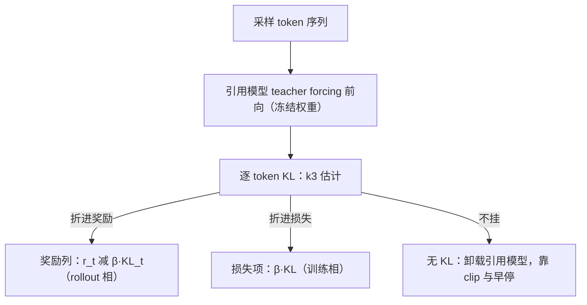
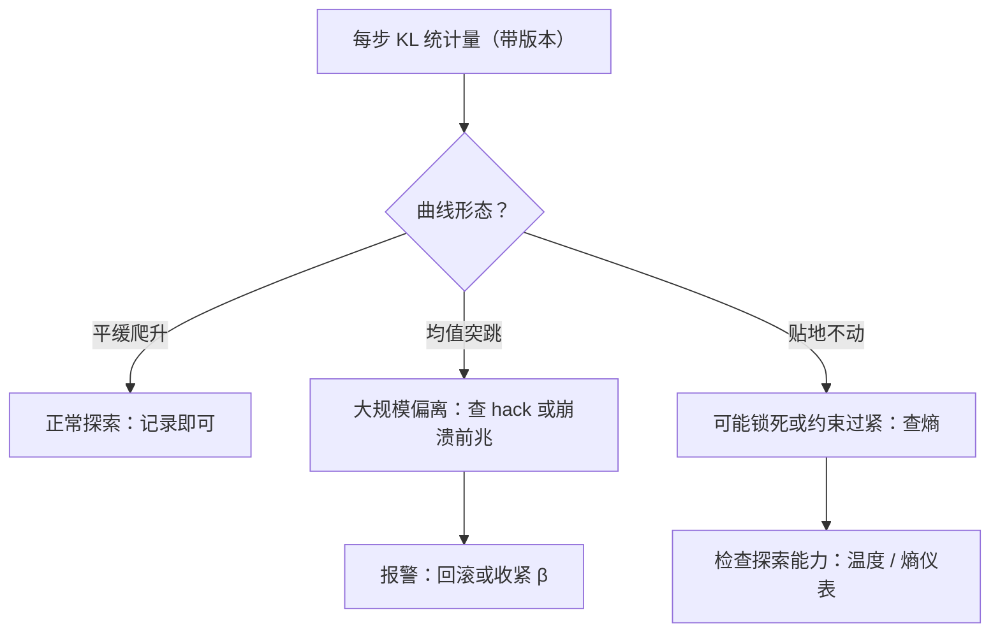

# 引用模型与 KL 的管理

引用模型是训练里唯一不许变的那块权重：它不产生梯度，却定义了整个跑道的边界。

<footer>—— 据 Schulman 等 2017（PPO）的 KL 惩罚设计与 Schulman 2016 的 KL 近似笔记整理</footer>

[上一课](/llm/rlsys-reward-serving)把打分做成服务，经验三件套齐了：序列、行为 logprob、奖励。本课补训练相最安静的角色——引用模型：冻结的初始策略，给出 KL 的参照分布。它不学一个参数，却占一份显存、付一份前向，还要回答一个算法问题：KL 到底挂在奖励里、挂在损失里，还是根本不挂。

## 问题

KL 正则把当前策略 $\pi_\theta$ 拉向 $\pi_{\mathrm{ref}}$，防止它离开数据支撑太远——这是[KL 惩罚与价值函数](/llm/ppo-kl-value)的算法面。系统面的问题是同一件事的三种挂法各有不同的账单。折进奖励（InstructGPT 式的 $r_t \gets r_t - \beta\,\mathrm{KL}_t$）：引用前向必须发生在 rollout 相，每个样本多一遍 teacher forcing 前向。折进训练损失：引用前向挪到训练相，与梯度计算分时共享卡。完全不挂（[无 KL 的 RL](/llm/kl-free-rl)）：引用模型整块不加载，显存立省一份，但漂移只剩 clip 与早停拦着。选哪种不只是算法口味，而是显存与吞吐预算的分配——这正是它进「架构」单元的原因。

「引用模型」$\pi_{\mathrm{ref}}$ 就是出发点的快照：通常是 SFT 刚结束时的那份权重，整个训练期间冻结不动。它唯一的职责是当参照物——每步回答「现在的策略离出发时偏了多远」，这个偏离量就是 KL。它自己一个参数也不更新。

## 方法

无论挂哪，估计用低方差的那支。对采样自 $\pi_\theta$ 的 token，取比值 $r = \pi_{\mathrm{ref}}/\pi_\theta$，用 $k_3 = r - \log r - 1$：其期望恰为 $\mathrm{KL}(\pi_\theta \,\|\, \pi_{\mathrm{ref}})$，且逐点非负、方差远小于直接平均 $\log r$；方向别接反，分母是行为侧。工程要点三条。第一，引用前向只需在已采样的 token 上取 logprob——不生成、不扫词表，成本是一次 teacher forcing 前向，可与 rollout 相共享批处理。第二，引用 logprob 与行为 logprob 同样要缓存并带版本：复用旧样本做离策略修正时，KL 的分子要用打分当时的 $\pi_\theta$，不是最新版。第三，显存管理：引用模型可常驻、可 offload 到 CPU 按需搬入、可在无 KL 配置下整个不加载；共置布局里它是第三个模型，与训练器、rollout 引擎抢峰值显存。

数字实例看 $k_3$ 的非负性：取 $r=2$（参考概率是行为概率的两倍），$k_3=2-\log 2-1\approx0.31$；取 $r=0.5$，$k_3=0.5-\log 0.5-1\approx0.19$。比值无论大于还是小于 1，结果都不为负——这是它能当 KL 估计量的好处之一；直接平均 $\log r$ 则正负不定、方差大。

$k_3 = r - \log r - 1$ 的期望等于 KL，靠的是 $\mathbb{E}_{\pi_\theta}[r] = 1$ 这条性质；换一个 token 分布（例如在温度缩放后的分布上取比值），期望就不再是 KL，而是一个不知名的量。

## 机制

KL 挂在哪里，决定它是「奖励的一部分」还是「约束的一部分」，监控语义随之不同。折进奖励时，KL 是代理奖励的组成部分，优化器会主动权衡它——调小 $\beta$ 等于放宽跑道，[奖励过优化的理论视角](/llm/reward-overoptimization-theory)里它正是压力旋钮；折进损失时它更像信赖域的软实现，两种挂法的曲线要分开解读。两条路都要求把每步 KL 统计量记进监控：均值突跳通常是策略在大规模偏离（可能是 hack，也可能是崩溃前兆），缓缓爬升是正常探索。无 KL 配置下这根仪表没了，漂移监控改由评测与熵承担——省下的显存买走了一根最重要的仪表，这笔交易要显式记账。

直觉类比：KL 惩罚像风筝线——线放得长（$\beta$ 小），风筝飞得高、探索得远；线收得太紧，风筝贴地打转什么也采不到；完全剪断（无 KL）飞得最爽，但一头栽下来时没有任何东西拦着。三种挂法（折进奖励 / 折进损失 / 不挂）只是把「收线的手」装在不同位置。

## 边界

引用模型管理不提供对齐保证：KL 小只代表离起点近，不代表好；KL 的支撑性质保证不了内容质量。$\pi_{\mathrm{ref}}$ 选哪个快照（SFT 末、某轮 RL 前）本身是超参，换参照点等价于换跑道，跨实验比较时必须同参照。多轮迭代里「上一轮产物当下轮参照」会让参照本身漂移，跑道随训练移动，这个边界条件要写进配方而不是留在实现里。

## 小结

- 引用模型是冻结权重，只付前向不付梯度；三种挂法（奖励/损失/无）对应三份显存与吞吐账单。
- KL 估计用 $k_3 = r - \log r - 1$：期望即 KL、逐点非负、低方差；方向是 $\pi_{\mathrm{ref}}/\pi_\theta$。
- 引用 logprob 只在采样 token 上取，需缓存并带版本；复用旧样本时分母取打分当时版本。
- KL 曲线是核心仪表：突跳查 hack 或崩溃，缓升是探索；无 KL 配置拿掉它要换仪表。
- 出处：Schulman 等 2017（PPO）；Schulman 2016（KL 近似笔记）；据 InstructGPT 与开源框架实现整理。
