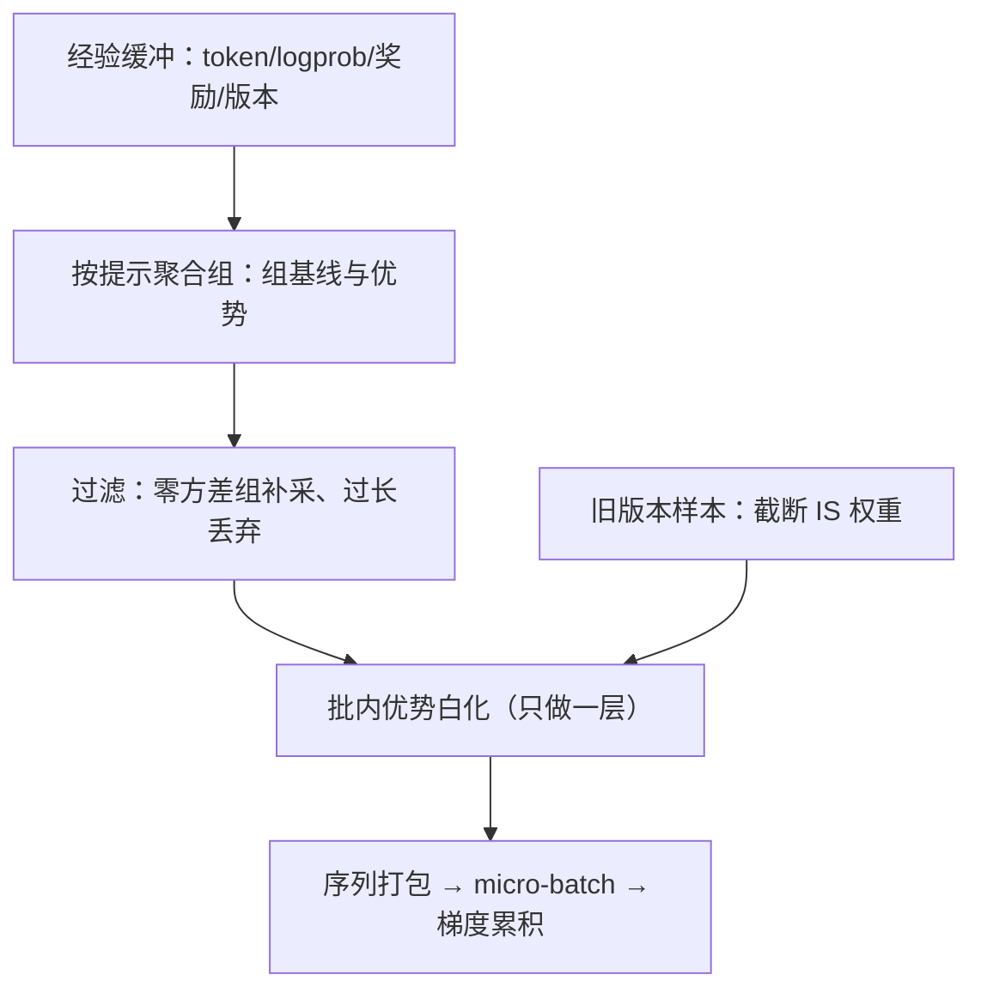
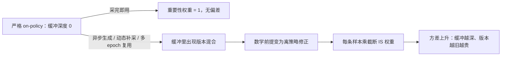

# 经验回放与批处理

语言模型的 RL 大多号称 on-policy，于是「回放缓冲」缩水成一条传送带——但传送带的分拣与丢弃规则，决定了训练器吃进去的是什么。

<footer>—— 据 Shao 等 2024（GRPO）与 DAPO 的组内口径整理</footer>

[上一课](/llm/rlsys-refmodel-kl)把 KL 挂好位置，经验四件套齐了：序列、行为 logprob、奖励、KL。本课写它们如何变成一次参数更新：组批、分拣、过滤与打包。经典 RL 的经验回放在这里只剩残影——on-policy 训练基本现采现用——但组基线、动态采样与序列打包把「怎么组一批」变成了有真实杠杆的工程问题。

## 问题

一个更新步吃一批序列，这批怎么来？语言模型 RL 的答案几乎总是：同批提示、组内多采样。

数字实例看零方差组：$G=8$ 时一组 8 个响应全对（或全错），组内基线消掉后每个优势都是 0——8 条序列的前向反向白算。任务准确率 90% 时，一组全对的概率约 $0.9^8\approx43\%$，意味着近半算力在产出零梯度：这就是「有效组占比」要单独监控的原因。

GRPO 对每个提示采一组 $G$ 个响应，用组内统计当基线算优势——组是这个算法族的原子结构，组批必须保住它。缺口有三。其一，组内全对或全错时优势全零，这一组白采，而且随训练进展越采越多。其二，响应长短悬殊：pad 浪费与截断失真二选一。其三，批次间优势尺度漂移，学习率与 clip 范围的物理含义跟着漂。

## 方法

缓冲区按四列存：token、行为 logprob、奖励、版本号。组批流水线四步。第一步按提示聚合组，组内算基线与优势（[GRPO](/llm/grpo) 与 [RLOO](/llm/rloo) 的差别主要在基线取组均值还是留一均值）。第二步过滤：零方差组不带梯度，动态采样补采新提示补齐批次（[动态采样](/llm/dynamic-sampling-rl)）；超长响应要么截断要么整条丢弃（[过长过滤](/llm/overlong-filtering)），且丢弃规则必须与奖励设计一致——若截断响应仍送 RM 打分，模型会学会把话说一半骗分。第三步尺度控制：批内优势白化钉住尺度，让学习率与 clip 跨实验可比（[奖励归一化与白化](/llm/reward-whitening)「只做一层」的纪律在这里生效）。第四步打包：多条序列拼进 micro-batch 最小化 pad，梯度累积凑出全局批。凡混入旧版本的样本（异步补采、多轮复用），必须带截断重要性权重，不能假装还在 on-policy。

「on-policy」翻译成大白话：用来更新的样本必须出自「当前这一版策略」之手，梯度公式才严格成立；样本一旦是老版本生成的，就带「陈旧度」，要靠重要性权重打折扣补偿。像生鲜直送与冷冻库存的区别——直送免校正，库存越久，越要贴标签补手续。

准确率升到高位后，零方差组占比可能过半：全对（或全错）的组优势为零，算力照烧、梯度为零。监控「有效组占比」与「有效 token 占比」，比监控 loss 更早暴露这层浪费。

## 机制

「回放」在语言模型 RL 里的真实身份是版本控制问题。严格 on-policy 意味着缓冲深度为零：采完即用，用完即弃，重要性权重恒为 1。任何打破它的机制——异步生成、动态补采、多 epoch 复用——都让缓冲里出现版本混合，此时训练的数学前提从策略梯度变成离策略修正，每条样本要乘行为版与当前版比值的截断权重，方差随之上升（[截断重要性采样](/llm/truncated-importance-sampling)）。所以批处理流水线的每个过滤器都有双重身份：既是算力优化（少算零梯度样本），也是分布控制（不让偏差样本混进批次）。把它们当纯性能开关随手开关，改的不是速度而是算法。

## 边界

组批不创造信息：零方差组只能丢弃或补采，不能凭空补梯度，补采的前提是还采得出方差——上游是任务难度分布（[难度课程](/llm/rl-difficulty-curriculum)）的事。白化抹掉「这批任务普遍偏易或偏难」的信息，看训练进展要回到原始奖励曲线。打包与梯度累积的数值效应（等效大 batch）是另一层超参，别与算法改进混为一谈。

常见误区：初学者容易把「序列打包」「梯度累积」当算法改进来报喜——它们只是把算力排满、把批凑大的工程手段，等效于调大 batch 这一超参。真做算法改进（换基线、加过滤）时，也要先钉死这些工程旋钮，两者混在一起动，就说不清功劳归谁。

## 小结

- on-policy 让回放缓冲缩成传送带，但组批规则（组结构、过滤、白化、打包）每项都同时是性能与算法开关。
- GRPO 族以组为原子：基线取自组内统计，组批必须按提示聚合，不能跨组混算。
- 零方差组与过长响应是两类必过滤样本；丢弃规则必须与奖励设计一致，否则教模型钻空子。
- 任何版本混合（异步、补采、复用）都要补截断 IS 权重；装作 on-policy 是静默偏差。
- 出处：Shao 等 2024（GRPO）；Ahmadian 等 2024（RLOO）；Yu 等 DAPO（动态采样）；据 verl 实现整理。
