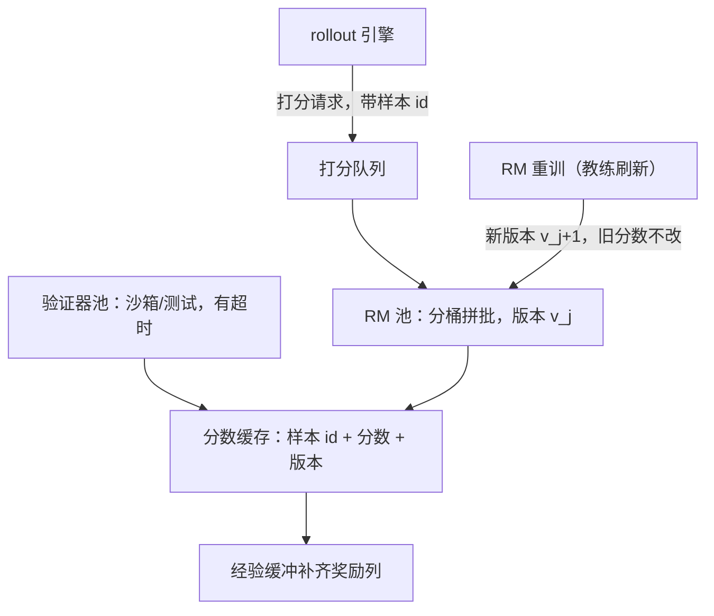
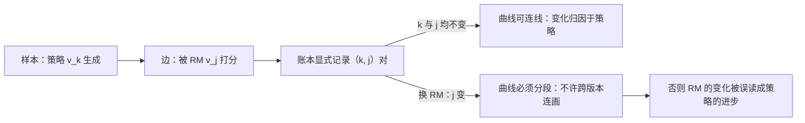

# 奖励模型的服务化

打分器一旦进了训练环，它就不再是评测工具，而是每秒要出几千个分数的在线服务——评测可以排队，训练不能。

<footer>—— 据 Ouyang 等 InstructGPT 2022 的管线与 verl、OpenRLHF 的实现形态整理</footer>

[上一课](/llm/rlsys-rollout-arch)钉了 rollout 引擎的接口契约：序列与行为 logprob 出引擎，版本号随样本走。经验还缺一列：标量奖励。本课写奖励模型的服务化——把训好的 RM 从评测桌搬进训练环，当成一块要管理吞吐、排队与版本的在线组件。可验证奖励没有 RM，但验证器池（编译、测试、沙箱）面对同样的服务问题，本课一并覆盖。

## 问题

rollout 出的每个响应都要一个分数。RM 本身是一个 transformer，打分是又一个推理负载：单条打慢、成批打省；好在打分只取序列末端的标量头，不需要生成。缺口的形态是排队论式的：训练步要等最慢的样本，RM 池吞吐不足时训练器饿死；RM 池过大又挤占训练与生成的卡。第二个缺口是版本：迭代式 RLHF 里 RM 会随策略更新再训练，哪个样本用哪个版本的 RM 打分，必须像权重一样带版本号——否则监控曲线会把 RM 的变化误读成策略的进步。这两个缺口都不在算法论文里，全在服务层。

数字实例看分桶的收益：一批 64 条响应长度从 200 到 4000 token 不等，直接拼批要全部 pad 到 4000，近九成算力花在 padding 上；按长度分成 4 桶各自拼批，浪费立刻降到一成以下。打分是纯前向、可大批跑，分桶是最便宜的吞吐优化。

## 方法

部署形态两种。共置：RM 与 rollout 引擎共用一组卡，生成相结束进入打分相，RM 权重常驻或按需加载——省卡，但峰值显存要把 RM 算进去。分置：RM 独立成服务池，rollout 异步发打分请求，吞吐解耦、可独立扩缩，代价是网络往返与队列管理。打分请求天然可批：把同批响应按长度分桶再拼批，RM 前向的算术强度立刻上去。分数与（样本 id、RM 版本）绑定写进经验缓冲，缺列即废。超时与降级要预先写进配置：单条打分超时重试几次、超限丢弃还是整批等待，不能当场拍脑袋。用 LLM 裁判作奖励时（[LLM 裁判作奖励](/llm/llm-judge-reward)），服务层还要多管一份裁判提示模板的版本。可验证奖励走验证器池：沙箱有墙钟与内存限额，挂起的测试进程会卡死整批，超时返回失败让训练继续。

「共置 / 分置」翻译成大白话：共置是把 RM 和 rollout 引擎塞进同一组卡（合租，省卡但互相挤显存）；分置是让 RM 单独成池对外服务（单住，多花卡但互不打扰、可独立扩缩）。选哪种，本质是选「抢显存」还是「抢网络往返」。

打分只读最后一个非填充位置的标量头，一条响应一次前向；把 padding 也计入批内计算量，RM 池的表观吞吐会虚低——按长度分桶与合理填充是最便宜的吞吐优化。

## 机制

服务化把 RM 从静态函数变成有生命周期的组件，机制上多出两件事。一是分数的幂等：重试与重放不能打出不同的分数——同一版本 RM 对同一响应的分数必须确定（批内位置引起的数值抖动要压住），否则监控看到的方差是服务的，不是策略的。二是版本对齐的账本：策略在 $v_k$ 下生成的样本被 $v_j$ 的 RM 打分，这条边要显式记录；迭代 RLHF 换 RM 的那一刻，前后分数不可直接连成一条曲线，监控必须按（策略版本，RM 版本）分段。这正呼应[RM 过优化与 Goodhart](/llm/rm-overoptimization)的提醒：只看代理分数曲线，分不清是策略在进步还是代理在被钻空。

常见误区：初学者容易把「RM 换版后分数涨了」当成策略进步——同一批旧样本用新 RM 重打一遍分也会变，因为尺子换了。判断进步只能看「同版本 RM 给新策略样本打的分」，换尺前后的曲线必须分段，不许连成一条。

## 边界

RM 服务化不解决 RM 本身的偏置与过优化：长度偏置、风格偏置、Goodhart 拐点，都是[RM 工程收束](/llm/rm-engineering-map)那门课的存量问题，服务层只是把这些现象按时钟放大。可验证奖励也别高兴太早：沙箱逃逸与过拟合测试集是新的黑客面。分置池的可用性是新的单点：RM 池挂掉时训练是停还是用旧分数顶上，必须提前决定并写进配置。

## 小结

- RM 进训练环即成在线服务：吞吐、排队、超时、降级都要显式管理，训练器不能无限等。
- 打分可批、分数要缓存且幂等；奖励列与样本 id、RM 版本一起入缓冲。
- RM 版本随样本走；迭代换 RM 时监控曲线按版本分段，不许跨版本连线。
- 可验证奖励走验证器池，服务问题同构，另加沙箱限额与超时两面。
- 出处：Ouyang 等，InstructGPT，2022；Sheng 等，HybridFlow，EuroSys 2025；据 verl、OpenRLHF 实现整理。
