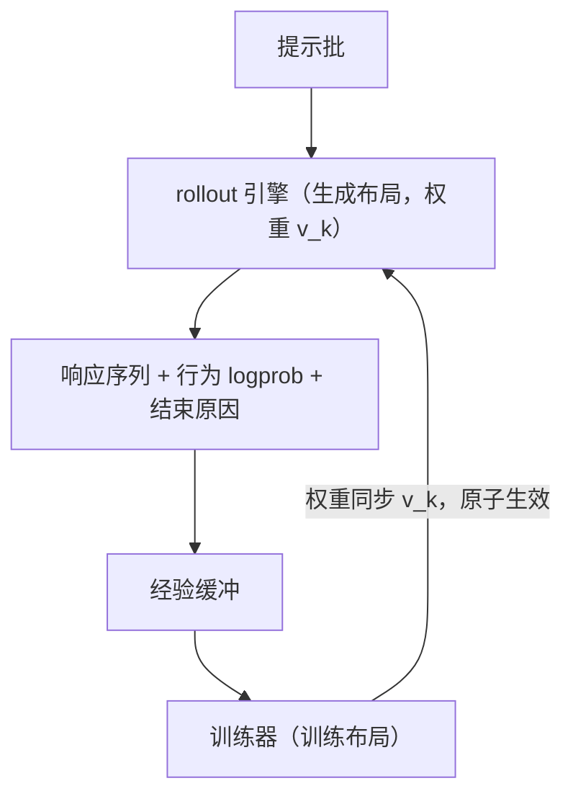
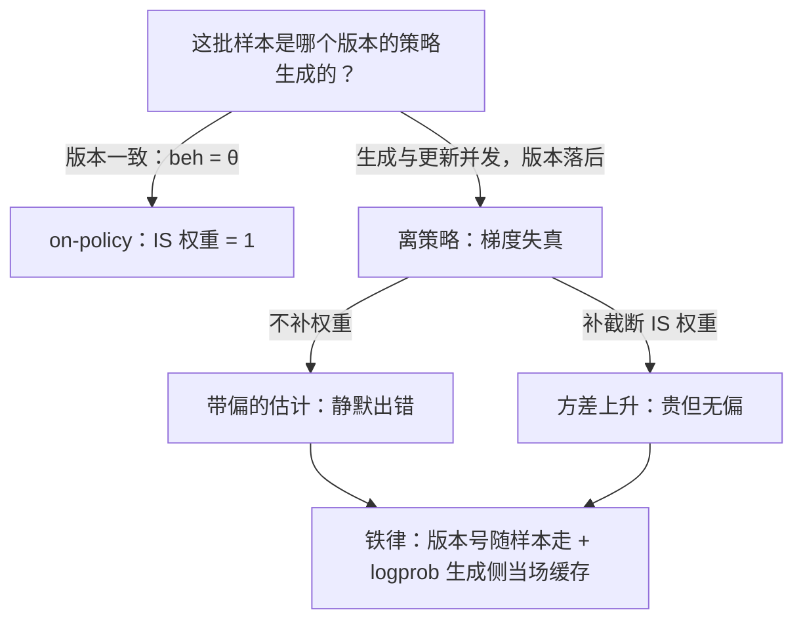

# rollout 引擎的架构

算法论文写的是一次梯度更新怎么算；训练系统回答的是这次更新每天重复几千次时，样本从哪来、由谁生成、凭什么还算 on-policy。

<footer>—— 据 Sheng 等 HybridFlow（EuroSys 2025）的抽象分层整理</footer>

[上一课](/llm/dist-map)把分布式训练收成四本账与八步决策单：状态、通信、时间、故障，同步组是合同、峰值决定生死、恢复时间是有效算力的一部分。训练侧的机器装好了，RL 训练还剩另一半：算法只规定「拿到一批样本之后怎么更新」，没有规定样本由谁生成。本课程开卷 RL 训练系统：把算法装成一台机器。第一个零件是 rollout 引擎——把提示批变成经验批的部件，本课程其余课默认已读完本课给出的接口定义。

「rollout」翻译成大白话：让模型按当前策略往下生成一整条回答的过程，像下棋时「往前推演一盘」。训练机把它当成专门部件：你给它一批提示和一版权重，它还你一批「序列 + 每个 token 生成当时的概率」，这批产出就叫经验。

## 问题

训练器自带 `generate`，为什么还要一个专门的 rollout 引擎？因为两种负载的最优布局相反。训练布局为前向反向设计：3D 并行、激活重计算、优化器状态分片；生成负载是自回归逐 token，吃 KV cache、连续批处理与大显存占用，这些是推理引擎的本行。让训练布局兼职生成，每步都要跨流水线传递缓存，或干脆不做 cache，吞吐差一个量级。于是系统分裂成两个角色，缺口随之出现：两者的边界划在哪，接口传什么，权重如何从训练侧流到生成侧而不出错。这些问题答错的代价不是慢，而是静默地不再 on-policy。

数字实例看「布局错了有多亏」：让训练布局兼职生成、不做 KV cache，每出一个 token 都要把整个前缀重新前向一遍——生成 2000 token 的序列，计算量从约 2000 次单步前向膨胀到约 $2000^2/2=200$ 万次 token 计算。慢还只是轻的，静默脱离 on-policy 才是重的。

## 方法

rollout 引擎的职责契约只有一条：输入提示批与权重版本 $v_k$，输出响应序列、逐 token 的行为 logprob $\log \pi_{\mathrm{beh}}(y_t \mid y_{\lt t})$，以及结束原因（自然结束或截断）。围绕契约有三个设计决定。第一，放置：与训练器同卡共置，还是独立一组卡分置——共置省卡，但要协调两相的显存峰值；分置吞吐高，要付权重传输与过期（staleness）的账。第二，编排：HybridFlow 用单控制器编排 RL 数据流（谁先生成、谁后打分、谁更新），多控制器执行每个模型的分布式计算；前者好改算法，后者好跑通信。第三，权重同步：全量广播、重切分重组、还是参数服务器拉取，共同要求是原子生效并带版本号。同步协议的细节与坑，[rollout 引擎与权重同步](/llm/rollout-weight-sync)已有专课，本课只钉接口。

HybridFlow 论文报告相对既有 RLHF 系统 1.53×–20.57× 的吞吐，倍数强烈依赖基线实现与放置策略；引用时必须带上实验设定，否则不可比。

## 机制

接口里最值钱的一列是行为 logprob。严格 on-policy 时 $\pi_{\mathrm{beh}}$ 与当前策略 $\pi_\theta$ 相同，重要性权重恒为 1，可以不算；可系统里「相同」是靠版本号对齐维护出来的性质，不是天然成立的事实。生成与更新一旦并发（权重同步有延迟、部分请求还挂在旧引擎上），$\pi_{\mathrm{beh}}$ 就落后于 $\pi_\theta$，梯度立刻变成离策略的：不补重要性权重是带偏的估计，补了则引入截断权重的方差（见[截断重要性采样](/llm/truncated-importance-sampling)）。所以 rollout 引擎的第一职责不是快，而是让「这批样本是哪个版本的策略生成的」永远可答。工程上由此推出三条铁律：权重同步原子、版本号随样本走、行为 logprob 在生成侧当场算好并缓存，而不是训练时重算冒充。

直觉类比：行为 logprob 像小票上的「出厂批次号」——样本在生成那一刻，每个 token 的概率是多少就被当场盖章。训练时若拿最新版策略重算概率冒充小票，等于篡改出厂信息，重要性权重的分母从此对不上，梯度悄悄带偏。

## 边界

rollout 引擎不负责打分与组批：奖励谁来算、经验怎么变成更新批次，是随后两课的事。它也不承诺收敛：引擎加速的是迭代成本，算法层的方差与偏差（[REINFORCE 与方差](/llm/reinforce-variance)、[GRPO](/llm/grpo) 的组基线选择）不因系统变快而消失。共置与分置没有免费解：显存峰值与墙钟结构随模型规模与序列长度变化，跨框架的默认值不可直接照搬。

## 小结

- rollout 引擎的契约：提示批加权重版本进，序列、行为 logprob、结束原因出；本课程后课默认此接口。
- 三个设计决定：放置（共置/分置）、编排（单控制器数据流/多控制器计算）、权重同步（原子加版本号）。
- 行为 logprob 是接口里最值钱的一列：版本对齐靠它可验证，离策略偏差靠它可修正。
- 引擎只管迭代成本；算法的方差、偏差与奖励设计不归它管。
- 出处：Sheng 等，HybridFlow，EuroSys 2025；Kwon 等，vLLM，SOSP 2023；据各开源框架实现整理。
