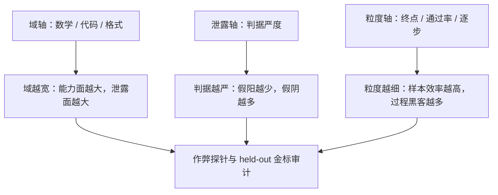
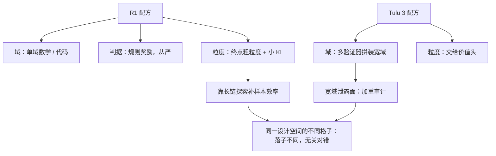

# RLVR 的设计空间

RLVR 不是单一方法，而是一组选择：验什么域、判据写多严、信号切多细——每一格既是能力边界，也是泄露面。

<footer>—— 据 Lambert 等 Tülu 3；DeepSeek-AI R1 整理</footer>

[上一课](/llm/verifier-bottleneck)把「回路上限由验证质量决定」落成假阳放大的因果链，并指出堵假阳与减假阴互相顶。本课把结论落回 [RLVR](/llm/rlvr) 的设计表。分工先说清：那课讲机制——验证器替换 RM、PPO 与价值头、$\alpha=10$ 与 $\beta$ 的相对尺度；本课讲设计权衡——可验证域怎么选、判据的漏洞怎么治理、验证粒度怎么切。

## 问题

设计空间三个轴，每个轴同时定义能力与风险。域轴：只有存在程序真值的任务能进 RLVR——数学答案、单元测试、格式约束。选域就是选能力：策略改进集中在被验证的分布上，域外不动；Tulu 3 的实测口径是目标域分升、总平均不保证升。泄露轴：判据是程序，程序有最短路径——答案正则匹配、约束满足而内容空洞、硬编码训练测例；泄露面等于判据没写明的每一个维度。粒度轴：终点 0/1、组内通过率、逐步 PRM 三档——粗粒度样本效率低且全对全错组无梯度，细粒度引入过程黑客与终点错位。

格式域的典型泄露：IFEval 式约束谓词（「恰好三段」「不得出现某词」）可以被完全满足而内容空洞。谓词只验证形式，写题时没写明「内容须切题」，策略就只优化形式。

「RLVR」（可验证奖励的强化学习）翻译成大白话：不用学出来的打分模型，改用写死的程序判对错——数学题对答案、代码跑测试、格式查正则。验证器是程序，所以「暂时分不出对错」的开放任务（这篇散文写得好不好）进不了这个圈子，这是能力边界也是安全边界。

## 方法

逐轴列权衡。域：窄域信号干净但能力窄；宽域靠多验证器拼装，每拼一个多一面泄露。各域堵法不同——代码域靠隐藏与随机化测例，数学域靠等价规范与同源脚本（两门验证器课的结论），格式域必须配内容判据或抽样复核。粒度：默认先终点后过程——终点信号便宜且无过程标签偏差；PRM 何时上，由题目难度与样本预算决定（Lightman 的口径：Best-of-$N$ 下 PRM 与 ORM 的间隙随 $N$ 加宽，难题上过程信号才显值）。判据审计：每个 $v$ 配一组作弊探针——故意构造满足判据但答案错的样本，检查 $v$ 是否给分；探针进回归测试，判据一改就重跑。

常见误区：初学者容易以为「信号越细越好」，上了 PRM 就万事大吉——实际上过程合法不蕴含终点正确：每一步看着都对、最后答案错，过程分照样给高。粗粒度的终点信号虽笨，却直接对准你真正关心的目标，所以默认先终点后过程。

## 机制

三轴互相锁。判据从严压假阳、抬假阴——即上一课的覆盖损失；域扩宽稀释单域信号——同样的 KL 预算摊到更多任务，每域推进变慢；粒度变细降低单次假阳损失，但 PRM 的过程标签偏差引入新的错位（[过程监督](/llm/process-supervision)课：过程合法不蕴含终点正确）。所以 RLVR 设计不是找全局最优，而是把不可避免的误差堆到代价最小的轴上：高价值域接受严判据的假阴，覆盖优先时接受宽域的泄露面并加重审计。R1 的路线是另一种落子：单域数学代码、规则奖励、[GRPO](/llm/grpo) 组采样、小 KL——粒度轴留粗，靠长链探索补样本效率；Tulu 3 把粒度交给价值头。两份配方落在同一设计空间的不同格子，不是谁对谁错。

数字实例看判据严松的两难：判据放宽后假阳率从 1% 升到 10%，一批 1000 个响应里就有 100 个「错题领奖」；收紧到假阳 0.1%，又可能错杀 5% 的正确答案（假阴），可学的信号变稀。没有两全，只有把误差堆到代价最小的那根轴上。

## 边界

本课不重写 RLVR 的机制与超参；奖励模型域的过优化见 [RM 过优化](/llm/rm-overoptimization)与[奖励黑客](/llm/reward-hacking-llm)课。域轴向外的扩展有硬限制：没有程序真值的开放任务进不了 RLVR——偏好与开放式能力的判分谁来当，是下一单元循环依赖的入口。域内的题目从哪来、难度怎么排，收在本单元末课合成课程与自出题。

## 小结

- 设计空间三轴：域、泄露、粒度；每轴既是能力边界又是风险面。
- 选域即选能力：改进集中在被验证分布上，总平均不保证升。
- 判据审计配作弊探针并进回归测试；各域堵法不同：隐藏测例、同源脚本、内容复核。
- 三轴互相锁：设计是把误差堆到代价最小的一轴，不是找全局最优。
- 出处：Lambert 等 Tülu 3（arXiv:2411.15124）；DeepSeek-AI R1；Lightman 等；Zhou 等 IFEval。
