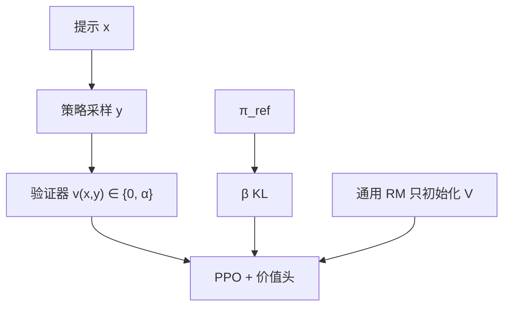

# RLVR

    
把奖励模型换成验证函数：只有生成被判定为可核实时才给常数奖励，否则为零；目标仍是带 KL 的强化学习，只是标量来自程序而不是神经网络。

    <footer>—— Lambert 等，Tülu 3: Pushing Frontiers in Open Language Model Post-Training，arXiv:2411.15124</footer>

[Tulu 3](/llm/tulu) 专文写整条开放后训练配方。**RLVR**（Reinforcement Learning with Verifiable Rewards）是其中第四段被单独命名的方法：在数学与可检查指令上，用确定性验证器给出稀疏标量，再用 [PPO](/llm/schulman-ppo) 优化。它比 R1 早公开成「配方级」术语，也不绑定 [GRPO](/llm/grpo)。本篇写验证器奖励本身、与结果监督 RL 的异同，以及 Tulu 3 里已经测到的过优化。

## 问题

RLHF 的 RM 在开放写作上有用，对 GSM8K / MATH 的对错分辨很弱：文风像教师也能拿高分，算错仍过。过程标注与 PRM 又贵。若任务存在**程序真值**——最终数字、代码测试、[IFEval](/llm/ifeval) 式约束——奖励不必学，可以算。需要一种把「可验证技能」从偏好阶段拆出来的后训练，使数学与格式约束进入梯度，同时不要求实验室再训与策略同规模的 RM。

命名上的混乱来自时间线。Lambert 等人在 2024 年 11 月把 RLVR 写成 Tulu 3 的最后一段；2025 年 R1 用规则奖励 + GRPO 做大规模推理，社区常把两者口语化成同一件事。精确说法：RLVR 是**奖励来源**（验证器 vs RM）；GRPO 是**优势估计**。Tulu 3 的 RLVR 实现是 PPO + 价值头，价值从通用 RM 初始化。它也不是新的学习理论：作者自己把它写成对 STaR / ReST-EM 与「执行反馈 RL」的简化——不做逐步搜索，只把匹配或约束谓词当成二元信号。新意在开放配方里把这一段接在 SFT 与 DPO 之后，并配上可下载的验证器与去污染评测。

### 验证器覆盖什么

Tulu 3 公开三类提示与验证：GSM8K、MATH、以及可检查约束（从 IFEval 的 25 类约束合成）。奖励在成功时为常数 $\alpha$（实验取 **10**），否则 0，再减 $\beta\,\mathrm{KL}(\pi_\theta\|\pi_{\mathrm{ref}})$。他们**没有**把代码执行反馈写进主 RLVR 段，尽管讨论里指向 Gehring 等人的执行 RL。更复杂的形式化证明器、含糊的开放写作，没有 $v(x,y)$。

数据在 Hugging Face：`allenai/RLVR-GSM`、`RLVR-MATH`、`RLVR-IFeval` 与混合集。复现应对验证脚本，而不是只下载提示。

## 方法

目标（原文式 (7)）为

$$
\max_{\pi_\theta}\mathbb{E}_{y\sim\pi_\theta(\cdot\mid x)}\bigl[v(x,y)-\beta\,\mathrm{KL}[\pi_\theta(\cdot\mid x)\,\|\,\pi_{\mathrm{ref}}(\cdot\mid x)]\bigr],
$$

$v\in\{0,\alpha\}$。优化器用 PPO。超参与「对 RM 做 PPO」不同：最终 8B 取 $\beta=0.05$、$\omega=0.0$；70B 取 $\beta=0.07$、$\omega=0.07$（$\omega$ 为原文表中与 RM 设定对照的项）。价值头从通用 RM 初始化，比其它初始化在 GSM8K 上更好。从 **DPO 检查点**接 RLVR，比从较弱 SFT 接，在同一 $\beta$ 下 KL 更小。提示可多 epoch，约 10 万 / 7473 ≈ 13 epoch 量级的消融，epoch 间打乱。异步 PPO：vLLM 推理与 ZeRO-3 学习器分开，规模到 405B。

技能结果（以报告表为准）：RLVR 相对 DPO 抬 GSM8K / MATH / IFEval 等目标域；**总平均不保证升**。下游曲线在 KL 变大后会掉——即使用真值验证器，也会过优化（IFEval 上尤其明显）。把验证器分**加在 RM 分数上**的消融，不如纯验证器。最终应在开发评测上按步选检查点，而不是训到奖励平台。

### 与 R1 规则奖励同构，栈不同

两者都是结果监督：中间步骤不打分，假推理只要终点过检查器就能得正奖励。差别：Tulu 3 强调 KL 锚与价值函数，规模从 8B 到 405B 的**开放配方**；R1-Zero 去掉 SFT、用 GRPO、KL 很小并周期性换参考，追求长链涌现。RLVR 不是「小规模 R1」，R1 也不是「大规模 Tulu 3」。引用时分开：[R1 论文](/llm/deepseek-r1-paper) 的超参表与 Lambert 的 $\alpha=10$ 不能混抄。

## 机制

验证器把信用钉在可判定命题上。GSM8K 的 $v$ 是答案匹配；IFEval 的 $v$ 是约束谓词（恰好三段、禁止大写等）。策略提高的是「让验证器返回真」的生成程序，包括格式。稀疏性与 RL 相同：整段一个比特量级的信息，样本效率低于逐步 PRM，但零标注成本。

保留 KL 是因为 Tulu 的产品目标是**多技能助手**：数学 RL 不得把聊天与安全轴撕掉。$\beta$ 过小，目标域分还在涨，平均分已掉——过优化的对象可以是「验证器可黑客的格式」，而不必是学坏的 RM。这解释了为何真值奖励仍要早停。基础设施上他们把推理放到独立 GPU 的 vLLM，学习器走 ZeRO-3，才能把带价值头的 PPO 拉到 405B；这与后来开源推理社区默认的「无 critic、组采样」不是同一套机器账。读 RLVR 的 405B 数字，要连这三项模型（策略、参考、价值）一起算显存，不能只按 GRPO 的两份对数概率去外推墙钟。价值头从通用 RM 初始化有效，说明即使标量来自验证器，advantage 的逐步结构仍受益于偏好模型里已经学到的「什么样的回复完整」。

$\alpha=10$ 只来自试点，作者未再扫。换 0/1 或 $\pm 1$（DAPO）会改与 KL 的相对尺度，必须重调 $\beta$。不要把 10 当成验证器 RL 的物理常数。

## 边界与工程取舍

RLVR 不覆盖开放写作；那是 Tulu 的 DPO 段。验证器写错（解析失败、约束实现与 IFEval 不一致）会系统性强化错误程序。MATH 的等价判断比整数 GSM8K 脆，假阴性把对的当 0。405B 实验证明配方可放大，不证明每个实验室都该上价值头——后续开源推理栈更多用 GRPO 类无 critic。

社区把任何规则奖励都叫 RLVR，会抹掉 Tulu 的评测协议（开发/留出、去污染）。写「我们做了 RLVR」应注明验证器定义、$\alpha$、算法（PPO 还是 GRPO）与是否保留 RM。

STaR / ReST-EM 也用对错过滤再监督学习。RLVR 的差分是在线策略梯度而不是离线模仿被滤后的正例。二者可叠，但论文把它写成 PPO 段。

### 何时不必单开 RLVR 段

没有可靠 $v$，不要用随机启发式冒充验证器。已经在用 R1 式大规模 GRPO，再套 Tulu 的 $\alpha=10$ PPO 是另一套超参。只要格式约束、数据少，SFT 加拒绝采样可能够。要逐步监督，看 [Lightman](/llm/verify-step)，不是把 PRM 改名为 RLVR。

## 小结

- RLVR 用程序验证器替换奖励模型，成功给常数 $\alpha$、否则 0，再 KL 约束下做 RL。
- Tulu 3 用 PPO、价值头从通用 RM 初始化，主攻 GSM8K / MATH / IFEval；从 DPO 检查点接更稳。
- 目标域会升，总平均与 OOD 不保证；真值奖励仍会过优化，需选检查点。
- 奖励来源 ≠ 优势估计：RLVR 可配 PPO 或 GRPO；R1 是后者加规则奖励。
- 出处：Lambert 等，*Tülu 3*，arXiv:2411.15124；代码 `allenai/open-instruct`。
