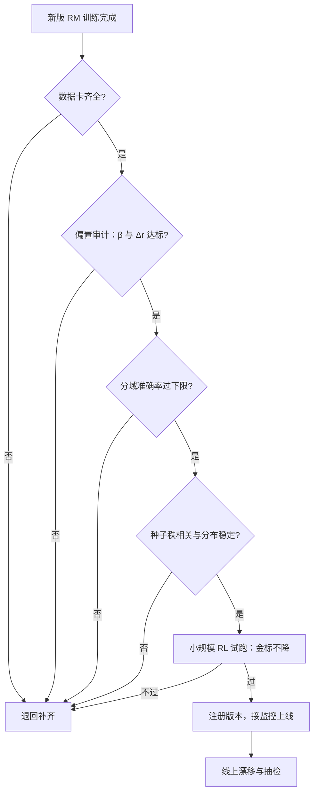

# RM 上线前的验收清单

验收清单是把前面十四课的失效模式翻译成数字门：报告说明你想了什么，门说明你必须做到什么。

<footer>—— 验收框架据 Llama 2 的消融与安全流程、InstructGPT 的迭代采集协议整理</footer>

[上一课](/llm/rm-benchmarks)排好评测的三层漏斗；本课把漏斗变成门：一份新版 RM 从训练完成到接入 RL 之间必须通过的清单。工程上 RM 的失效极少是「全面变差」，几乎总是单点塌陷——某安全子域掉回随机、长度系数悄悄回正、重训后分数尺度漂了一倍。清单的价值在把「没人想到要看」变成「门不过就别上线」，把每一课的病对应成一个可执行的检查项。

## 问题

没有门的组织靠评审会放行：报告里放全局准确率与一张雷达图，评审依赖发言人的口径。三种典型事故都从这里过：其一，分域塌陷被均值吃掉——安全子域 0.55 藏在全局 0.74 里；其二，版本间不可比——重训后分数整体平移，与旧版数据混训的下游全部静默失配（[方差课](/llm/rm-variance-policy)的归一化把漂移藏得更深）；其三，蒸馏版在冷门域崩——主流域正常，长尾域上学生没学到教师的判断（[级联课](/llm/rm-distill-cascade)的已知边界）。清单因此不是流程装饰，是把已知失效模式各设一道数字门的工程纪律。

### 清单的五层

数据卡层：来源四类、配比矩阵、分域一致率 $\kappa$、仲裁归因比例、强度档协议——[数据单元](/llm/rm-data-sources)的全部口径，缺项即退回。偏置审计层：长度系数 $\beta$ 与反事实改写的 $\Delta r$ 分布（[长度课](/llm/rm-length-bias)、[风格课](/llm/rm-style-bias)的口径），按域报告，设上限。性能门层：分域持有准确率下限（不是全局均值），公共基准子集（[基准课](/llm/rm-benchmarks)的漏斗顶端）。稳定性层：三个种子的重训，分数的秩相关（Spearman）下限与分数分布的 KS 检验；种子间排序不稳的 RM 说明训练本身欠收敛。端到端层：固定预算的小规模 RL 试跑，金标不掉、平均长度与格式统计不漂（[公平比较课](/llm/rm-ensemble-fair-baseline)的协议，只有一项也要跑）。

## 方法

门要配三件套：数字、口径、豁免流程。数字门如「安全子域准确率 $\ge 0.65$、长度系数 $|\beta| \le \epsilon$」——阈值从上一版的实测分布定，不拍脑袋：取上版 P25 略宽作为新版的下限，防止门变成随机数生成器。口径门是引用前课的测量协议原文（改写器版本、持有集版本、评测提示列表），防止「同名不同测」。豁免流程承认清单会误伤：某项不过但业务必须上（如安全修复急发），豁免要记录风险、设回看日期，豁免不是绕过，是带息借款。门与监控的交接在最后：上线时把偏置审计的复测脚本接进线上定时任务（[OOD 课](/llm/rm-ood-behavior)的三代理），门内门外同一把尺。

## 机制

为什么是门而不是报告：报告是单向的，门是双向的——每次退回都制造一次「为什么不过」的归因，清单因此成为组织的学习机制：反复出现的失效模式，下一版就多一项。这与[人工评测 vs 自动评测](/llm/human-vs-auto-eval)的分工一致：自动检查覆盖已知维度（便宜、可重复），评审会只裁决清单外的新形态。端到端门最贵，也是唯一能抓「判别好、引导坏」的，哪怕缩到单域单任务也要保留——跳过它等于只验了 RM 的静态面。

清单自身的回归：每半年把已放行版本重新过一遍现行门，统计误杀率（好 RM 被拦）与漏放率（坏 RM 上线）。两个数都高的门说明阈值或口径已过时，修订清单优先于修订模型。

## 边界

清单防的是已知失效，防不了新捷径：偏置审计的特征表是枚举的，表外维度（新的格式流行、新的谄媚句式）要靠[红队评测](/llm/red-team-eval)与线上人评抽检补位。门还有组织成本：过严的门让版本冻结、修复挤在豁免通道里，反而降低整体质量——门密度要与迭代节奏联动，急修走窄门、大版本走全门。最后，清单是课程的汇点不是终点：它假设失效模式会被持续归类，而归类本身依赖前面每一课的测量口径还在被维护——口径失修，清单就退化成一排没有意义的红灯。

## 小结

- 清单五层：数据卡、偏置审计、分域性能门、稳定性重训、端到端 RL 试跑。
- 门配三件套：从上版分布定的数字阈值、引用原文的口径、带回看日期的豁免流程。
- 端到端门最贵也最不可省：只有它能抓「判别好、引导坏」。
- 退回归因是清单的学习机制；表外捷径靠红队与线上监控补位。
- 出处：据 Touvron 等 Llama 2、Ouyang 等 InstructGPT 的流程口径整理。
