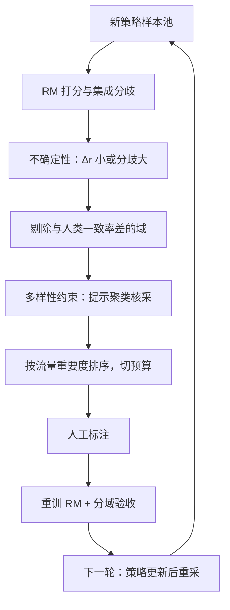
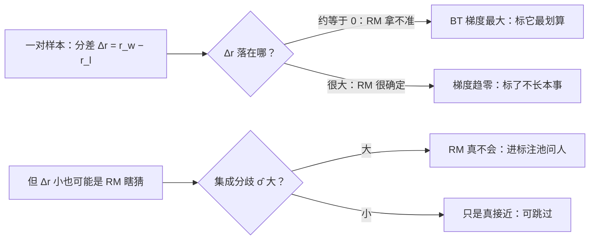

# 主动采集下一批偏好

标注预算花在哪一对，是奖励工程里杠杆最大的单一决策：RM 已经分得对的对，再标一万次也是零信息。

<footer>—— 不确定性采样框架见 Settles 综述 2009；偏好式主动学习见 Sadigh 等 2017；迭代采集见 Stiennon 等 2020</footer>

[上一课](/llm/rm-variance-policy)把奖励的方差接进策略稳定的账；本课换到工程与评测单元，回到数据侧回答一个滚动问题：下一批标注预算花在哪。前面的课留了两条线索——[OOD 课](/llm/rm-ood-behavior)说「分歧大的样本是下一批标注的最优原料」，[一致性课](/llm/annotation-agreement)说「难分的对恰好是翻转率最高的对」；这两句话表面打架，本课把它们摆进同一个采集策略里。[拒绝采样数据循环](/llm/rft-data-loop)在主干讲过策略侧的数据循环，本课只管标注预算这一段。

## 问题

随机采集新策略样本去标注，预算的大头会浪费在两类对上：RM 已经分得很对的（梯度趋零，标了不长本事），以及人自己都分不清的（上一致性课的「真模糊」档，标了注入噪声）。采集的目标函数因此不是「多标」，而是单位标注成本换来的 RM 改进最大。InstructGPT 与 Stiennon 等 2020 的迭代流程已经隐含了这个逻辑：每轮用新策略的样本重采比较，因为旧分布上的对随着策略移动不断失效；本课把「挑哪些」从隐式变成显式算法。

「主动采集」就是机器学习里的「主动学习」：不是随机发卷子，而是模型先挑出自己最拿不准的题去问老师。直觉是——会做的题刷一万遍分数也不涨，涨分的永远藏在不会做的那批题里，标注预算就该花在那里。

### 选对的三类信号

不确定性信号：RM 对某对越拿不准，标它越可能改边界。两个口径——分数贴近判别边界（$|r_w-r_l|$ 小，BT 损失的梯度 $\sigma(-\Delta)$ 在 $\Delta=0$ 处最大），以及集成分歧 $\hat\sigma$ 大（[RM 集成](/llm/rm-ensembles)的 epistemic 信号，上一课刚讲过它在支撑外的抬升）。覆盖信号：只挑不确定的会聚成一堆同质怪样本，要对提示嵌入做多样性约束（聚类的核采样思路）。价值信号：不确定 × 流量重要度——线上高频提示域的不确定对，优先级高于猎奇提示。

## 方法

一轮采集的流水线：新策略 rollout 出候选池；当前 RM（最好带集成）打分；按 $|\Delta r|$ 与 $\hat\sigma$ 排出不确定带；先剔除高危——上一致性课分域一致率低的域里，「不确定」大概率是「人类也不确定」，标了白标，这类对转仲裁或丢弃而不是进池；再过多样性约束防止样本塌缩到少数提示；按流量分布加权后切预算送标；标完重训、分域验收，进下一轮。节奏对齐策略迭代：策略每前进一段，旧比较对就贬值一截，采集是滚动预算。

## 机制

不确定性采样为什么有效：BT 损失对单对的梯度模是 $\sigma(-(r_w-r_l))$，在 $\Delta=0$ 处最大、在两端指数衰减——分得对的对几乎不产生梯度，挑 $\Delta\approx 0$ 的对等于把预算花在梯度最大的地方。集成分歧补的是另一半：$|\Delta r|$ 小可能是「真接近」也可能是「RM 瞎猜」，分歧大标记后者，而后者才需要人。这与主动学习的一般原理一致（Settles 2009）：查询分类器最不确信的样本，期望的假设空间收缩最大。两句话打架的化解也在这里：OOD 课说的「分歧大要标」针对**人能判而 RM 不能**的区域；一致性课警告的是**人也不能判**的区域——所以采集流水线必须在不确定性信号后接人类一致率过滤器，顺序不能反。

数字实例看梯度的悬殊：BT 损失的梯度是 $\sigma(-\Delta)$。取 $\Delta=0$（RM 五五开），梯度 0.5，最大；取 $\Delta=4$（比较确定），约 0.018；取 $\Delta=8$，约 0.0003——差出三个数量级。同一份预算，标在 $\Delta\approx 0$ 的对上，买到的是近千倍的训练信号。

自选偏差是主动采集的固有税：按当前 RM 的不确定性挑对，训练分布逐步偏向 RM 的失败区域，全局准确率会因此「显得」下降。对账口径：验收永远在固定的随机抽样持有集上做，主动采集的对只进训练，不进验证。

## 边界

主动采集不是越多轮越好：每轮采集都在旧 RM 的定义域附近找事，长循环后数据集体积越来越偏向边界带，支撑中心的「常识对」占比下降，RM 的基础判断反而可能松动——轮间要掺入按分布随机抽的对做打底。不确定性信号还有被利用的一面：策略若学会待在 RM 犹豫的区域，会同时压低采集效率与优化信号，这与 [OOD 课](/llm/rm-ood-behavior)「监测量变成目标就失效」是同一条递归。最后，预算分配离不开成本口径：不同域的标注单价不同（安全域要资深标注员），单位「改进/元」的排序才是真实的优先级，纯按信息量排的采集计划在预算会上活不过第二轮。

常见误区：初学者容易以为「不确定的样本多多益善」，一轮全标边界带——结果训练分布整体偏向 RM 的失败区，支撑中心的「常识对」越来越少，RM 的基础判断反而松动。正确做法是每轮掺入按分布随机抽的对做打底，别让边界带吃掉整个菜单。

## 小结

- 采集目标函数是单位标注成本的 RM 改进：随机采集的大头花在零信息对上。
- 选对信号两层：$|\Delta r|$ 小与 $\hat\sigma$ 大标出「RM 不确定」，人类一致率过滤掉「人也不确定」。
- 多样性约束与流量加权防样本塌缩；预算按「改进/元」排序。
- 验收只在固定随机持有集上做，自选偏差不进验证口径。
- 出处：Settles 2009 综述；Sadigh 等 2017；Stiennon 等 2020 的迭代采集流程。
