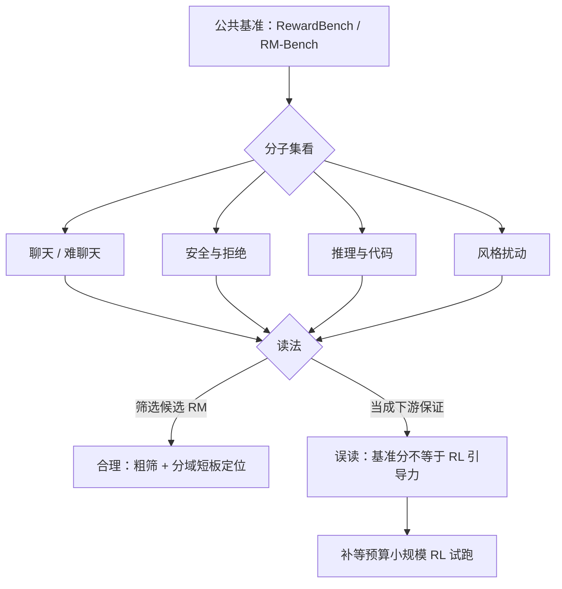
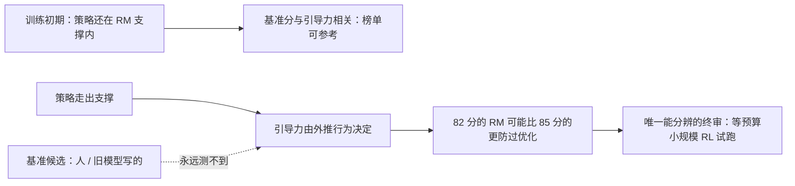

# RM 评测基准与排行榜

基准测的是分布内分辨力，RL 用的是分布外引导力；两个榜单名都叫 RM 评测，量的是不同的东西。

<footer>—— RewardBench 见 Lambert 等 2024；风格扰动口径见 RM-Bench（Liu 等 2024）与主干课风格控制</footer>

[上一课](/llm/rm-ensemble-fair-baseline)立了内部比较的配平规矩；本课看公共基准：当你没有预算自建全套评测，RewardBench 一类基准给什么、不给什么，以及排行榜的名次怎么误读。基准是别人替你冻结的评测轴——用它便宜，代价是把「什么算好 RM」的定义权交给了它的子集构成。

## 问题

训练对附近的持有准确率会表扬捷径：持有对与训练对同分布、同样偏爱长回答，长度偏置在两边同时成立，分数照涨。公共基准的第一价值因此是**切片**：用另一批人、另一套构造逻辑出的对，把 RM 的能力切成可分别考察的面。RewardBench（Lambert 等 2024）按聊天、难聊天、安全、推理等子集报告比较准确率，比单一总分有用得多——总分掩盖「安全子集 0.52、聊天子集 0.88」的结构。第二价值是防自欺：基准由外部定期更新，团队没法对着自己冻结的老持有集过拟合十年。不这么做会错在哪：内部持有集分数年年涨，上线的新 RM 在真实策略上一蟹不如一蟹，因为内部对早已按团队自己的捷径口味养熟了。

「基准」（benchmark）就是别人出好的标准化考卷：固定的题、固定的评分口径，谁都能考。它替你省了出卷成本，代价是「什么算好 RM」的定义权交给出卷人——考卷偏重哪里，你的优化就容易被引向哪里。

### 基准测什么、怎么被污染

标准形态是给提示与两个候选，测 RM 选对率。RewardBench 的子集构成刻意混入「反捷径」的挑法：候选对里包含需要拒绝的安全场景、以及表面弱但实质好的选项。第二代的口径更进一步：RM-Bench（Liu 等 2024）把风格扰动做进构造——同一内容换排版、调难度，专测「分数是否被表面特征牵走」，等于把本课程偏置单元的反事实对变成了公共考题。污染方向也明确：这些基准是公开的，检索式选数据、或直接把基准分布的对造进训练池，都能刷分；[评测污染](/llm/eval-contamination)的清单在 LM 评测侧讲过，RM 基准同样适用。

## 方法

用法上把基准放在漏斗顶端：新 RM 先过公共基准分域看短板（安全塌陷、风格敏感一眼可见），再进内部持有集，最后一关是上一课的等预算小规模 RL 试跑看金标曲线。排行榜名次的读法同理：RewardBench 榜与 Arena 类人类偏好榜（[LMSYS Arena](/llm/lmsys-arena)、[Arena-Hard](/llm/arena-hard)）的相关性是外部效度检查，但两榜之间隔着「评 RM」与「评策略」两层测量，相关性中等是常态；用风格控制口径（[风格控制](/llm/style-control)）后相关性会变，那才是去偏后的效度。报告惯例：写基准版本与子集分数，不写裸总分；写训练数据与基准的去重声明，不做就别引榜。

## 机制

为什么基准分与下游引导力脱钩：比较准确率测的是 RM 在给定对上的判别，RL 用的是 RM 在**策略生成的**完成上的分数序，两个分布只在训练初期重合。策略走出支撑后（[OOD 课](/llm/rm-ood-behavior)），引导力由外推行为决定，而任何基准都测不到外推——基准的候选是人或既有模型写的，不是你的策略走远后写的。这就是「82 分的 RM 比 85 分的更防过优化」完全可能、且只有 RL 试跑能分辨的原因。机制上基准与内部持有集是互补而非替代：基准防团队自欺，持有集防基准失配，RL 试跑防「判别好但引导坏」，三层缺一不可。

常见误区：初学者容易把「RewardBench 高分」当「RL 里一定好用」——前者测的是对给定候选对的判别，后者用的是给策略新生成内容打分的排序，两个分布只在训练初期重合。选 RM 的最后一格永远是等预算的小规模 RL 试跑，别拿榜单一锤定音。

读 RewardBench 的一个实用细节：部分基准子集上强 RM 的分数挤在 0.9 以上，区分度枯竭；此时子集内比较与新一代基准（难度更高、扰动更狠）才 carry 信息——榜顶并列不等于并列的模型一样好。

## 边界

公共基准测不了你的域：垂直域（医疗、法务、内部工具）的判据不在通用对里，域内持有对只能自建，配比课的下限口径照搬。基准的子集构成本身是编辑决策：什么算「难聊天」、安全场景怎么采样，都带构造者偏好，换一家基准排名重排是常态，因此任何单榜名次都不构成决策依据。最后，基准分数的方差也要按评测方差课的口径报告——候选顺序、打分实现的细节都能摇动一两个点，榜上 0.5 分的差距多半是噪声。到这里评测三层（基准、持有、试跑）已齐全，下一课装进上线前的验收清单。

数字实例看榜上差距的水分：评测方差（候选顺序、打分实现的细节）就能摇动 1–2 个点，而榜上第 3 与第 5 名常只差 0.5 分——这个差距多半是噪声，换个候选顺序重测名次可能互换。读榜先问一句：「这个差距超过评测方差了吗？」

## 小结

- 基准的第一价值是外部切片：分子集报告，拒绝裸总分。
- 基准分测分布内判别，不保证分布外引导力；等预算 RL 试跑是唯一终审。
- 污染防治与去重声明是引用榜单的前提；榜顶并列处区分度已枯竭。
- 基准防团队自欺、内部持有防基准失配、RL 试跑防「判别好引导坏」。
- 出处：Lambert 等 RewardBench，2024；Liu 等 RM-Bench，2024；Zheng 等 2023 的裁判口径。
