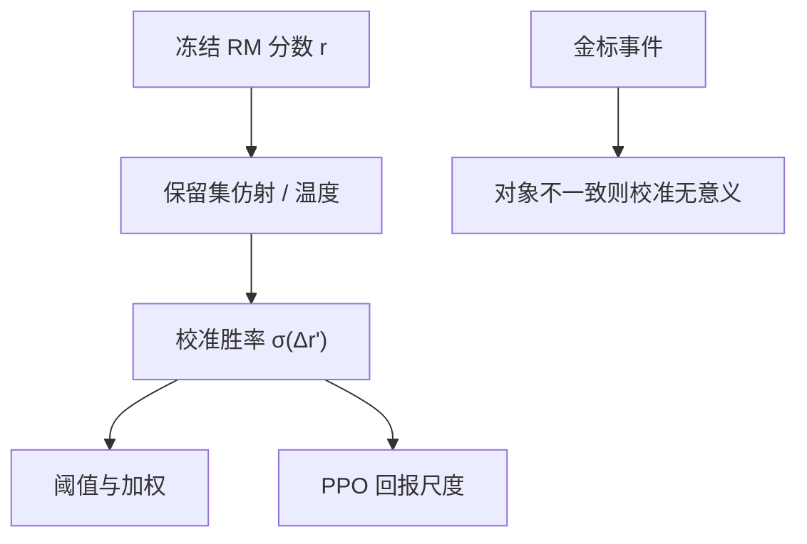

# RM 校准

奖励分数排得对，不等于 0.7 真表示七成会赢；未校准的标量一旦当概率用，阈值、加权和期望全歪。

<footer>—— 对照 Guo 等神经网络校准；奖励模型上的胜率–分数关系见 InstructGPT 与后续 RewardBench 一类协议</footer>

[上一课](/llm/rm-ensembles)用集成给出 $\bar r$ 与 $\hat\sigma$，策略可以避开成员打架的区域。缺口立刻出现：**分歧小只说明看法一致，不说明分数的数值有概率含义。** [Bradley-Terry](/llm/bradley-terry) 把 $r$ 差送进 $\sigma$，训练只要求序正确；PPO 却把 $r$ 当回报的绝对尺度。本课补校准。后课过优化默认：即使序对、数值也不等于金标。

## 问题

RM 损失推动的是 $r(y_w)-r(y_l)$ 的符号，不是 $r$ 的零点与单位。同一批比较，两份 RM 可以差一个仿射变换仍得相同交叉熵。接到 [PPO](/llm/ppo-llm) 时，仿射会被优势归一化部分吃掉，但阈值规则吃不掉：安全门「$r\gt 0$ 才更新」、多目标加权、或把 $r$ 当「人类会选的概率」，都会把未校准的零点当成决策。集成的 $\hat\sigma$ 同样未校准——成员方差大，不代表真实误差大。

评测常用成对准确率。准确率高可以与校准差同时成立：高分段全挤在一个窄区间，低分段拖一条长尾。可靠性图（把预测胜率分桶，对照经验胜率）才会暴露。

### 校准的是哪一件事件

要对齐的事件必须写明：是「标注员选 $y_a$ 而不是 $y_b$」，还是「金标任务正确」，还是「Arena 裁判偏好」。RM 拟合的是第一种；产品门槛用的往往是第二种。用比较数据上的 Platt 缩放去校准准确率，是错对象。

InstructGPT 报告过 RM 与人类一致率，没有把 $r$ 当成校准概率部署。后来把 RM 分数直接显示给用户当「质量」，已经换了语义。

## 方法

保留序的校准：在冻结的 RM 上，用一小份保留比较做温度缩放或 Platt，$r' = a\, r + b$，使

$$
\hat p(y_a\succ y_b)=\sigma(r'(y_a)-r'(y_b))
$$

匹配经验胜率。$a,b$ 只在保留集上估，不许回流训练。分桶可靠性图与 ECE 是监控，不是训练损失。对 Best-of-N，校准改变的是「第几名之间的间隔」，不一定改变 argmax；对 PPO，校准改变优势的尺度，需与 [奖励白化](/llm/reward-whitening) 一起看，不要叠两次仿射。

集成之后可以对 $\bar r$ 做一次校准，不要对 $K$ 个成员分别 Platt 再平均——后验混合与分别校准不可交换。若成员已悲观聚合，$\lambda\hat\sigma$ 再校准需要把惩罚项当作特征，而不是事后乘一个系数。

## 机制

温度 $a\lt 1$ 压分数差，等于承认模型过自信：小 $\Delta r$ 不该对应极端胜率。PPO 里这会减小优势幅度、更新更温和，表面上更稳，也可能只是把学习率乘了一个隐式因子。因此校准后必须重扫 KL 系数与 clip，不能把「更稳」写成校准的因果效应。

可靠性图在分布外会坏。策略一更新，完成离开保留集，校准曲线过期。正确做法是周期性在**当前策略样本**上重估 $a,b$，或只把校准用于离线选优，不放进在线奖励。这与 InstructGPT 迭代标注 RM 是同一精神：分数的含义跟着分布走。

不要用生成式裁判的口头「置信」当校准。那是另一套未校准的语言，见后课 LLM 裁判。

## 边界与工程取舍

[可验证奖励](/llm/verifiable-reward) 的 0/1 已经是事件本身，不需要 Platt；要校准的是「模型自报的对错概率」，不是 RM。DPO 没有显式 $r$，本课的仿射用不上，它的 $\beta$ 承担类似温度的角色，见 [DPO](/llm/dpo)。校准不阻止 Goodhart：下一课把过优化写成标量奖励的命运，而不是「没校准好」。

## 小结

- RM 训练保序，不保数值零点与单位；PPO 与阈值用的是数值。
- 在保留比较上做仿射 / 温度，使预测胜率对上经验胜率。
- 校准对象必须等于决策事件；分布一移，校准过期。
- 校准后要重扫 PPO 超参，避免把缩放当成算法改进。
- 出处：Guo 等校准；Ouyang 等 InstructGPT 的一致率；集成课的分数仍需单独校准。
