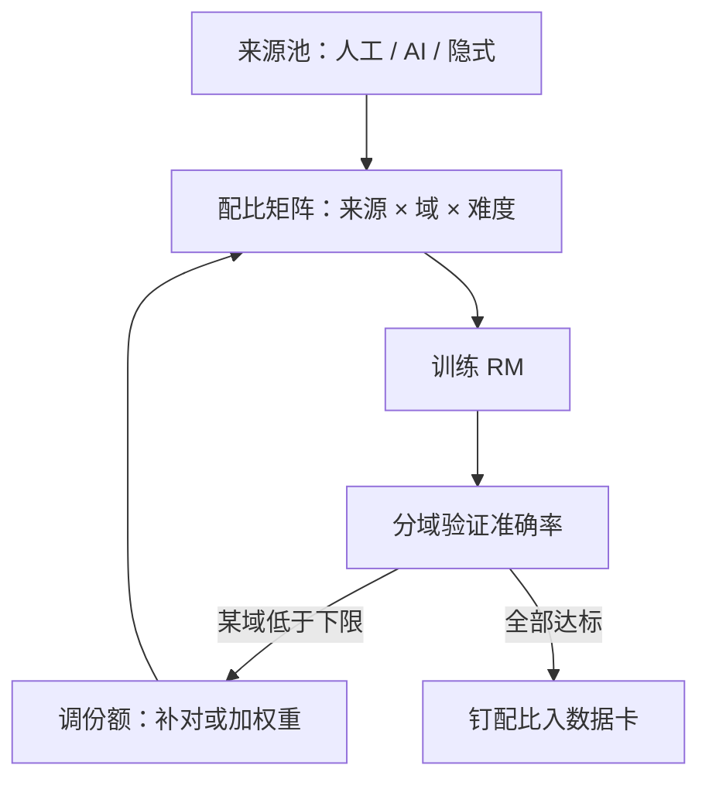

# 偏好数据的配比与域覆盖

全局准确率是一个会撒谎的平均数：把每个域各自的下限钉住，比把总分再抬高一分重要。

<footer>—— 据 Touvron 等 Llama 2 2023 的数据集构成与 InstructGPT 2022 的消融整理</footer>

[上一课](/llm/rm-data-sources)把比较对分成人工、隐式、AI 反馈与自评四类源，并要求各源成池后再混。缺口立刻出现：混的时候各占多少？本课写配比与域覆盖。预训练侧的[配比定律与领域配比](/llm/data-mixture-laws)用代理损失找配比，偏好数据没有等价的代理目标——RM 的「损失」就是下游策略的行为，这使配比更像验收问题而非拟合问题。

## 问题

配比失衡的失效不是均匀变差，而是结构性塌陷。安全比较与有用比较的判据相反：前者赢方常是拒答，后者赢方常是给全。Llama 2 干脆拆成两个 RM，因为单一标量装不下这对冲突。若一份 RM 的数据里安全对占九成，容量会被安全特征占满，有用性维度退化成噪声；反过来闲聊对淹代码对，RM 在代码域的比较准确率会跌回 0.5 附近——等于随机，而全局准确率可能仍漂漂亮亮地停在 0.7。不这么做会错在哪：上线后才发现代码域奖励接近随机，RL 在该域的梯度就是噪声放大器。

覆盖面是配比的另一半。域要按什么切？实用口径是「损失会因它而异」的粒度：事实问答、写作、代码、数学、多轮状态跟踪、安全拒答、格式遵循。切太粗，塌陷的子域藏在均值里；切太细，每个桶的样本撑不起稳定估计。经验起点是十来个域，每个域留出独立验证对。

### 配比的三个轴

来源轴：人工与 AI 反馈各占多少。人工对贵而准，AI 对便宜可扩；常见做法是以人工对定锚、AI 对补量，人工池的占比按各域一致率分级。域轴：上段十余域的份额，向真实流量分布靠拢，再对安全域加权重，因为安全塌陷的代价不对称。难度轴：容易对帮 RM 学判据，难对（分数接近、结构相似）撑开分辨边界，类似[难负例挖掘](/llm/hard-negatives)的道理；全给容易对，RM 学会的是挑软柿子。

## 方法

操作流程：先钉验证集——每个域独立的持有对，比例固定、永不进训练；再设初始配比（可从流量分布出发）；训练后看分域准确率而不是全局值；任何域低于预设下限就补对或加权，重训；达标后把配比写进数据卡。若做加权， $\mathcal{L}=\sum_d \lambda_d\,\mathbb{E}_{\text{域 }d}[\ell_{\mathrm{BT}}]$ ， $\lambda_d$ 按下限缺口调整。预训练的 [DoReMi](/llm/doremi) 与 [RegMix](/llm/regmix) 用小模型搜配比，偏好侧只能省着用：每次改动都要重训 RM，消融贵，所以改动要有假设、有记录，别做无方向网格搜索。

## 机制

配比起作用的机制是梯度竞争：BT 损失下，梯度大小正比于当前分错的程度，长期占多数的域在参数里留下更深的分界面；RM 容量不足时，稀有域的特征被挤压。所以「补数据」之前先看容量：小 RM 撑不起太多域，与其全部 0.6，不如砍掉低价值域保住关键域的 0.75。另一个机制是锚污染：AI 反馈池若在所有域同比例灌注，裁判的固定偏差就在每个域留下同向残差——上一课说噪声不独立，配比的机制面是：偏差也不独立，加大份额会线性放大它。

一个常用的自查：把全局准确率按域拆开重写为 $\sum_d w_d a_d$ 。若各域 $a_d$ 在 0.52 与 0.9 之间大幅摆动，说明均值无意义；配比的验收对象是 $\min_d a_d$，不是 $\sum_d w_d a_d$。

## 边界

配比不是一次定死的常数：策略迭代后各域的失分点会移动，配比要跟着采集计划（本课程后段的主动采集课）滚动。分域下限也不能防所有失效——两个域各自达标，但交界处（安全与写作之间的「敏感话题怎么聊」）可能仍是空洞，交界覆盖要靠专门构造的对。最后，配比消融用的是分域准确率，这只证明 RM 在该域「分得对」，不证明按它优化策略会变好；这一步的失效留给偏置单元与过优化课，本课先在数据侧把地基钉平。

## 小结

- 配比有三个轴：来源、域、难度；失衡的典型失效是某域准确率塌回随机而全局均值不变。
- 验收看分域持有准确率，验收对象是各域下限，不是加权平均。
- 机制是梯度竞争与锚污染：多数域占容量，AI 池份额放大裁判的固定偏差。
- 配比随策略迭代滚动，改动要有假设、要写进数据卡。
- 出处：Touvron 等 Llama 2，2023；Ouyang 等 InstructGPT，2022；预训练配比方法见 DoReMi、RegMix 对照。
