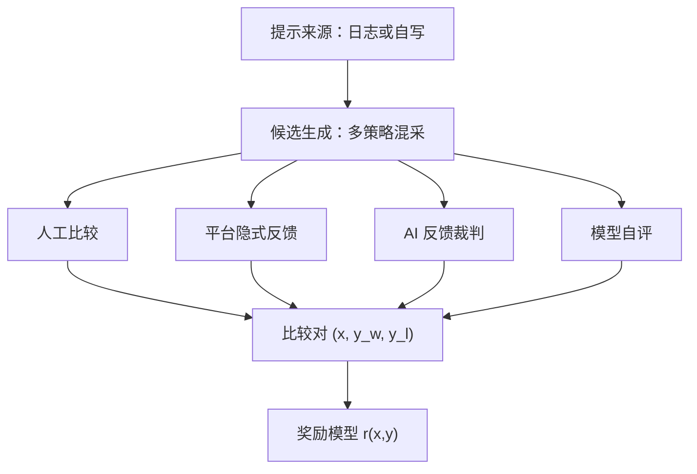

# 偏好数据的来源谱系

奖励模型是比较数据的回归器：数据从哪来，「好」就被定义成什么——先看清楚每一行的偏置，再谈训练。

<footer>—— 据 Ouyang 等 InstructGPT 2022、Bai 等 Constitutional AI 2022 的数据采集章节整理</footer>

[上一课](/llm/retrieval-poisoning-defense)把检索投毒的防御收在「可写索引即可被劫持，忠实阅读器会放大毒块」，防线落在鉴权、多源交叉与敏感人审。那是 RAG 课的末尾，也是本课程的起点：凡是「模型读什么就信什么」的地方，数据来源就是第一道工程。本课程打开奖励模型工程。[奖励模型](/llm/reward-model)已经在主干把 RM 定义成 $r(x,y)$ 的回归器，本课回答更上游的问题：比较对从哪来。来源决定噪声结构与覆盖面，先钉谱系，后课的配比、标注形态与一致性检验都默认已读完本课。

## 问题

要训 RM，先要有 $(x, y_w, y_l)$ 三元组。谁提供 $x$、谁生成 $y$、谁判 $y_w \gt y_l$，三个空各有几种填法，组合起来就是来源谱系。填错组合的代价不是效果差一点，而是 RM 学到的东西和产品要的东西完全不同：用合成裁判的判断训出来的 RM，优化它会得到「裁判喜欢的回答」，不是「用户喜欢的回答」。所以来源选择是奖励工程里第一个不可逆的决策——后面的损失函数换起来便宜，数据重采很贵。

### 四类来源的填法

人工比较：InstructGPT 让标注员对同一提示下的模型样本排序，Llama 2 采了约 141 万条成对比较。提示可来自真实使用日志或标注员自写，候选通常混采自多个策略版本，避免只含单一模型的怪癖。质量最高、最贵，指南决定一切。

平台隐式反馈：点踩、点选、停留时长，[隐式反馈](/llm/implicit-feedback-prefs)已有主干课。量大、免费，但「点踩」混着质量差与情绪差，选择偏差严重，只能做辅源或评测信号。

AI 反馈：[RLAIF](/llm/rlaif) 与 Constitutional AI 用一个强模型按成文原则替代人。便宜、可无限采、可复现，但裁判的偏差随数据进入 RM；[LLM 裁判偏差](/llm/llm-judge-bias)列过的位置、长度、自我偏好一样不少。

模型自评：[自奖励语言模型](/llm/self-rewarding-lm)让策略自己给自己当裁判，闭环最快，分布也收得最快——模型看不见的东西，循环里永远不会出现。

## 方法

工程上先钉三件事。其一，提示分布：真实日志保覆盖，但含隐私与毒性，须走同一套[数据清洗](/llm/data-quality-filter)；自写提示干净但窄。其二，候选采样：候选应来自当前策略及其近邻版本，RM 要在策略的支撑内分辨好坏，拿两个毫不相干模型的输出做比较，学到的边界用不上。其三，标注协议：成对为主干，四类来源给同一对打的标签不能直接混用——人给的「好一点」和 GPT-4 给的「好一点」不是同一个测量。各来源先各自成池、各自测一致率（后课展开），再按配比进损失。

## 机制

来源怎么写进 RM 的行为：比较对定义了损失的经验分布，RM 的容量有限，会先拟合分布里最强的可分特征。人工数据把指南内化成 RM 的价值函数；隐式反馈把平台的界面位置内化进去；AI 反馈把裁判模型的风格偏好内化进去。四类源混训时噪声不独立——同一个裁判模型给整个池子打分，它的系统性偏差在每个样本上同向，等于在损失里加了一项固定偏移，梯度下降只会拟合它。这就是为什么来源谱系要写进数据卡：RM 出问题时，第一件事是回查每一类源各贡献了什么。

Llama 2 的比较集约 141 万条，其中有用性与安全性几乎各半；把两类比较拆开采、拆开标，正是承认不同来源的「好」不可互相翻译。

## 边界

来源谱系不回答配比：各池占多少、按什么域切分，是下一课的题。也不回答标注形态：成对、列表还是点级，第三课展开。人工源不是零偏差——标注员的雇佣关系、指南措辞、报酬结构都会写进偏好；AI 源更不是，它把裁判的训练数据一起继承。最容易被略过的是隐式反馈：它看似「真实用户」，实则测的是界面反应，不是回答质量，直接喂进 RM 会把产品文案的好感误记为能力。凡是把来源混用的流水线，都要在数据卡上为每一行写清：谁生成、谁判断、判断的锚是什么。

## 小结

- 比较对来自四类源：人工比较、平台隐式反馈、AI 反馈、模型自评，噪声结构各不相同。
- 候选应采自当前策略及其近邻，RM 的分辨边界要在策略支撑内才可用。
- 各来源先各自成池、各自测一致率，再按配比混合；标签不可跨源直译。
- 来源的系统性偏差会被 RM 拟合成固定项，数据卡必须记录来源与判断锚。
- 出处：Ouyang 等 InstructGPT，2022；Touvron 等 Llama 2，2023；Bai 等 Constitutional AI，2022。
