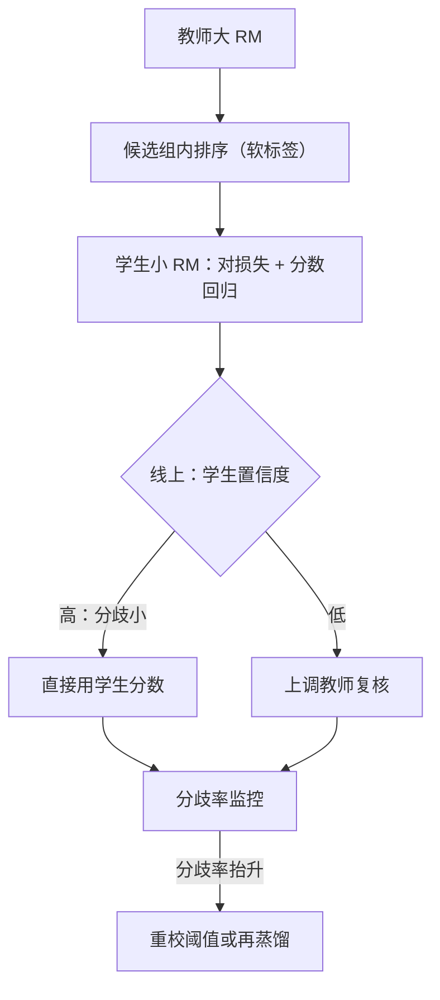
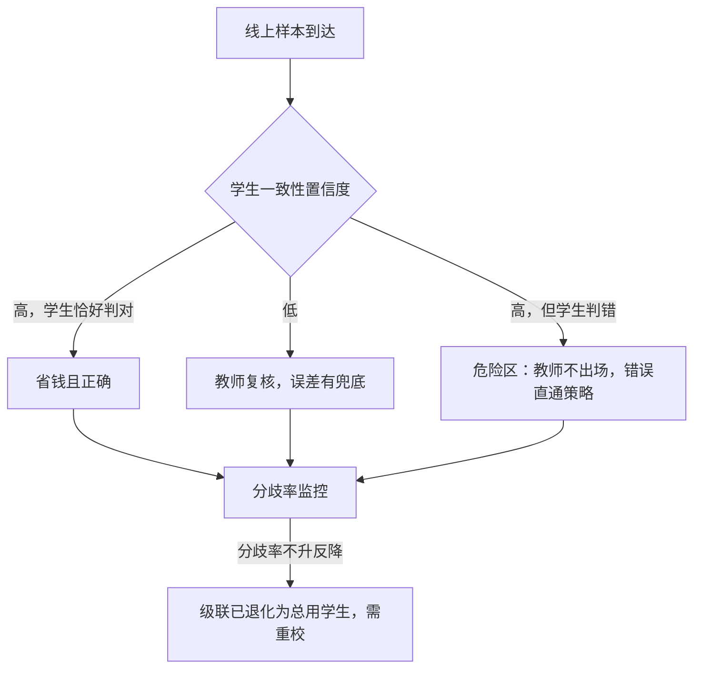

# RM 蒸馏与级联

大 RM 准但贵，小 RM 便宜但糊；蒸馏把序传下去，级联把预算花在分歧处——两者都继承教师的病，一个不少。

<footer>—— 蒸馏框架见 Hinton 等 2015；权重平均近似集成见 Ramé 等 WARM 2024</footer>

[上一课](/llm/rm-active-collection)解决了「标什么」；本课解决「打分贵」：RL 每条 rollout、BoN 每个候选、采集预筛，都要过 RM 前向。教师级 70B RM 固然准，打一亿条分数的账单会让后训练预算失衡。[模型路由与级联](/llm/model-cascade-routing)在推理侧处理过同一个经济学问题；本课是 RM 侧的对应物：分数怎么蒸馏进小模型，级联阈值怎么定，以及蒸馏会放大哪些前课的病。

## 问题

直接把小 RM 在比较数据上重训一遍，不是蒸馏，是训练——它会走出自己的捷径，与教师的判断系统性偏离。蒸馏的承诺是「小模型以教师的行为为界」，代价是：教师的一切偏置（长度系数、风格指纹、[OOD 课](/llm/rm-ood-behavior)的外推曲面）都会被学生原样继承，而且学生容量更小，只能抓教师行为里更低阶的特征，糊掉的那部分恰是精细分辨力。不这么做会错在哪：拿学生分数直接替代教师跑 RL，前期看着正常，策略在分歧样本上悄悄走向教师不认可的方向——等人工抽检发现，分歧已攒了几十万条。

术语翻译：蒸馏就是「不让学生自己学判断，只让它模仿教师的判断结果」。区别在于学生不再面对原始标注，而是面对教师的输出——教师的每个系统性习惯（偏爱长答案、某种句式）都会作为「标准答案」被学生照抄，且学生容量更小，抄下来的还是简化版。

### 蒸馏什么：序优先于分

教师的绝对分数受随机性影响大，可蒸馏的稳定结构是序：同提示候选组内教师的排序。学生损失两条腿：对损失（学生在教师认定的胜方上分高，BT 形式）加分回归（MSE 对齐 $\Delta r$，权重低，只做尺度锚）。这与 LM 蒸馏里「[对数概率蒸馏](/llm/logit-distill)传分布、序列级传行为」的分工同构：分数差对应 logit 差，序对应结构。Hinton 等 2015 的温度思想照样适用：分数差除以温度过 softmax，温度高时次序被软化传出，比硬标签传得多。

## 方法

级联的经济学：设学生成本是教师的 $\alpha$ 倍，置信度低的 $\beta$ 比例上调教师，期望成本 $\approx \alpha+(1-\alpha)\beta$ 。置信度用哪一个是关键决策：$|r_s|$ 的绝对值不靠谱——学生对自己的捷径输出往往自信（风格分又高又稳）；该用一致性口径：单模型用 dropout 多次前向的方差，多教师用[集成](/llm/rm-ensembles)分歧，小模型多头共享底座是便宜的变体。Ramé 等 2024 的 WARM 是第三条路：多个 RM 的权重算术平均成「一体集成」，推理成本与单模型相同，近似均值集成的稳健性——省的是上线后的每一张卡。阈值定法：在持有集上画「教师-学生分歧率对阈值」的曲线，按目标分歧率反解阈值；策略每次大更新后分歧分布会移动，阈值要重校。

代入数字体会这条成本公式：学生成本是教师的 $\alpha=0.05$ 倍，10% 的低置信样本上调教师（$\beta=0.1$），期望成本 $\approx 0.05+0.95\times0.1=0.145$，即约 14.5%。注意 $\beta$ 翻倍只多花约 9.5 个百分点，所以「宁可疑一点就上调」在成本上通常是可承受的。

## 机制

级联为什么能保准：教师只在分歧处出场，最终误差由学生单独判对的比例与教师复核准确率卷出，只要置信度与真实分歧正相关，误差被压在直接用学生的版本之下。机制上要警惕的是置信度与错误的**相关性**而非独立：上一课说过学生对着自己的失败区可能自信，此时级联退化为「总用学生」，监控里的分歧率是唯一能暴露退化的指标——所以分歧率不是运维图表，是级联的正确性前提。蒸馏的机制代价：温度软化传的是教师**训练分布内**的判断，分布外学生更容易崩（容量小、外推更线性），RL 走远后学生分数先失去语义——[方差课](/llm/rm-variance-policy)的截断与归一化在学生侧要更早接上。

常见误区：以为学生的分数继承了教师的「含义」。蒸馏目标里只有教师的行为，没有教师的校准——学生的 0.8 分和教师的 0.8 分不是同一个测量。拿学生分数当优势或阈值之前，必须先在自己的数据上重新校准一遍。

成本账：学生 3B 对教师 70B，单条打分成本约 4%；90% 流量学生直判、10% 上调教师，总成本约 13.6%——级联省的不是精度，是「为简单样本付大模型的钱」。

## 边界

蒸馏不能清洗偏差，只能压缩它：教师先去掉长度偏置才值得蒸馏，否则学生把「爱长」学成更粗糙的版本，验收面对的是两层混淆的叠加。级联的边界在反馈回路里：RL 中策略分布持续移动，分歧区跟着移动，阈值要滚动重校；静态级联只在一次性打分（离线生产、BoN 评测）里完全安全。最后，蒸馏目标里没有「教师的校准」，只有它的行为——把学生分数当概率语义用（当优势、当阈值、当置信度）之前，先按 [RM 校准](/llm/rm-calibration)的口径在自己的数据上重校一遍。

## 小结

- 蒸馏传序优先于传分：对损失为主、分数回归做尺度锚、温度软化多传结构。
- 级联阈值按师生分歧率反解，置信度用一致性口径，不用绝对分数。
- WARM 权重平均以单模型成本近似集成稳健性，是级联外的第三条路。
- 学生继承教师全部偏置并额外丢分辨力：先去偏再蒸馏，分歧率监控是正确性前提。
- 出处：Hinton 等 2015；Ramé 等 WARM 2024；成本口径据级联推理通行算法整理。
