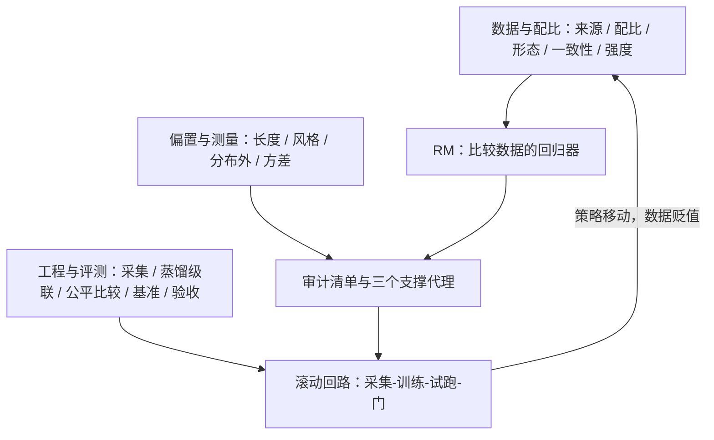

# RM 工程收束

整门课是一句主干课结论的展开：奖励模型是比较数据的回归器——数据的信噪比与覆盖是它的天花板，策略的优化是它的放大器。

<footer>—— 据 Ouyang 等 InstructGPT 2022、Touvron 等 Llama 2 2023、Gao 等 2022 的工程口径整理</footer>

[上一课](/llm/rm-acceptance-checklist)把十四项失效模式钉成一排数字门，门关上，工程闭环成形。本课程从 [奖励模型](/llm/reward-model) 被当成真值的那个标量开卷，经数据、偏置、工程三单元，至此收束。收束课做该做的事：把三个单元放回同一张账，写明每课回答的问题、留下的手段，以及它们共享的那条主线——**RM 的每个性质都是数据性质的影子，策略会把影子放大成制度**。后课默认已读完本课程。

## 问题

把十五课压成一个判断：RM 工程是在「比较数据定义好」的前提下管三件事——数据的信噪比与覆盖、测量的偏置清单、优化回路里对放大器的约束。缺任何一件的失效形态都见过：数据不管（不标一致性、不记来源），RM 学到的是标注流程的副产品；测量不管（不算长度系数、不做反事实改写），捷径在验证集的掌声里长大；回路不管（不白化、不监测分歧、不跑金标试跑），PPO 把每一处小病放大成行为。三个单元就是这三件事的顺序，也是新 RM 项目的开工顺序。

## 方法

三单元各留下一件可持续的东西。数据与配比单元留下**口径**：来源四类进数据卡、配比按分域下限验收、形态以成对为主干、一致率给准确率封顶、强度档当免费的噪声探测器。偏置与测量单元留下**三口径模板**——数据相关、反事实改写、行为漂移，长度与风格两课示范了怎么套到任何新特征上；再加两个仪表：OOD 三代理与奖励方差三层稳定化。工程与评测单元留下**回路**：主动采集决定下一批预算花在哪，蒸馏与级联决定打分的钱怎么省，公平比较决定主张怎么证，基准-持有-试跑三层决定信什么，验收门决定放不放。每件都能独立运行，合起来是自我修正的系统：策略移动 → 监测发现失配 → 采集补对 → 重训 → 门。

## 机制

贯穿全课的机制只有一条：BT 损失忠实拟合数据的可分结构，而「可分」优先选最便宜的特征——长度、格式、语气；持有集与训练集同分布，分数于是表扬捷径；RL 是以分数为目标的最大化器，任何系统偏差都被单调放大（[RM 过优化与 Goodhart](/llm/rm-overoptimization) 的曲线是它的宏观投影）。课程里所有「根本解」都作用在这条链的同一环上：改数据的经验分布，让便宜特征失去预测价值——反事实对、强度降权、主动采集、配比补域，全是这一招的不同入口；而损失端惩罚、评测端控制、入口截断都是局部止血，各有副作用，只能当第二道防线。理解了这条链，就理解了为什么课程把数据单元放在最前：源头上的每一分功夫，都比下游多一分的杠杆。

留给新项目的自查顺序：先问数据从哪来、谁判的（来源谱系），再问域怎么切、下限定多少（配比与验收），最后才问损失与模型多大——顺序反了的项目，通常把该花在第一问的预算花在了第三问。

## 边界

收束即边界。本课程的全部方法都以「比较数据可采集、标注员可训练、指南可成文」为前提；监督本身成为瓶颈的场景——专家稀缺、判断超出人类、偏好不可言说——已经站在 [RLAIF](/llm/rlaif)、[可扩展监督](/llm/scalable-oversight)与生成式 RM（[生成式奖励模型](/llm/generative-rm)）的地界，那是另一门课的输入。可验证域是另一个出口：验证器不需要一致性检验，也就不需要本课程大半的仪表——工程量省下来，换成了「验证器覆盖不到什么」的新问题（[RLVR 的设计空间](/llm/rlvr-design-space)）。最后，RM 工程的输出从不只是分数：它把一个组织的价值观写成数据卡、指南与门，这三样东西比任何单个模型活得都久。本课程到此收束。

## 小结

- 全课主线：RM 是比较数据的回归器，数据定天花板，策略做放大器；三个单元分别管数据、测量、回路。
- 根本解只有一个入口：改数据的经验分布，让长度、格式等便宜特征失去预测价值；惩罚与截断是第二道防线。
- 回路五件套：采集、训练、三口径审计、三层评测、验收门，靠监测触发滚动。
- 前提即边界：监督可采集、可成文才适用；可验证域与监督瓶颈是两处出口。
- 出处：Ouyang 等 InstructGPT，2022；Touvron 等 Llama 2，2023；Gao、Schulman、Hilton，2022；Coste 等 2023。
