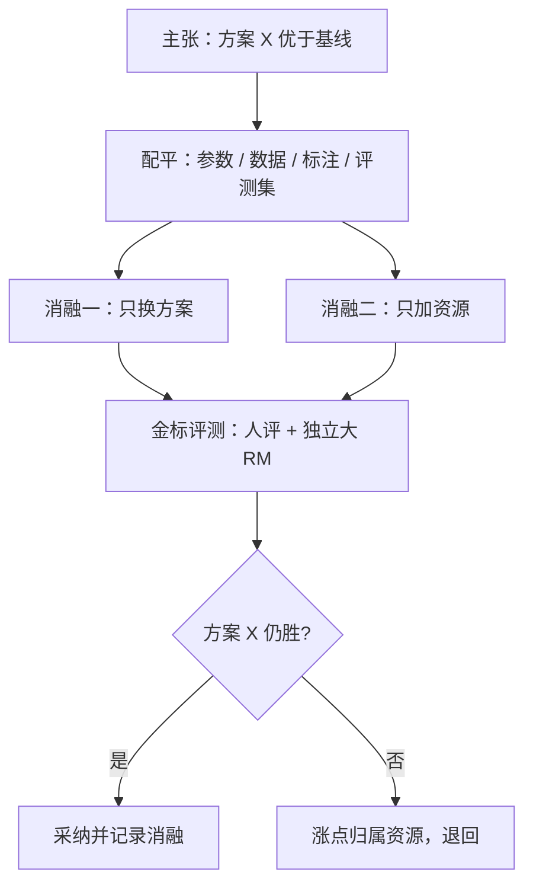

# 集成基线的公平比较

「集成更好」在没配平参数与数据之前是一句空话：涨的可能是那一倍参数，不是集成这件事。

<footer>—— 集成均值是否稳定优于最佳成员见 Eisenstein 等 Helping or Herding 2023；过优化对照协议见 Gao 等 2022</footer>

[上一课](/llm/rm-distill-cascade)把大 RM 的算力账算清；本课处理证明题：当你主张「集成（或任何新 RM 方案）更好」，比较本身必须成立。[RM 集成与不确定性](/llm/rm-ensembles)讲过集成的定义与 $\hat\sigma$ 的用途；Eisenstein 等 2023 的批评要在这里展开成方法：集成的均值并不稳定优于最佳单成员，很多「涨点」换个基线就消失。本课写公平比较的配平清单——同样适用于蒸馏、新损失、新配方的一切「我的 RM 更好」主张。

## 问题

RM 比较的自欺有固定套路：拿 $n$ 模型集成对比 1 个单模型，涨点来自 $n$ 倍参数；拿双倍数据训的新方案对比旧配方，涨点来自数据不是方案；拿训练集附近的持有对算准确率，涨点是捷径的一致化。每一种都通过了「有数字」的检验，没有一种回答了「这个方案本身的贡献」。Eisenstein 等 2023 的多组实验说明：集成均值在分布内的分辨力常不高于把同样预算给最佳单成员，可靠收益在不确定性信号与分布外稳健，不在点估计涨分。不这么做会错在哪：为集成维护 $n$ 份训练与推理，上线后发现不如单模型加大一档，沉没成本已堆满一个季度。

### 配平清单

公平比较至少配平四轴。参数轴：$n$ 成员集成的对照物是同总参数的单模型（更大的一个）或共享底座的多头，而不是最小的那个单模型。数据轴：各成员的数据份额加总等于基线的数据总量；「集成加数据」的主张要拆成两个单变量消融。标注轴：若新方案需要额外标注（如强度档、仲裁），成本记入方案。评测轴：金标固定——held-out 人评加一个与各方都独立的大 RM，评测集在方案设计前冻结。四轴之外还有时间轴：算力与墙钟时间也是资源，报告写清哪些配平了，比假装全配平诚实。

## 方法

指标层同样要换。全局比较准确率换成两件套：分域准确率（配比课的下限口径）加过优化曲线——按 Gao 等 2022 的协议，对每个方案跑等预算的小规模 RL，画金标对步数曲线，比拐点位置与曲线下面积。「RM 好不好」的最终定义不是「分得对不对」，是「拿它优化策略，策略变好多少、多久变坏」：一个 RewardBench 低两分但拐点晚一倍的 RM，工程价值更高。成员多样性的消融也在此列：种子、数据、初始化多样性各贡献多少，决定买集成的钱该花在哪种多样性上。

## 机制

为什么集成均值常输给大单模型：集成提高估计的稳定性（方差下降），不改变假设空间（偏差不变）；同样参数给单模型，容量变大、偏差可降。RM 任务里偏差恰是大头——捷径、覆盖空洞都是偏差病，方差药治不了。集成的真收益在两处：分歧 $\hat\sigma$ 当免费的不确定性量（单模型要靠 dropout 或多头近似），以及成员独立失效时的表决稳健性。WARM 类权重平均（上一课提过）是谱系的另一端：不训 $n$ 份模型，靠损失面平坦性用一份权重近似均值行为——它的存在说明集成的可取部分可在参数空间里复制，也支持「均值涨点多数来自方差」的判断。

Coste 等 2023 的集成主张与 Eisenstein 等 2023 的质疑并不矛盾：前者展示集成降低过优化（用 σ 与保守均值），后者质疑均值在分辨力上胜过最佳成员。引用任何一方时先写清「在哪个指标上」。

## 边界

公平比较做不到完备：金标有人评噪声（一致性课口径适用），独立大 RM 也有偏置，配平四轴仍可能有隐藏轴（数据管线与分词版本）。可执行的底线是「可复核」：另一组人拿配平清单能重跑出同一结论，比追求完美配平实际。也要防反向错误：不能拿「比较难做公平」拒绝比较——不配平的涨点进了决策，整个团队的算力跟着错。本课的方法论在下一课的公共基准上会遇到更强的约束：基准分高与下游好之间的落差，比内部比较更隐蔽。

## 小结

- 不配平的比较是资源声明不是方法主张：参数、数据、标注、评测集四轴是底线。
- Eisenstein 等 2023 的教训：集成均值在分辨力上不稳定优于最佳成员，收益在 $\hat\sigma$ 与稳健性。
- 终局指标是过优化曲线：等预算 RL 的金标拐点，比比较准确率更接近「RM 的用途」。
- 消融要单变量化，报告写清配平了什么、没配平什么。
- 出处：Eisenstein 等 Helping or Herding，2023；Coste 等 2023；Gao、Schulman、Hilton 2022。
