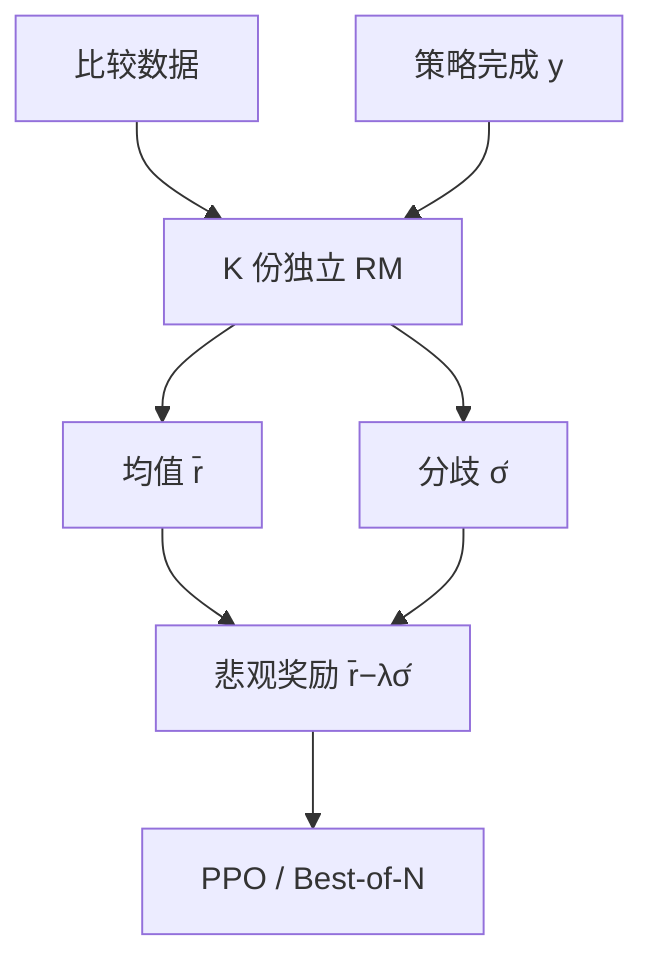

# RM 集成与不确定性

单个奖励模型给出的是点估计；几份独立拟合的差异，才把「这道完成有多不可信」写进标量。

<footer>—— Coste 等，Reward Model Ensembles Help Mitigate Overoptimization；对照 Eisenstein 等 Helping or Herding</footer>

[上一课](/llm/negative-task-vector)把行为改写收在权重空间里的负任务向量：沿一条微调方向反走，抹掉不想要的能力。本课打开「强化学习进阶」。策略不再被一条向量推，而是被一个标量奖励拉。[奖励模型](/llm/reward-model) 在 [RLHF 流程](/llm/rlhf-pipeline)里被当成真值；它其实是比较数据上的回归器，对分布外完成的方差从未进入 PPO。缺口是：**同一条 $y$，不同初始化的 RM 会打出差很远的分，策略却只看见均值。** 后课校准、过优化都默认已经读完本课的不确定性。

## 问题

InstructGPT 用一份 RM 给 PPO 打分。训练数据是标注员对旧策略样本的排序，测试时策略已经离开那片邻域。Gao、Schulman、Hilton 后来量过：代理奖励继续涨，金标奖励先升后降——过优化。单模型没有内部信号说「我在瞎打」。集成的问题不是再训一个更准的头，而是把 $r_\phi$ 从点改成分布：$\hat r(x,y)$ 与 $\hat\sigma(x,y)$，让策略在不确定的区域少走。

几份 RM 的分歧来自三处：随机种子与数据顺序、比较对的不可传递残差、以及表征对长度/格式捷径的不同敏感度。分歧大，不证明金标低；但分歧小，也不证明金标高——只说明这族模型看法一致。

### 集成不是投票选最好的那份

把 $K$ 份 RM 的分数取 $\max$，等于把最乐观的黑客面交给策略。取 $\min$ 过保守，探索停住。主流是均值作奖励、方差作惩罚或门控。Coste 等人表明集成能推迟过优化，不能取消它；Eisenstein 等人进一步问：集成是在帮助，还是只是把策略赶到「所有成员都喜欢」的更窄捷径上（herding）。

成员必须独立训练，或至少独立数据折。对同一 checkpoint 做 dropout 采样，相关太强，$\hat\sigma$ 系统性偏小。不要把 LoRA 的几个 rank 当成集成。

## 方法

数据与损失仍是成对比较，不重写 Bradley-Terry。做 $K$ 份 RM（$K$ 常取 3–8）：不同种子，或把比较对折成 bagging。推理时

$$
\bar r=\frac1K\sum_{k} r_{\phi_k}(x,y),\qquad
\hat\sigma^2=\frac1K\sum_k\bigl(r_{\phi_k}-\bar r\bigr)^2.
$$

接到 [PPO](/llm/ppo-llm) 的标量可以是 $\bar r-\lambda\hat\sigma$（pessimism），或仅当 $\hat\sigma$ 低于阈值才用 $\bar r$ 更新。Best-of-N 也可以按 $\bar r-\lambda\hat\sigma$ 排序。WARM（Rame 等）把成员权重平均，得到一条平滑奖励，显存比 $K$ 次前向便宜，但失去运行时的 $\hat\sigma$。

成员初始化自同一 SFT，只改种子，实现便宜，相关偏高；从不同 SFT 或不同比较子集训，相关低、成本高。报告必须写清 $K$、聚合与 $\lambda$，否则「用了集成」不可复现。

## 机制

悲观聚合改变的是策略面对的地形：在成员一致的区域，梯度与单 RM 接近；在成员打架的区域，有效奖励被压低，PPO 的正优势变少。于是策略更愿意停留在训练分布附近——这正是推迟 Gao 式过优化的来源。Herding 风险是：捷径（更长、更像清单）若被所有成员学到，方差反而小，悲观项不罚，集成一起被骗。

不确定性是认知的（模型不知），不是随机的（标注噪声）。标注员分歧要另建模，不能指望多训几份 RM 自动吸收。

## 边界与工程取舍

$K$ 次 RM 前向在在线 RL 里很贵。可把成员量化、放到推理卡，或只对高分候选算满 $K$ 份。开放域偏好上集成有文献支持；[可验证奖励](/llm/verifiable-reward) 的 0/1 没有模型不确定性，本课的 $\hat\sigma$ 用不上，应换校验器。集成推迟过优化，下一课问分数的绝对含义是否校准。

## 小结

- 单 RM 是点估计；集成用成员分歧估计对分布外完成的不可信程度。
- 聚合用均值减方差惩罚，不要用 max；一致的捷径仍会 herding。
- 接到 PPO 或 Best-of-N 时，$\lambda$ 与 $K$ 必须写入实验卡。
- 可验证 0/1 不需要 RM 集成。
- 出处：Coste 等 ICLR 2024；Eisenstein 等 COLM 2024；过优化曲线见 Gao, Schulman, Hilton。
