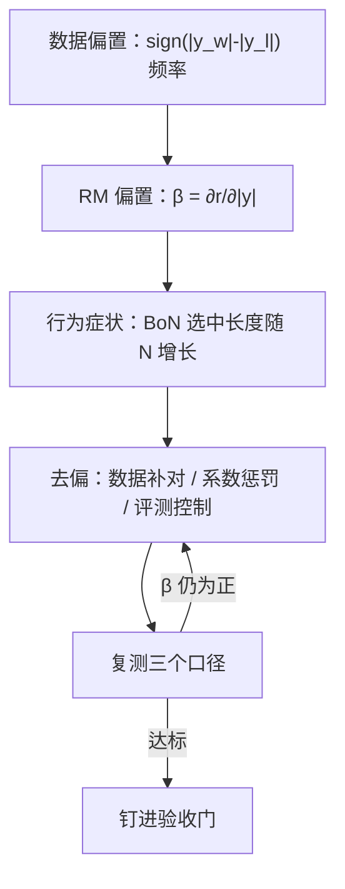
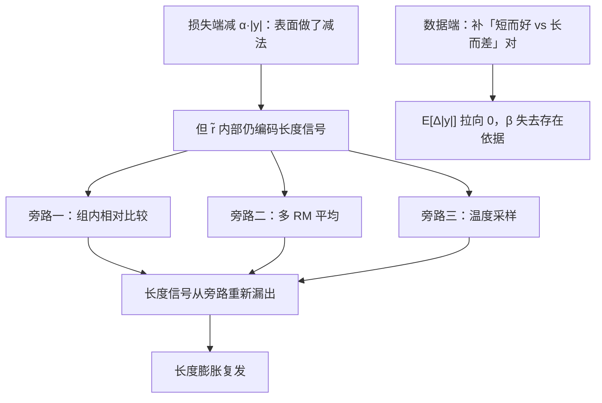

# 长度偏置的测量与去偏

长度是奖励模型最便宜的特征：标注员用「信息量大」当启发式，RM 把启发式学成权重，RL 把权重放大成制度。

<footer>—— 长度与偏好的相关见 Singhal 等 A Long Way to Go 2023；长度惩罚的工程源头见 Stiennon 等 2020</footer>

[上一课](/llm/preference-strength-calibration)给损失接上强度，数据单元收束；本课进入偏置与测量单元，从最大名鼎鼎的捷径开刀：长度。主干已有[风格黑客与长度偏置](/llm/length-bias-rm)，把现象与 RLHF 里的放大讲过；本课深钻测量与去偏——怎么把「RM 爱长」从一个传闻变成一个可报告的数，去偏动作各付出什么代价。后课的风格偏置、分布外行为都以本课的方法为模板。

## 问题

机制链条很短：开放域比较里更长的回答更常被标胜（信息量启发式），BT 损失如实拟合这个相关，RM 给 token 数配上正系数，[PPO](/llm/ppo-llm) 或 Best-of-N 随后把系数兑换成平均长度。[Stiennon 等 2020](/llm/instructgpt) 在摘要任务就观察到长度随优化超线性增长，不得不用显式惩罚拉回；Singhal 等 2023 系统量出了偏好与长度的相关在 RLHF 各环节的传导。不测会错在哪：验证准确率一切正常，因为持有对同样偏爱长回答；策略越训越啰嗦，产品指标（会话完成率、延迟）在别处恶化，没人把两件事连起来。

直觉类比：标注员心里把「信息量大」当启发式，就像改卷老师发现「写得长的学生显得用功」，于是按页数给印象分。RM 把这个印象分学成权重，RL 再把权重执行成制度——每个回答都被逼着注水。数字感受一下：抽 1000 对比较，若 620 对是胜方更长，频率 0.62 已显著高于 0.5，「数据爱长」就有了量化证据。

### 测量：三个口径

其一，对内差分：训练与验证对上算 $\operatorname{sign}(|y_w|-|y_l|)$ 的频率，RM 学到长度偏置的直接证据是这个频率显著高于 0.5——注意这是**数据**的偏置；再看模型：分数差 $\Delta r$ 与长度差 $\Delta|y|$ 的相关，或拟合 $r(x,y)=\beta|y|+\tilde r(x,y)$ 看系数 $\beta$，这是 RM 的偏置。其二，反事实对：同内容不同排版长度的改写对，测 $r$ 的变化分布，把内容与长度解耦——这是最干净的口径，成本是构造改写。其三，行为端：Best-of-$N$ 选出的回答长度随 $N$ 的增长曲线，偏置被优化利用后的表观症状。

## 方法

去偏按层次叠加。数据端：专门构造「短而好 vs 长而差」的对进池，直接反转启发式的相关——这是最有效的一招，因为它改变的是损失的经验分布而不是打补丁。损失端：给 $r$ 减 $\alpha|y|$ 或对 $\beta$ 正则；[Stiennon 等 2020](/llm/instructgpt) 的惩罚系数靠网格搜索定，系数是行为旋钮：太小没用，太大把模型压成电报体。评测端：比较评估时做长度控制回归（[风格控制](/llm/style-control)与 Arena 系的口径），保证你看到的涨分不是长出来的。三条各防一段：数据防学习、损失防利用、评测防自欺，只做损失端惩罚而数据不动，RM 内部仍保有长度特征，换个没惩罚的下游（比如换一批人做拒绝采样）照样复发。

术语翻译：「长度控制回归」是评测端的统计补丁——把「赢是因为长还是因为好」解开后重新算胜率，通常拟合一个以长度差为自变量的回归，再取截距作为「长度归零时的胜率」。不做这步，你的新模型可能只是学会了写得更长。

## 机制

为什么数据端补对比损失端惩罚更根本：BT 拟合的是数据里的相关结构，$\beta$ 是它的影子；惩罚只在最终标量上做减法，$\tilde r$ 内部仍编码着长度信号，任何旁路（组内相对比较、多 RM 平均、温度采样）都会把它重新漏出来。数据补对直接把 $\mathbb{E}[\Delta|y|\mid w\succ l]$ 拉向 0，$\beta$ 失去存在依据。另外要分清两个方向的相关：在代码与数学域，长度与正确性真实正相关（解题确实要写步骤），全局压长度会误伤——去偏必须按域条件化，至少把「结构性长」的域排除在惩罚外。这与[奖励黑客](/llm/reward-hacking-llm)的一般教训一致：捷径不可消灭，只能切断它被利用的通路。

常见误区：把去偏理解成「把长度往死里压」。压到底的结果是电报体——用户想要的详尽回答也被误伤。正确的靶子是「长度与质量的混淆」：让长不再自动等于好，而不是让长自动等于坏。所以代码、数学这类「解题必须写步骤」的域要排除在惩罚之外。

Singhal 等 2023 报告：RLHF 训练后模型输出长度显著上升，且偏好增益在控制长度后明显缩水；AlpacaEval 2 的长度控制回归（Dubois 等 2024）把同样的修正搬到了评测端。

## 边界

去偏的边界首先是目标错位风险：把长度压到底，用户真正想要的详尽回答也被压没了——正确的对象是「长度与质量的混淆」，不是长度本身。其次是测量的局限：反事实改写覆盖不了所有风格维度，$\beta$ 只是线性近似，RM 内部高阶的长度交互抓不到；三个口径都要报，单口径达标不算去偏。最后，长度只是最大的捷径，不是唯一的：把预算全花在长度上，格式、语气、列表癖在下一个验收周期等着你——那是下一课的题。

## 小结

- 长度偏置的传导链：标注启发式 → 数据相关 → RM 系数 → 优化放大为长度膨胀。
- 测量三口径：对内差分（数据）、长度系数与反事实对（模型）、BoN 长度曲线（行为）。
- 去偏三层：数据补「短而好」对最根本，损失惩罚是行为旋钮，评测端长度控制防自欺。
- 去偏按域条件化：代码数学的结构性长不应被惩罚误伤。
- 出处：Stiennon 等 2020；Singhal 等 A Long Way to Go，2023；Dubois 等 2024 长度控制评测。
