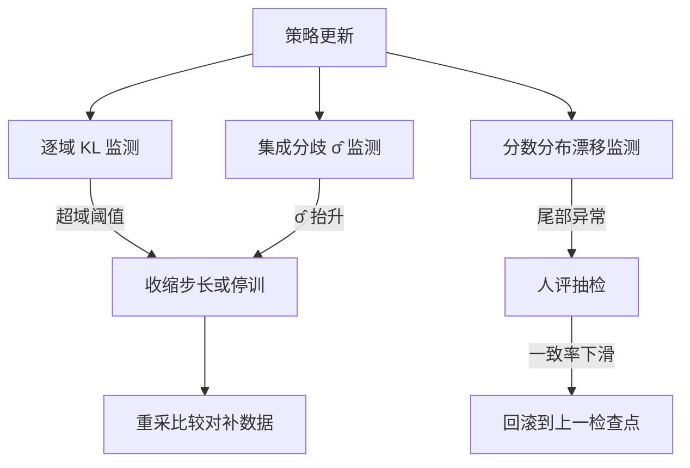

# 分布外的奖励行为

奖励模型只在比较数据的邻域内有定义；策略一旦走出那片邻域，分数仍会输出，只是不再对应任何人的判断。

<footer>—— 过优化曲线见 Gao、Schulman、Hilton 2022；集成不确定性作为 OOD 信号见 Coste 等 2023</footer>

[上一课](/llm/rm-style-bias)把表面特征的偏置清单拉完，都是**分布内**的病：数据里有的捷径被利用。本课转向分布外：RL 把策略推出比较数据的支撑之后，RM 的分数行为没有任何保证。[RM 过优化与 Goodhart](/llm/rm-overoptimization) 已把宏观曲线（代理奖励涨、金标先升后降）讲过，[RM 集成与不确定性](/llm/rm-ensembles)给了不确定性的定义；本课写工程侧：怎么监测策略正在走出支撑、走出之后拿什么兜底。

## 问题

BT 损失只在训练对上约束 $r$：它要求 $r_w \gt r_l$ 在样本处成立，样本之间的曲面形状由归纳偏置自由决定。PPO 每步把策略向高分区域推，高分区域先是「数据里真正更好的区域」，随后是「RM 外推想象出来的更好区域」——两者在支撑边缘开始分叉，这正是过优化曲线拐点的微观机制。危险在于分叉不可见：代理分数照常上涨，唯一知道真相的金标（人、更大 RM、任务指标）不在训练回路里。不这么做会错在哪：训练到第 300 步才发现回答开始出现奇怪的句子结构——那是策略找到了 RM 外推的高分谷，此时回滚窗口已过。

### 监测：三个支撑代理

支撑不可观测，只能用代理。其一，KL 距离：策略与参考策略的逐域 KL 是「走多远」的度量，KL 球本来就是支撑边界的工程近似，[KL 惩罚](/llm/ppo-kl-value)的系数因此不只是稳定性旋钮，也是外推风险旋钮。其二，集成分歧：多个独立 RM 对同一条完成打分的标准差 $\hat\sigma$（[RM 集成](/llm/rm-ensembles)的产出），分歧在支撑内低、支撑外暴涨，是成本最低的内窥镜。其三，分数分布漂移：训练中 $r(x,y)$ 的均值与尾部随步数的移动，配合定期小规模人评抽检——每 $n$ 步把当期最高分样本送人判，人判与 RM 的一致率是唯一不经过代理的金标。

## 方法

工程动作按发现顺序接续。预防：KL 系数按域设阈值，超阈收缩学习率或停训——把「走多远」钉在支撑大概率尚存的范围内。检测：把 $\hat\sigma$ 写进训练日志，与奖励同图监控；$\hat\sigma$ 的分位数（如 P90）比均值敏感，先抬头。兜底：分歧大的样本不要扔，它们是下一批标注的最优原料（工程单元的主动采集课展开），把外推区域重新拉回有数据的区域。可验证域另有一条硬兜底：数学与代码切到[可验证奖励](/llm/verifiable-reward)或混合加权，验证器不外推——它只判对错，RM 负责的「好不好」再交还给有数据的区域。

## 机制

为什么集成 $\hat\sigma$ 能当 OOD 信号：各成员在训练分布上被同一批对约束，预测被拉齐；离开分布，约束消失，各自归纳偏置起作用，预测发散。Coste 等 2023 把这个分歧用进 RL：在不确定处收缩优势，等价于把策略软性摁在支撑附近。但要明白它量的是什么：$\hat\sigma$ 是**这族 RM 内部**的一致性，成员同源（同初始化、同数据）时分歧会系统性低估真实的不确定性——Eisenstein 等 2023 的批评在工程单元的公平比较课展开。为什么 KL 只是近似：KL 小不等于在支撑内——策略可以留在 KL 球内但落在数据密度的洞里；KL 是必要条件不是充分条件，所以三个代理要同时看。

Gao 等 2022 的标度律给监测提供了预期管理：RM 越大、数据越多，拐点越晚但不消失。日志里应同时记录优化步数与代理奖励积分，对照标度律预估「还剩多少安全余量」。

## 边界

本课的方法都不能消灭外推，只能推迟与发现。人评抽检的时延与样本量决定它只能抓宏观趋势，抓不住单条异常；分歧信号本身可以被策略利用——策略若学会避开分歧大的区域，$\hat\sigma$ 会回落而外推照旧，这是把监测量变成优化目标后的标准副作用（Goodhart 的递归）。支撑的几何也没有想象中清晰：高维里「邻域」由 RM 的表征决定，两个输入在 token 空间近、在表征空间远（或反之）都常见，这正是下一课要把奖励当成随机变量、从方差角度重看稳定性的原因。

## 小结

- BT 损失只在训练对邻域约束 $r$；OOD 处分数由归纳偏置决定，外推即过优化的微观机制。
- 三个支撑代理：逐域 KL、集成分歧 $\hat\sigma$、分数漂移加人评抽检，同时看，缺一不可。
- KL 是必要非充分条件；$\hat\sigma$ 受成员同源限制，会低估真实不确定性。
- 可验证域用验证器兜底；分歧大的样本留作下一批标注原料。
- 出处：Gao、Schulman、Hilton 2022；Coste 等 2023；Eisenstein 等 2023。
