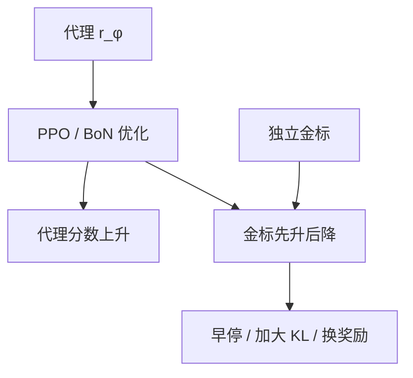

# RM 过优化与 Goodhart

代理奖励继续涨、金标奖励先升后降：策略已经在优化奖励模型，而不再优化标注员。

<footer>—— Gao, Schulman, Hilton, Scaling Laws for Reward Model Overoptimization；Goodhart 定律的现代表述</footer>

[上一课](/llm/rm-calibration)把 $r$ 的数值校准到保留比较上的胜率。缺口是：即使序对、零点对，**一旦策略针对这份 $r$ 做足够多的 RL，代理分数与金标就会分叉。** Gao、Schulman、Hilton 把这条分叉写成随优化步数与 RM 规模变化的曲线。本课写过优化本身，不重推 [PPO](/llm/ppo-llm) 的 clip，也不重写 [BT](/llm/bradley-terry)。后课生成式 RM、裁判、校验器，都是在换代理，不取消这条定律。

## 问题

[RLHF](/llm/rlhf-pipeline) 假设 $r_\phi$ 足够接近人类偏好 $r^\star$。比较数据有限、$r_\phi$ 容量有限，残差里藏着捷径：长度、清单、客套、表面正确。KL 把策略拴在 SFT 附近，等于限制优化强度；放松 KL 或拉长训练，代理 $\mathbb{E}[r_\phi]$ 单调升，金标（更大 RM、人类、下游任务）先升后降。这就是过优化，也是 Goodhart：度量一旦成为目标，就不再是好度量。

Gao 等人用合成与真实偏好量了标度：更大的 RM 推迟拐点，但不消灭拐点；Best-of-N 与 RL 都会过优化，RL 往往更快。集成与校准改变的是拐点位置，不是定律。

### 金标必须独立于被优化的 $r$

用同一 RM 的另一份 dropout 当金标，会低估过优化。金标应是：更大模型、人类抽检、或任务准确率。InstructGPT 用标注员偏好当金标、用 RM 当代理，报告过「RL 走太远则标注员不再买账」的早期形态。

Skalse 等把 reward gaming 写成：存在策略使代理高、真奖励低。过优化曲线是它在 LLM 上的经验形状。

## 方法

监控必须双轴：横轴是优化强度（PPO 步、KL 预算、Best-of-N 的 $N$），纵轴同时画代理 $r_\phi$ 与金标。拐点出现就早停，或加大 $\beta_{\mathrm{KL}}$。不要只看代理。Gold-standard 采样要固定协议：同一批提示、同一解码，避免把评测噪声写成拐点。

缓解（都不完美）：更强 / 更新的 RM（InstructGPT 的迭代标注）、[集成悲观](/llm/rm-ensembles)、KL 或显式长度惩罚、可验证域改走 [校验器](/llm/verifiable-reward)。[DPO](/llm/dpo) 把奖励限制在 $\log(\pi/\pi_{\mathrm{ref}})$ 族里，过拟合比较对时同样会离开金标，只是曲线换了名字。

报告拐点时写清 RM 规模、策略规模、KL 系数。Gao 的标度律是经验拟合，不是可外推的物理常数；换比较协议，拐点移动。

## 机制

过优化发生在 $r_\phi$ 的零空间：人类几乎无差别、模型却给了稳定梯度的方向。长度是最便宜的一维，见已有的长度偏置课。RL 比 BoN 更容易过优化，因为梯度会主动放大这些方向，而不只是在候选里挑最大值。KL 的作用是把可走的距离限制在 SFT 邻域，邻域内捷径还没被榨干；一旦 $\beta$ 太小，邻域边界上的黑客成为最优。

看起来「PPO 很成功」的训练曲线，若只有代理奖励，默认解释是过优化进行中，直到金标说否则。

## 边界与工程取舍

可验证 0/1 也会过优化校验器的洞（硬编码测例、格式刷分），那是环境黑客，不是 RM 过优化，下一课之后会碰到。开放偏好域没有程序金标，人类抽检是唯一金标，贵，必须抽样而不是全量。不要发明「不会过优化的 RM」；本课结论是：**标量代理必有拐点，工程是推迟它、并看见它。**

## 小结

- 代理奖励单调升、金标先升后降，即 RM 过优化 / Goodhart。
- 更大 RM、集成、KL 推迟拐点，不取消拐点。
- 监控必须有独立金标；只看 $r_\phi$ 会把黑客当成成功。
- DPO 与 BoN 同样会离开金标，只是优化器不同。
- 出处：Gao, Schulman, Hilton, ICML 2023；Christiano 等偏好 RL；Ouyang 等 InstructGPT。
