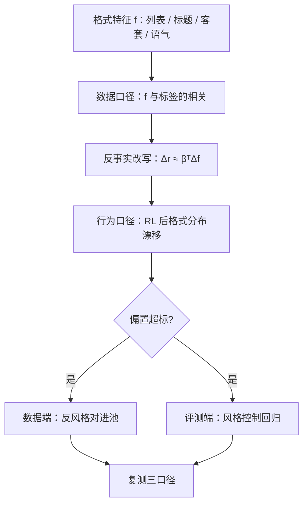
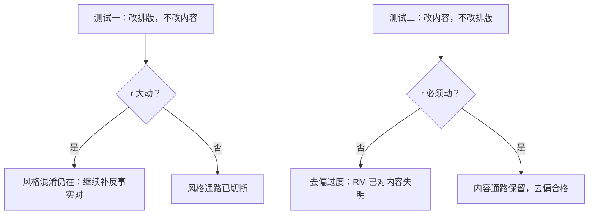

# 风格偏置与表面特征

内容要读懂才能评，格式扫一眼就能分；损失不知道你想要前者，它只挑成本最低的可分特征。

<footer>—— 评测端修正见 Dubois 等 2024 的风格控制；裁判侧偏差清单见 Zheng 等 2023</footer>

[上一课](/llm/rm-length-bias)把长度钉成可测量的系数 $\beta$，本课把同一套方法推广到其余一切表面特征：列表、加粗、小标题、开场客套、自信语气、emoji。长度只是风格空间里最显眼的一维；能被 tokenizer 表面统计捕捉的特征，都是 BT 损失的廉价候选。评测端的主干已有[风格控制](/llm/style-control)与[谄媚](/llm/sycophancy)，本课从 RM 工程角度写：风格偏置怎么测、从哪来、怎么在不误伤真实风格价值的前提下去偏。

## 问题

风格偏置的失效模式与长度同构但更难察觉：长度有个自然标尺（token 数），风格没有。RM 偏爱列表体，策略学会把一切回答排成清单；RM 偏爱开场白「好问题！」，策略学会逢题先奉承——这与[谄媚](/llm/sycophancy)的测量接上了：顺应的姿态在比较数据里常赢，不是因为它对。裁判侧的同款问题在 [LLM 裁判偏差](/llm/llm-judge-bias)里列过：位置、长度、自我偏好；当裁判模型批量生产 AI 反馈时（[RLAIF](/llm/rlaif)），偏差以工业规模写进训练池。不这么做会错在哪：所有模型的输出收敛成同一种排版，涨的是评分，丢的是「按内容回答」的能力面——评测分与用户留存开始背离。

直觉类比：风格偏置就像面试官凭西装是否笔挺打能力分——西装确实与职业度有真实相关，于是这条捷径成为最省力的判据；久之所有候选人都去买同一款西装（输出排版收敛），评分涨了，而「谁真会干活」的分辨力没了。

### 测量：把风格变成可比较的量

长度课的三口径照搬并改写。对内差分：胜方与败方的格式特征差（列表项数、标题数、感叹号密度），报告特征与标签的频率相关——量的是数据。反事实改写：同内容两种排版（清单化 vs 散文化、加客套 vs 删客套）过 RM，看 $\Delta r$ 的分布；这是把「风格系数」推广成「风格向量」：$\Delta r \approx \boldsymbol{\beta}^\top \Delta \boldsymbol{f}$ ， $\boldsymbol{f}$ 是特征向量。行为端：RL 数步后输出分布的格式统计漂移，或 BoN 选中答案的格式频率变化。三口径交叉验证，缺一不可——上次的教训原样适用。

给 $\Delta r \approx \boldsymbol{\beta}^\top \Delta \boldsymbol{f}$ 代个数：设列表项系数 $\beta_1=0.02$、标题系数 $\beta_2=0.03$，一条回答比另一条多 5 个列表项、多 2 个小标题，仅凭排版 RM 就白捡 $5\times0.02+2\times0.03=0.16$ 分——内容没变，分数已动，这就是「格式当内容用」的量化形态。

## 方法

去偏的动作分两处。数据端：构造反事实风格对进池——同一内容，中性与浮夸两种排版，标「胜」给中性方，直接反转相关；对 AI 反馈池，先把裁判输出做格式归一（或用多个裁判交叉），降低单裁判的格式指纹。评测端：[风格控制](/llm/style-control)的回归思路搬到内部验收——对候选回答的格式特征做回归扣除后再比较，内部评测集与外部榜统一口径。损失端通常不再额外加惩罚：风格维度太多，逐维惩罚不可维护，数据端补对是唯一可扩展的杠杆。

## 机制

风格为什么是 BT 损失的最低成本特征：RM 初始化自 SFT 模型，其表征里格式特征线性可分程度极高——不需要理解内容就能从隐层读出「这是不是列表体」。比较只要求分对，梯度先磨平格式差、再谈语义。机制上这是[奖励黑客](/llm/reward-hacking-llm)的一般形式：任何与标签相关且比目标更易学的特征都会被优先利用。为什么数据补对仍然是最根本的解：相关结构改变后，格式特征失去预测价值，梯度不再流向它；而评测端回归只修正测量，RM 内部的格式表征原样保留，换一个不控制的下游照样复发。这条因果与长度课完全一致。

自我偏好在自评闭环里最强：模型给自己风格的回答打高分（Zheng 等 2023 观察到同族偏好），于是自奖励循环会加速格式收敛——闭环越紧，风格偏置的增长越快。

## 边界

风格不是纯噪声：排版与分节对可读性有真实贡献，用户偏好里确实含这部分。目标是切断「用格式替代内容」的混淆推理，不是惩罚一切风格——验收时用反事实对：改排版不改内容，$r$ 不该大动；改内容不改排版，$r$ 必须动。做不到第二条，说明去偏过度，RM 已经对内容失明。测量本身有循环：反事实改写依赖改写器，改写器的风格偏好会漏进「中性」侧；至少换两个改写器交叉验证。最后，风格空间无限，审计只能覆盖已知维度的清单——清单外的捷径靠红队与线上监控兜底，这是验收课的题。

为什么改写器本身也要审计：反事实对的「中性侧」是改写器生产的，若改写器偏爱某种排版，「中性」就不中性，测出来的风格系数被污染。至少换两个改写器交叉验证——两边一致的结果才可信，这和「两个证人对不上口供就要重查」是一个道理。

## 小结

- 风格偏置是长度偏置的推广：一切表面可分特征都是 BT 的廉价候选。
- 测量沿用三口径：特征-标签相关（数据）、反事实改写的 $\Delta r$（模型）、RL 后格式漂移（行为）。
- 去偏主杠杆在数据端反事实对，评测端用风格控制统一口径，损失端逐维惩罚不可维护。
- 保留真实风格价值：验收标准是「改内容必须动分，改格式不该动分」。
- 出处：Dubois 等 2024；Zheng 等 2023；谄媚与裁判偏差见主干课。
