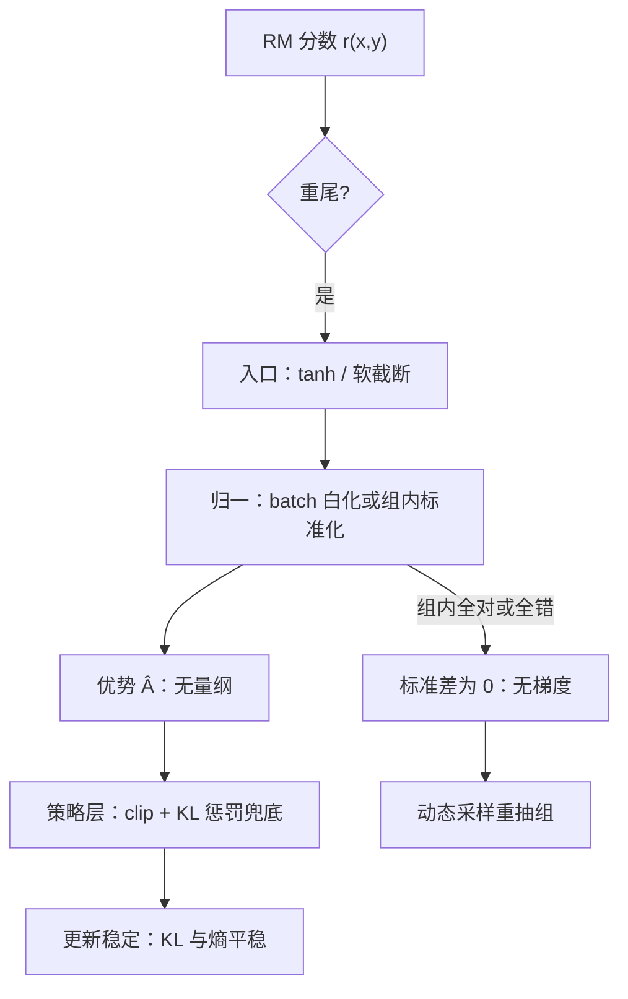
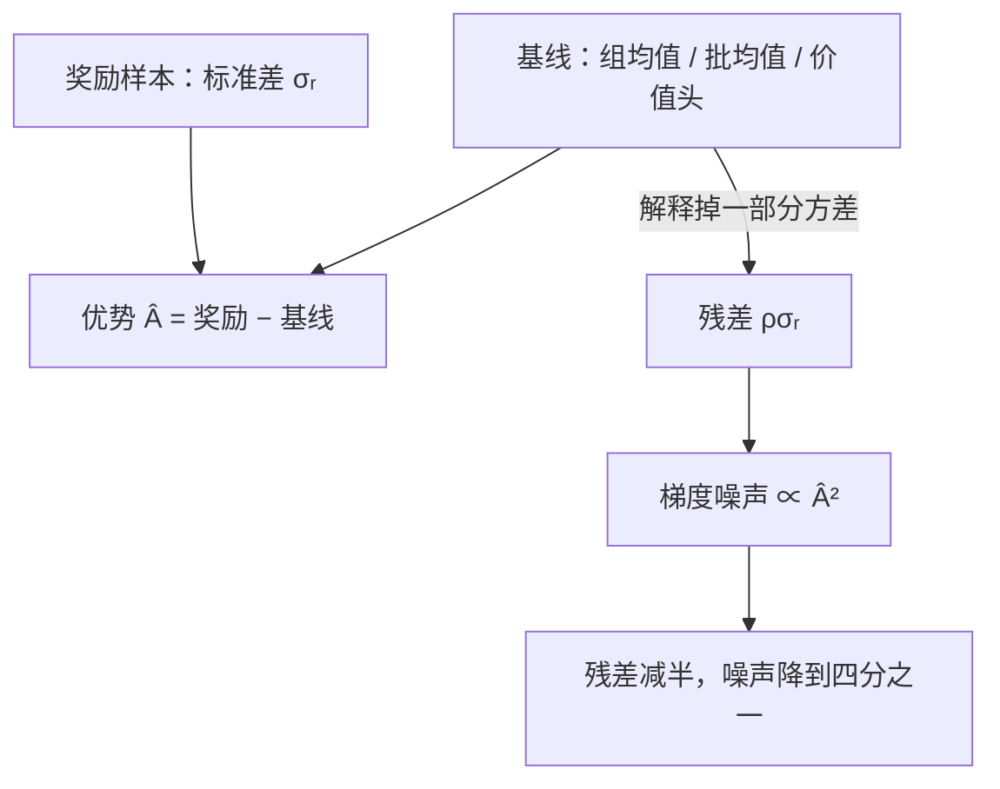

# 奖励方差与策略稳定性

策略梯度吃进的是奖励的样本，不是奖励的期望：分数的尺度与方差经优势函数一比一写进梯度的方差。

<footer>—— 方差分解溯至 Williams 1992；组内标准化见 Shao 等 GRPO 2024；归一化实践见主干课奖励归一化与白化</footer>

[上一课](/llm/rm-ood-behavior)处理「分数不再对应人类判断」的分布外问题；本课回到分布内，处理一个更早爆雷的问题：分数本身的方差与尺度。同一份比较数据训出的两个 RM，一个分数挤在 $[0.1, 0.3]$、一个横跨 $[-8, 12]$，接到同一个 PPO 上行为完全不同。[REINFORCE 与方差](/llm/reinforce-variance)在主干立过方差账，[奖励归一化与白化](/llm/reward-whitening)讲过标准动作；本课把这些零件拼成因果链：RM 的校准缺陷如何变成优势爆炸，再变成策略崩坏。

## 问题

策略梯度 $\nabla J \approx \hat A\nabla\log\pi$ 的方差正比于 $\mathbb{E}[\hat A^2]$，而 $\hat A$ 是奖励的（标准化）线性函数：奖励的方差直接进入更新的噪声，奖励的尺度决定学习率的有效大小。RM 的校准缺陷从两头来：其一，BT 损失只约束序，不约束间隙的绝对尺度——分数整体放大两倍，比较准确率不变，但梯度翻倍；其二，重尾——少数对上 RM 给出极端分数（外推、[OOD 课](/llm/rm-ood-behavior)的并发症），这些样本的优势巨大，单条更新就能把策略推出信任域。不这么做会错在哪：训着训着 KL 突然跳升、熵塌陷，回看日志发现是某批奖励的极差拉出了十倍于平日的优势——没有强度标定与尺度约束的训练，几乎必然攒出这种尾巴。

给个平方的威力：梯度噪声正比于 $\hat A^2$，也就是正比于奖励标准差 $\sigma_r$ 的平方。若一个 RM 分数挤在 $[0.1,0.3]$（$\sigma_r\approx0.05$），另一个横跨 $[-8,12]$（$\sigma_r\approx5$），后者单看是 100 倍的尺度差，落到更新噪声上就是 $100^2$ 量级的差距——同一段训练代码，一个是散步，一个是炮弹。

### 稳定化的三层

入口层：RM 输出做界，如 $\tanh$ 压缩或对 logit 软截断，给单条样本的分数设上限；训练时对 batch 内分数去均值、除标准差（白化）。归一层：[GRPO](/llm/grpo) 的组内标准化——同提示采 $G$ 条，奖励减组均值、除组标准差，优势变成无量纲的名次量，尺度由组内分布决定，与 RM 的绝对标尺脱钩（[群体相对基线](/llm/group-relative-baseline)的机制课）。策略层：[优势裁剪](/llm/ppo-clip-higher)与 KL 惩罚兜底，单步大优势被 clip 截住。

## 方法

推荐顺序是先归一、再截断、后兜底。白化最便宜且解决尺度，但抹掉跨 batch 的绝对语义——「用 RM 分数做回归或评测」的旁路都要接归一前的分数。组内标准化（GRPO 式）同时解决尺度与跨提示可比性，代价是要处理退化组：组内奖励全相同（全对或全错，[可验证奖励](/llm/verifiable-reward)域常见）时标准差为 0，整组没有梯度，预算白烧；[动态采样](/llm/dynamic-sampling-rl)把退化组重抽，直到有效组够数。截断针对尾部而非主体：截断阈值设在白化后分布的 P99 附近，压的是单样本灾难，不是分布形状。

术语翻译：「退化组」就是组内人人同分的组——同一条提示采 8 条回答全对（或全错），组标准差为 0，减均值除标准差后所有优势都是「零除零」，整组提供不了任何「谁比谁好」的梯度，采样的算力等于白烧。动态采样就是发现这种组就重抽，直到凑够有分辨力的组。

## 机制

把方差账算清楚：对单条样本，梯度噪声 $\propto \hat A^2$；设奖励标准差为 $\sigma_r$、基线 imperfect 残差为 $\rho\sigma_r$，则优势二阶矩 $\approx (\sigma_r^2+\rho^2\sigma_r^2)/b$ 量级（$b$ 为组或 batch 大小）。这给出两个工程推论：其一，基线（组均值、批均值、价值头）每解释掉一分奖励方差，更新噪声按平方下降——基线不是稳定性的装饰，是主承重墙；其二，$\sigma_r$ 本身是可压的：强度标定（数据单元）压掉噪声对的间隙，入口截断压掉尾部，剩下的才是有信息量的方差，此时白化把它归一到学习率友好的区间。致命三要素在 LLM 场景常以「大方差奖励 + 强表征 + 陈旧样本」的组合现形，本课处理的是第一项的数据侧根源。

直觉类比「组内零和」：组内标准化后，一条回答的信号只来自「同组 8 条里的名次」——有人升就得有人降，像小组内部强制排名。而「这道题对全组都难」这个信息被减均值减掉了，策略再也看不见；题目难度的均衡因此要挪到提示配比那一侧去做。

尺度错配的隐式风险：KL 惩罚项 $-\beta\,\mathrm{KL}$ 在损失里与奖励项相加，奖励尺度翻倍等价于 $\beta$ 减半——优化强度被暗中放大，过优化（Gao 等 2022）提前到来。改奖励尺度而不重调 $\beta$，是常见的隐蔽数值事故。

## 边界

归一化不是免费午餐：白化后奖励的绝对语义消失，「分数高低」变成 batch 内相对量，跨批次、跨版本的分数漂移不再可见——OOD 监测（上一课的分数漂移口径）必须接归一前的原分数。组内标准化把每个提示内部变成零和战场：组内的名次就是全部信号，跨提示的「这题普遍难」信息被丢弃，题目难度均衡要靠提示侧配比。截断与 $\tanh$ 会压缩高分段的分辨力，若任务真的存在「好得多」的回答（强度单元的碾压档），压扁后下游拒绝采样就分不出最优——界要设在信息保留与尾部控制之间，并进验收清单的复测项。

## 小结

- 奖励的尺度与方差经 $\mathbb{E}[\hat A^2]$ 直接成为策略更新的噪声与有效学习率。
- BT 只约束序不约束尺度：校准缺陷从整体尺度与重尾两头进入梯度。
- 稳定化三层：入口截断压尾，白化或组内标准化管尺度，clip 与 KL 兜底。
- 退化组（全对全错）无梯度，动态采样重抽；基线每解释一分方差，噪声按平方降。
- 出处：Williams 1992；Shao 等 GRPO，2024；Gao 等 2022 的尺度-KL 耦合提醒。
