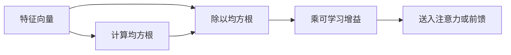

# RMSNorm

不必减去均值；用均方根把向量拉到稳定尺度，层归一化就能又快又够用。

<footer>—— Zhang 与 Sennrich，RMSNorm，2019</footer>

LayerNorm 对每个 token 的特征维做减均值、除标准差，再仿射。Zhang 与 Sennrich 在 2019 年问：均值中心化这一步对 Transformer 是否必要？他们给出 RMSNorm：只除以均方根，不减均值，保留一个缩放向量。LLaMA 之后的开源解码器几乎把它当成默认归一化。它不是新的残差顺序，而是 Pre-LN 块内部更便宜的一次归一化；和 DeepNorm、并行 Attention-FFN 正交，但常被一起写进同一套实现。

## 问题

LayerNorm 对 $x\in\mathbb{R}^{d}$ 计算

$$
\mu=\frac{1}{d}\sum_j x_j,\qquad
\sigma=\sqrt{\frac{1}{d}\sum_j (x_j-\mu)^2}
$$

再输出 $\gamma\odot(x-\mu)/\sigma+\beta$。减均值让特征在超平面 $\mathbf{1}^\top y=0$ 上，除 $\sigma$ 固定欧氏尺度。Transformer 里 $d$ 已是隐层宽度，不存在 BatchNorm 那种随批量变化的统计。计算上，减均值要先扫一遍求和，再扫一遍方差，再仿射；在带宽紧的内核里，这两次归约会占去不可忽视的时间。

更关键的是功能：若模型真正需要的是「别让下一层的线性映射碰到巨大的范数」，尺度比中心更重要。均值中心化会丢掉与全维偏置等价的一个自由度，有时还与残差里已经学到的偏置成分打架。问题是：去掉 $\mu$，只保留尺度约束，质量掉多少、速度换回多少？RMSNorm 的设计意图不是「近似 LayerNorm」。它假设再中心化不是 Transformer 残差块的必要条件。若某任务确实依赖特征均值所编码的全局偏置，去掉 $\mu$ 会改变可表示函数类，而不是只改变数值。

## 方法

定义均方根

$$
\mathrm{RMS}(x)=\sqrt{\frac{1}{d}\sum_{j=1}^{d} x_j^2+\varepsilon}
$$

RMSNorm 为

$$
\mathrm{RMSNorm}(x)=\gamma\odot\frac{x}{\mathrm{RMS}(x)}
$$

通常不再加 $\beta$。$\gamma\in\mathbb{R}^{d}$ 可学习，初始化为 $1$。$\varepsilon$ 防止全零向量。它只保证 $\|y\|_2$ 与 $\gamma$ 同量级，不保证 $\sum y_j=0$。

在 Transformer 里，把 Pre-LN 的 $\mathrm{LN}$ 全部换成 $\mathrm{RMSNorm}$ 即得到常见的 LLaMA 块。注意力与 FFN 的输入尺度被钉住，残差主干仍是未归一的求和。Zhang 与 Sennrich 在机器翻译等实验上显示，质量与 LayerNorm 接近，训练与推理更快。

## 机制

### 去掉均值之后还剩什么

除以 RMS 等价于把向量投影到球面上再按 $\gamma$ 拉伸各轴。下一层的线性映射看到的是方向与按维相对幅度，而不是绝对模长。这足以稳定点积注意力的尺度：若 $q$、$k$ 的输入范数被限制，$q^\top k$ 不会随残差流膨胀而线性膨胀。FFN 的第一层线性同样不会因输入范数暴涨而把激活推到饱和区之外毫无控制。

未减均值意味着若 $x$ 整体偏移，$y$ 仍带这个偏移的方向。残差块可以沿全维常数方向累积「背景电位」。实践中 $\gamma$ 可以抑制某些维，网络不一定会让这个方向爆炸；但它确实比 LayerNorm 更信任残差流里的加性全局成分。

### 计算与数值

实现只需一次平方和、一次开方、一次按维乘法，省掉减均值的依赖链，也省掉中心化后的第二次方差归约。混合精度下，RMS 在 fp16 里对大 $d$ 可能溢出平方和，通常在 fp32 里归约再转回。$\varepsilon$ 过小会在近零激活时放大噪声，过大则等同给所有 token 加地板，削弱归一化。与 LayerNorm 相同，统计沿特征维，不沿 batch，因此对变长与小批量友好。

增益 $\gamma$ 不是可选项。没有 $\gamma$，所有维被强迫同一 RMS，头与通道之间无法学「这一维该更响」。有人把 $\gamma$ 融进相邻线性层的权重，推理时可省一次逐元乘；训练时仍建议分开，便于与学习率解耦。

### 与 LayerNorm 的可替换性

在 Pre-LN 解码器、中等以上宽度上，二者常常可互换而不改其余超参，这是 RMSNorm 能成为默认的原因。但它们不是数学等价：LayerNorm 的输出正交于全 1 向量（仿射前），RMSNorm 不是。把 LayerNorm 训好的 $\beta$、$\gamma$ 直接接到 RMSNorm 上没有意义。从 LayerNorm 模型蒸馏到 RMSNorm 需要重训归一化与相邻投影。编码器、极浅模型、或强依赖特征均值的探针任务上，差距可能放大，不能把解码器上的成功直接写成定理。

## 边界与工程取舍

RMSNorm 不解决 Pre-LN 与 Post-LN 的顺序问题，也不提供 DeepNet 那种随深度变化的残差增益。它只降低归一化本身的成本与一个约束。QK-Norm 若存在，通常也是对 $q$、$k$ 做 RMS 或 LN，与块级 RMSNorm 叠床架屋时要避免重复压缩已经很小的向量。

与 BatchNorm 不同，RMSNorm 没有运行均值，推理与训练公式一致，这是它适合自回归解码的前提。序列长度不进入统计，长上下文不会让归一化统计「看见更多 token」——这既是优点（无长度泄漏），也意味着它不承担位置编码的职责。

在混合专家或并行 Attention-FFN 里，同一 $\tilde x$ 可能被多条分支读取。RMSNorm 只需算一次并广播，这比每条分支各做一遍 LayerNorm 更划算，但也意味着所有分支共享同一尺度。若某一专家希望自己的输入更尖或更平，不能指望归一化替它完成，必须写进专家权重。训练日志里应分别盯残差流范数与 RMS 输出范数：前者允许随层缓升，后者应大致钉在 $\gamma$ 的尺度上；若后者也暴涨，多半是 $\varepsilon$ 过小或 $\gamma$ 学习率过大，而不是「该换回 LayerNorm」的充分证据。

论文写于 2019 年，实验主体还不是千亿解码器。今日的默认地位来自后续开源模型的复用，而不是原文已经扫过所有尺度。换到新激活、新宽度或并行 Attention-FFN 时，仍应看梯度范数与损失尖峰，而不是假定 RMS 永远可插拔。

### 何时仍用 LayerNorm

需要 $\beta$ 来表达特征均值、或与一批仍用 Post-LN LayerNorm 的检查点对齐时，保留 LayerNorm。教学与对照实验里也应保留，以免把「归一化」与「RMS」绑死。新模型默认 RMSNorm 是工程选择，不是 LayerNorm 被证伪。

## 小结

- RMSNorm 用均方根缩放特征，不做均值中心化，通常只保留增益 $\gamma$。
- 它稳定的是输入范数，从而稳定注意力点积与 FFN 的数值范围。
- 计算比 LayerNorm 少一次中心化归约，更易写成高速内核。
- 与 LayerNorm 函数类不同，不能无损热替换已训仿射参数。
- 不改变残差顺序，也不替代位置编码或残差缩放。
- 开源解码器的默认地位来自实践复用，原文提供的是方法与早期证据。
- 出处：Zhang 与 Sennrich，*Root Mean Square Layer Normalization*，2019；对照 Ba、Kiros、Hinton 的 LayerNorm（2016）以及 Xiong 等关于 LN 位置的讨论（2020）。
