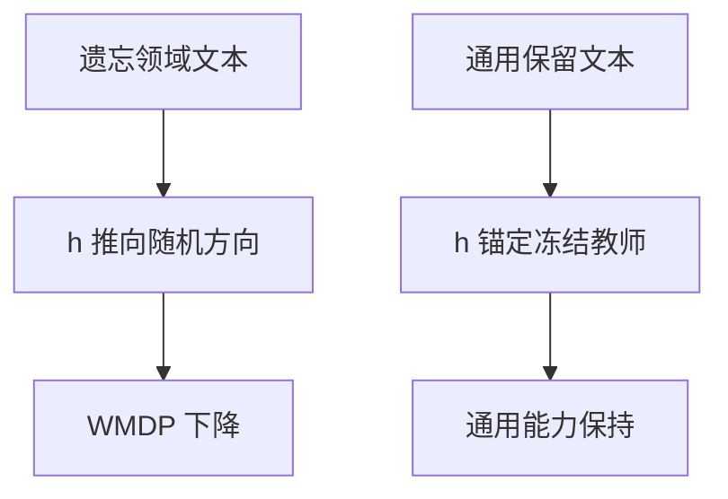

# RMU 与 WMDP

把危险领域相关的隐藏表示推向噪声，模型在该领域的完成会崩；WMDP 用来测崩得是否够、以及一般能力是否还在。

<footer>—— Li 等，The WMDP Benchmark: Measuring and Reducing Malicious Use With Unlearning（ICML 2024）</footer>

[机器遗忘](/llm/machine-unlearning)给出近似遗忘的目标。危险能力这条线需要公开基准与一种可复现的表示干预。Li、Han 等人的 WMDP（Weapons of Mass Destruction Proxy）用生物、化学、网络代理题测恶意使用相关知识，并给出 RMU（Representation Misdirection for Unlearning）：在选定层把遗忘集激活推向随机方向，同时用保留集锚定。本课只写这一对基准–方法。不提供任何危险领域的操作内容；题面与数据以论文发布为准。下一课把「还要继续学新任务」接到回放。

## 问题

隐私遗忘针对可识别的文档字符串。危险能力针对**领域**：即使记不住某篇论文，仍可能从预训练里拼出有害程序。评测因此不能只用几条记忆探针，要用领域问答代理。WMDP 的设计是：高分意味着掌握可被滥用的专业知识代理，低分意味着该代理被削弱。同时必须报通用基准，否则把模型打成乱码也会「WMDP 满分遗忘」。

方法上，梯度上升在领域文本上会连语言能力一起烧。需要把更新限制在「领域相关表示」而不是整张 $W$。RMU 选择误导（misdirect）隐藏态：遗忘批次的表示对齐到固定随机向量，保留批次的表示对齐到冻结教师。

### 代理基准不是真实危害的充要条件

WMDP 是选择题式代理。考低不证明模型在开放生成里无害，考高也不等于已实施危害。它提供的是可复现的比较尺，用来淘汰「只拒答关键词、知识还在」的假遗忘。

RMU 与 ROME 都动中层表示附近，但 ROME 写特定键值，RMU 把整片领域方向推开。粒度更粗，适合「这一门知识」而不是一条三元组。

## 方法

选一层或几层 MLP 附近的隐藏态 $h$。对遗忘集 $D_f$（WMDP 相关文本，而非题目答案泄露）：最小化 $\|h-c\cdot u\|$，其中 $u$ 为固定随机单位向量，$c$ 为幅度。对保留集 $D_r$（通用文本）：最小化与冻结模型同层 $h_{\mathrm{ref}}$ 的距离。两损失加权，只更新该层附近参数（或配合小学习率全参）。训练步数很少，效用一掉就停。

评测：WMDP 准确率应下降；MMLU 等应接近原模型。对话模型在[模板](/llm/chat-template)下再测开放生成是否仍流畅。不要在训练集里塞入评测题。

实现上 $D_f$ 是领域语料而非「如何制造」的说明书汇编目标；论文提供基准与方法，工程应使用其发布的划分。本课不讨论如何构造额外危险语料。

## 机制

若危险领域在表示空间里有可分的方向，把 $h$ 推向与该方向无关的噪声，后续层读到的是无结构激活，领域内下一词预测崩溃，选择题准确率掉。锚定项阻止同一层对普通英语也噪声化。失败模式：领域与通用表示纠缠（生物描述与普通科普重叠），锚定与误导对打，结果是两头掉或两头都不动。另一失败：只崩选择题格式，开放生成仍能被套出知识——所以要补生成评测。

与 [LoRA](/llm/lora) 结合：可在目标层挂适配器做 RMU，便于回滚；若知识主要在冻结 $W_0$，适配器可能学的是「在该层加上噪声映射」，卸载适配器则知识回来。对预训练内嵌的能力，应接受必须写骨干或接受可逆=未真正遗忘。

这与安全拒答 SFT 互补：拒答改接口，RMU 改可用性。只有拒答时，换语言或角色扮演会漏；只有 RMU 时，模型可能在领域内胡言却仍尝试作答。产品常要两者。

## 边界与工程取舍

WMDP 覆盖声明的三个代理领域，不是全部恶意使用。化学、生物题与真实实验室能力之间有鸿沟，降分不能当合规证书。反向，未降分也不能当「可以部署」。超参对层索引敏感，换基座必须重选层。持续学习新任务会把被推开的方向又学回来，下一课回放与此对抗。

## 小结

- WMDP 用代理选择题测危险领域知识是否还在，必须同时报通用效用。
- RMU 将遗忘集表示推向随机方向，并用保留集锚定教师表示。
- 粒度是领域方向，不是单条事实槽。
- 可逆适配器上的 RMU 可能一卸就恢复，预训练知识需写骨干。
- 拒答与表示误导互补，单用都会漏。
- 出处：Li 等，WMDP / RMU，ICML 2024。
