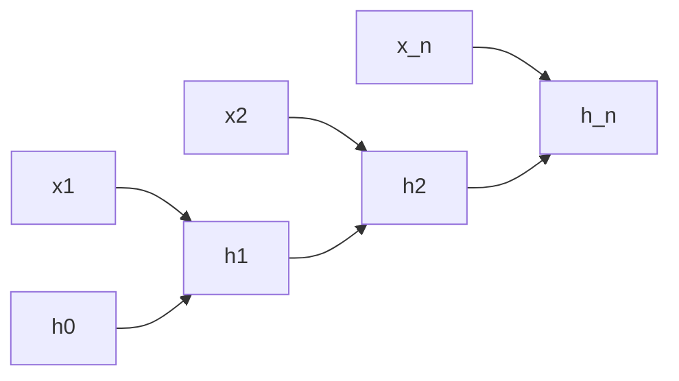

# RNN 与长程依赖

同一套参数沿时间步复用，把变长向量序列收成一条递推状态；状态要穿过许多步，增益连乘就变成对距离的指数。

<footer>—— 据 Elman, Finding Structure in Time, Cognitive Science, 1990；Bengio, Simard &amp; Frasconi, IEEE TNN, 1994 整理</footer>

[嵌入作为查找](/llm/embed-as-lookup-motive)给出 $X\in\mathbb{R}^{n\times d}$。本课不重写 gather。缺口是：窗口词向量没有「读到现在为止」的状态，下一词却依赖任意远的前缀。方法是循环：隐状态 $h_t=f(h_{t-1},x_t)$，参数不随 $t$ 变。本课把长程依赖写成时间轴上的梯度消失 / 爆炸；门控是下一课。不把注意力提前写成对全体键的一次读取。

## 问题

MLP 吃固定维向量。句子长度 $n$ 变，不能为每种 $n$ 做一张网。把 $n$ 个 $x_t$ 拼接，最大长度一变形状就坏，且参数随 $n$ 涨。缺口是共享参数的递推：每步读一个 $x_t$，改写 $h_t$，理论上任意远的 $x_1$ 都还留在 $h_n$ 里。这是序列模型在注意力之前的默认接口。

展开后，从 $h_n$ 回到 $h_1$ 的反向路径长度为 $n$，正是[梯度消失与爆炸](/llm/vanish-explode-grad)里的 $L$，只是 $L$ 变成了时间。$\partial h_t/\partial h_{t-1}$ 的谱半径偏离 $1$，则相隔 $k$ 步的梯度含 $\rho^k$。长程依赖不是「RNN 记性差」的文学说法，就是这条指数。

### 循环不是把整句平均成一个向量

平均池化也吃变长输入，但交换位置不改结果，且早期 token 与晚期同等权重。RNN 的 $h_t$ 对最近的 $x_t$ 更敏感（除非学成恒等传递），这是归纳偏置，也是短板。把 RNN 理解成「句向量编码器」只覆盖一种用法；语言模型用法是每一步都要从 $h_t$ 读出下一词分布。本课两种都承认，重点在递推与长程。

最简 RNN：$h_t=\tanh(W_h h_{t-1}+W_x x_t+b)$。$W_h$ 被乘 $n$ 次。$\|W_h\|_2\gt 1$ 则爆炸，$\lt 1$ 则消失。裁剪能管爆炸，不管消失——与前馈课同一句话，现在沿时间说。

## 方法

正向从 $h_0$（常取 $0$）走到 $h_n$。损失可以是最后一步的分类，或每步下一词交叉熵之和。反向沿时间展开（BPTT）：从末步把 $\mathrm{d}h$ 往回传，每步加上该步损失对 $h_t$ 的直接项。截断 BPTT 只回传固定步数，是内存与长程的折中：更长的依赖在截断处被切断。本课不把截断当理论解。

## 机制

参数共享让任意长度合法，也强迫「在 $t=1$ 与 $t=100$ 用同一转移」。能学到的长程，是那些与短程共用同一 $W_h$ 的模式。若 $\rho\neq 1$，远距离的 $x_1$ 在 $h_n$ 里的一阶影响指数衰减或爆炸，模型只能靠短程统计做下一词——看起来像「没学会语法里的远距离一致」，其实是优化到不了那条路径。

双向 RNN 从两端各走一次，每个位置看见左右上下文，对分类有用，对自回归语言模型不合法——未来会泄漏。本课默认单向。多层 RNN 把 $h_t$ 再送进另一条递推，深度与时间两个轴上各有一份 $\rho^L$，诊断时要分开看。

并行性：步与步有数据依赖，前向不能沿 $t$ 完全并行。这与按位置独立的 MLP 不同，是后来注意力被当成计算方案的原因之一；本课只记录这个约束，不引入 $QK^\top$。

## 边界

本课不写 LSTM 的三个门。下一课[LSTM 门控](/llm/lstm-gating)用加法单元状态把 $\rho$ 往 $1$ 拉。后课默认：变长序列的基础模型是共享参数的递推；长程问题首先是时间轴上的增益连乘，不是词表太大。也不把隐状态平均池化当成已经解决长程。

## 小结

- $h_t=f(h_{t-1},x_t)$ 用共享参数吃变长序列。
- 展开深度等于长度；$\rho^k$ 使长程梯度消失或爆炸。
- 裁剪与截断 BPTT 是工程闸门，不是长程的结构解。
- 递推沿时间不能完全并行。
- 双向会泄漏未来，自回归默认单向；多层则深度与时间两轴都有 $\rho$。
- 出处：Elman, 1990；Bengio et al., 1994。
