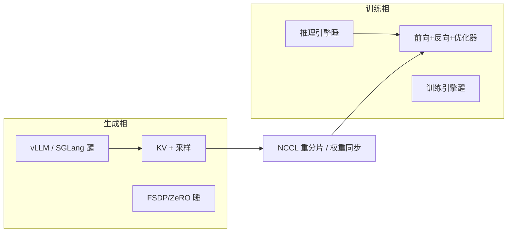

# Rollout 与训练资源复用

生成要 KV 与大 batch 解码，更新要分片梯度与优化器；两套并行度可以不同，但权重不必在 GPU 上存两份，过渡时也不该把整网再搬一遍。

<footer>—— Sheng 等，HybridFlow: A Flexible and Efficient RLHF Framework，EuroSys 2025（arXiv:2409.19256）</footer>

在线强化学习把一步迭代切成两相：用当前策略 **rollout** 出轨迹，再在同一批轨迹上算优势、反向、更新。朴素部署给 vLLM 一组卡、给 FSDP/ZeRO 另一组卡，生成时训练卡空转，训练时推理卡空转，权重还要跨设备同步。DeepSpeed-Chat 的 Hybrid Engine、OpenRLHF 的 colocate + sleep、HybridFlow 的 **3D-HybridEngine**，走的是同一条系统问题：让 **同一组 GPU 分时承担生成与训练**，并在两相之间做零冗余的参数重分片。Sheng、Zhang、Ye 等把 HybridFlow 发在 EuroSys 2025，开源实现即 veRL（`volcengine/verl`）。本篇写复用的显存与通信合同，算法目标仍见 [GRPO](/llm/grpo-paper) 与 [PPO](/llm/schulman-ppo)；[DeepSpeed-Chat](/llm/deepspeed-chat) 是更早的同构引擎，数字口径不要混用。

## 问题

RLHF 数据流里每个节点已是分布式 LLM 程序：actor 要训练也要生成，critic 要训练也要推价值，参考与奖励模型往往只做前向。生成是记忆带宽型、偏好较小的张量并行加较大的数据并行；训练是算力型、偏好较大的模型并行以便放下优化器状态。OpenRLHF 若把 actor 训练副本与 vLLM 副本放在不同设备，会 **双份权重** 加频繁同步。DeepSpeed-Chat 把同一份权重留在同一组卡上，但 ZeRO 与推理 TP 之间的 reshard 仍可能在大模型上打出可观的临时缓冲。NeMo-Aligner 让两相使用同一套 3D 并行，生成吞吐往往上不去。

第二问是调度。异构模型（7B actor 配 70B 奖励）与「先生成后更新」的数据依赖，使有的节点可以并行、有的必须串行。全部独占设备最简单，也最浪费；全部挤在同一组卡上最省，但并发会 OOM。需要一种放置：能 colocate 的分时，必须并行的分设备，并且把 actor 两相的权重过渡写成引擎原语而不是用户脚本里的 `copy_`。

### 生成与训练为何争同一份参数

设 actor 权重为 $W$。训练图在 [ZeRO-3](/llm/zero-stages) 或 FSDP 下按 DP 维切 $W$；生成图在 vLLM 下按 TP 维切 $W$，外加 KV。若坚持两份 $W$，显存近似

$$
\mathrm{mem}\approx 2|W|_{\mathrm{gpu}} + |\mathrm{KV}| + |\mathrm{opt}|,
$$

其中优化器通常只挂在训练分片上。删掉一份 $W$ 后，峰值变成 $\max(\mathrm{train\_footprint},\;\mathrm{gen\_footprint})$，前提是另一相把不用的分片与 KV **睡到 CPU 或释放**。睡不干净，colocate 只会比独占更先炸。HybridFlow 论文强调：actor 训练与生成占一步 RLHF 墙钟的大头（文中示例约 58.9%），值得为这两相单独做引擎。

「复用」指设备与权重，不是指把推理核拿去跑 backward。生成相仍走 vLLM / SGLang 的 KV 与连续批；训练相仍走 Megatron / FSDP 的梯度。共享的是 GPU 时间片和同一份参数字节，不是同一张计算图。

## 方法

3D-HybridEngine 把训练并行记作 $(p,t,d)$（流水线、张量、数据），生成记作 $(p_g,t_g,d_g)$，且生成再叠一层相对训练 DP 的复制，使两相落在同一组 $N_a$ 张卡上。关键构造是让每个设备上的训练分片与生成分片 **有重叠**：过渡时只做组内 All-Gather / Reduce-Scatter，不必把全量 $W$ 作为第三份缓冲。论文图 7 的 4 卡例子：训练 $1$-$2$-$2$，生成 $1$-$1$-$2$-$2$，权重在相变时零冗余改布局。通信被限制在微数据并行组内，而不是集群级广播一份完整模型。

OpenRLHF 的 Hybrid Engine 是时间片版本：`--train.colocate_all` 把 actor / critic / reward / ref / vLLM 放同一组 GPU；`--vllm.enable_sleep` 与 `--ds.enable_sleep` 让一方 offload 另一方醒来；权重用 NCCL 同步到 vLLM。异步 rollout（`--train.async_enable`）与 vLLM sleep 不兼容——异步要求生成引擎一直醒着，此时 vLLM 应独占一组卡，只把 DeepSpeed 模型 colocate。这是吞吐与 on-policy 程度的交换：生成不停会提高利用率，策略相对训练步更旧。

TRL 把同一选择暴露为 `vllm_mode`：`server` 用独立 GPU 跑 HTTP 推理，`colocate` 在训练进程内共享显存，可选 sleep。小模型与单机实验走 colocate；70B 级仍常把生成与训练拆开，避免 reshard 瞬时峰值。

### 放置：独占、分时、混合

HybridFlow 的 auto-mapping 按模型工作负载搜放置。无数据依赖的前向（参考 KL、奖励打分）可以与别的阶段重叠，只要不在同一组卡上抢显存。有依赖的（用完奖励才能更新 actor）只能串。实践中常见三种：

1. **全独占**：实现简单，空转高，适合调试与极大模型。
2. **actor 训练/生成分时，奖励独占**：3D-HybridEngine 的主场景。
3. **全部 colocate + sleep**：OpenRLHF 推荐内存够用时的默认，GPU 数最少。

权重同步必须走设备直连。PCIe 上拷一份 70B 的 fp16 会吞掉一步的时间预算；NCCL 组应与生成 TP 组对齐，避免先 gather 到 rank0 再广播。

## 机制

零冗余过渡的数学对象是「同一 $W$ 的两种切法」。训练切法服务 All-Gather 一层算一层；生成切法服务 TP 矩阵乘与 KV。若两种切法在每张卡上的字节集合相交足够大，过渡只需补齐缺失切片。相交为空时，引擎仍可能正确，但会退化成「先拼全量再切开」，显存峰值回到双份。因此并行度不是随意选：生成 TP 过小会抬 KV、过大又与训练 TP 对不齐。论文报相对当时 DeepSpeed-Chat、OpenRLHF、NeMo-Aligner 等基线 **1.53× 到 20.57×** 的吞吐，区间来自算法（PPO 变体）、模型规模与集群规模，引用时要带设定，不能收成一条常数加速比。

Sleep 的正确性依赖于分配器真正把 KV 与临时工作区还给操作系统或缓存池。PyTorch 缓存分配器持有的空闲块仍算进程 RSS；只 `model.cpu()` 而不清 CUDA caching allocator，下一相仍可能 OOM。工程上应在相变处显式 `empty_cache`，并给 vLLM `gpu_memory_utilization` 留出训练峰值——OpenRLHF 文档建议 8×A100 从 0.5 起加，而不是按纯推理的 0.9。

分时会把一步墙钟变成「生成+同步+训练」的和，不再能与「生成流水线填满训练」的理想重叠相比。若轨迹很长、更新很短，独占生成卡可能更划算。复用是利用率工具，不是在所有负载上的最优。

### 与 off-policy 噪声的关系

异步部分 rollout 让生成引擎不必等训练结束，提高卡利用率，但轨迹来自略旧的 $\theta$。PPO 的重要性采样能吞一点偏移；GRPO 组内相对优势对「组内混了两版策略」更敏感。资源复用选择（sleep 分时 vs 异步双组卡）因此会漏进算法超参。不要只在系统层开 async，却在论文表格里按严格 on-policy 报。

## 边界与工程取舍

复用解决的是 **设备空转与双份权重**，不解决长轨迹的 CPU tokenizer、环境模拟器或奖励模型排队。那些瓶颈要把环境并行与 [delta tokenization](/llm/delta-tokenization) 分开治。MoE 生成若用专家并行，与训练的 EP 布局再对一次，3D-HybridEngine 的相交假设要重验。LoRA 只训适配器时，生成引擎必须能在基座上热插适配器，否则每步仍要同步整网。

数字上，DeepSpeed-Chat 的「8×A100 上 OPT-13B Step 3 约 9 小时」绑在其 135M token 设定；HybridFlow 的 1.53–20.57× 绑在其对当时基线实现的对照。二者都证明分时可行，不能用来反推你的 GRPO 作业今晚几点结束。

把 vLLM 与 FSDP 塞进同一进程后，NCCL 通信器数量会暴涨。相变时销毁生成组、重建训练组，或使用可休眠的 communicator，否则会在长时间跑中踩「通信器泄漏 → 假 OOM」。

## 小结

- 在线 RL 的生成与训练工作负载不同，独占两组 GPU 会空转并可能双份存权重。
- HybridFlow 的 3D-HybridEngine 在同一组设备上用不同 3D 并行，过渡时零冗余 reshard；OpenRLHF / DeepSpeed-Chat 用 sleep 分时达到同类目标。
- 峰值显存变为两相足迹的最大值，前提是 KV 与优化器状态真正释放。
- 异步生成提高利用率，但引入 off-policy；sleep 分时更 on-policy，墙钟是两相串行。
- 加速比随模型、算法、基线实现变化；引用 HybridFlow 用 1.53×–20.57× 并标明 EuroSys 设定。
- 出处：Sheng 等，*HybridFlow*，EuroSys 2025，arXiv:2409.19256；对照 Yao 等 DeepSpeed-Chat，arXiv:2308.01320。
