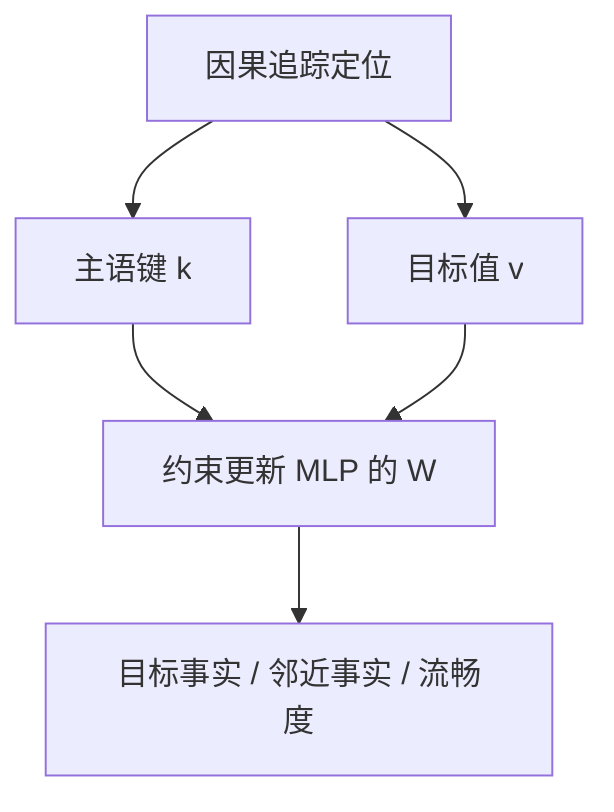

# ROME / MEMIT

一条事实往往集中在中层 MLP 把主语映射到属性的位置；改那个键值，不必再跑一遍指令 SFT。

<footer>—— Meng 等，Locating and Editing Factual Associations in GPT（NeurIPS 2022）；Mass-Editing Memory in a Transformer（ICLR 2023）</footer>

[内在秩](/llm/lora-intrinsic-rank)说明任务适应常落在低维切空间。有时你不要「学会一种任务」，只要改一条关联：Eiffel Tower 在巴黎 → 在罗马。全参或 [LoRA](/llm/lora) SFT 会把整份条件分布拖向示范，副作用是邻近事实与口吻一起漂。Meng、Bau、Belinkov 等人的 ROME 先定位后编辑；MEMIT 把同一套键值更新扩到批量事实。本课打开「改一处而不动其他」。不把知识注入的限度（[下一课](/llm/knowledge-injection-limits)）写成编辑已成功。

## 问题

因果语言建模把事实散在权重与上下文里。用户却按「主语–关系–客体」来想：谁位于哪里。SFT 用自然语言句子教这条，损失沿全序列回传，许多层、许多 token 都动。能否找到一个模块，它以主语的表示为键、以客体为值，像可改写的记忆槽？

定位若失败，编辑就是在随机层加扰动，等于劣质微调。定位若成功，仍要约束：改巴黎→罗马时，埃菲尔铁塔的高度、法国的首都不应一起变成罗马的。这是局部性指标，不是指令遵循分数。

### 中层 MLP 当关联存储器

ROME 用因果追踪：把干净运行与损坏运行的激活对换，看客体 token 的概率何时恢复。发现：在主语最后 token 的位置上，中层 MLP 贡献关键。将该 MLP 的下行投影看成线性关联记忆 $W$，$k$ 来自主语表示，$v$ 编码客体。编辑变成：解一个约束最小二乘，使 $Wk_{\mathrm{new}}\approx v_{\mathrm{new}}$，并尽量保持其它已有键。

MEMIT 对多层、多事实同时解约束，把残差分配到一段 MLP 层，避免单层 $W$ 过载。批量不是循环调用 ROME 一千次而不管层间耦合。

## 方法

对每条事实构造提示（「The Eiffel Tower is located in」），取主语末 token 在选定层的激活为 $k$，用优化得到目标 $v$（使模型在客体位置输出新客体）。ROME 更新单层 $W$；MEMIT 选一段中层，解联合目标。插入后用生成与闭卷探针检查：目标事实是否改写、释义提示是否泛化、无关事实是否保持。

这与 SFT 契约正交：不经过[chat template](/llm/chat-template) 的助手轮，也可以在基座补全格式上编辑。若产品是对话模型，编辑应在对齐后的权重上做，并用对话提示回归，否则补全编辑与助手行为脱节。

不要用指令数据「再训一遍」代替定位：那是回到全分布适应。编辑失败时先查层是否选对、键是否取在主语末 token，再查约束权重。

## 机制

MLP 的 $W_{\mathrm{down}}$ 把高维特征映回残差。若某列方向专门为某主语–属性服务，改 $W$ 使该键指向新值，相当于改写记忆。注意力负责把主语信息送到那个位置；编辑不改注意力，假设路由仍把同一主语送到同一槽。因此对未见句式的泛化取决于键是否稳定：换一种说法若主语表示漂移，编辑不触发。这解释了为何 ROME 在释义上部分泛化、在反向提示（罗马的地标是什么）上常失败——反向是另一条键，下一课的限度。

MEMIT 把 $\|Wk-v\|$ 的残差分到多层，每层改得少，对无关键的破坏小于单层猛改。事实数量超过层容量时，仍会互相覆盖：局部编辑不是无限字典。

与 LoRA 的关系：可以在同一 MLP 上挂 LoRA 去做「可逆编辑」，但几何不同。ROME 直接改已有记忆槽；LoRA 在残差上加一段任务增量。批量事实用 MEMIT 通常比用一个事实表做 LoRA 更局部。

## 边界与工程取舍

编辑的是补全型事实探针，不是世界模型。涉及多跳、时间、计数的「事实」常常没有单一槽。安全对齐过的模型上，编辑可能被拒答头盖住：补全显示已改，对话仍拒绝或仍说旧答案。评测协议必须同时含补全与对话。规模上，MEMIT 能到数千条量级（论文设定），不是整部维基。超出则应用检索或接受微调的全局性。

下一课：即使槽改对了，把新知识当训练数据灌进去仍会幻觉——编辑成功 ≠ 注入成立。

## 小结

- ROME 用因果追踪把事实定位到主语位置的中层 MLP，再约束更新键值。
- MEMIT 将批量更新分配到多层，减轻单层过载。
- 评测要含目标改写、释义泛化、无关事实与流畅度。
- 反向提示与多跳常不共享同一键，编辑不自动对称。
- 对话对齐模型须在助手提示上回归，不能只看补全。
- 出处：Meng 等，ROME，NeurIPS 2022；Meng 等，MEMIT，ICLR 2023。
