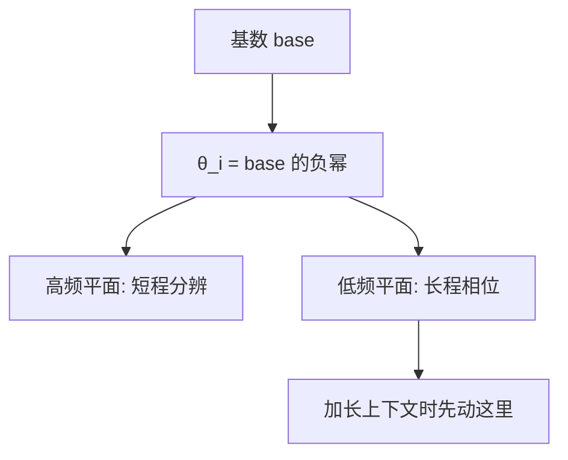

# RoPE 的频率、基数与长上下文

$\theta_i = \mathrm{base}^{-2i/d}$ 决定每一维转多快；改基数是在改长程维度何时开始错位。

<footer>RoPE 频谱；NTK / YaRN 仅作为改频率的动机，不作专述</footer>

RoPE 的相对恒等式对任意距离成立，训练却只覆盖一段距离。加长上下文是在要更大的 $|n-m|$，也就是要每个平面转到未见过的相位。$\theta_i$ 与基数决定「哪一维在多长的跨度上仍可分辨」。改 base、做 NTK 式非均匀缩放、上 YaRN，都是在动这条谱，不是在换一套位置编码。本篇停在频谱与基数，不把 YaRN 写成步骤清单。

## 问题

RoPE 的相对恒等式对任意距离成立，但训练只在 $0 \le |n-m| < L_{\mathrm{train}}$ 的距离上见到过匹配分数。推到更长上下文，新的是**更大的相对距离**，不是新的绝对下标。更大距离意味着每个平面上的转角 $ |n-m|\theta_i $ 进入训练时没见过的区间，尤其是中高频平面会转过训练时从未对齐过的相位。

于是长上下文问题在 RoPE 里具体化为频谱问题：$\theta_i$ 太大，远距离上几乎所有平面都转乱，位置信息死掉，注意力退化为与距离无关的内容匹配（或噪声）；$\theta_i$ 太小，近距离上各平面几乎不转，模型分不清相邻与隔开几十步。默认 $\mathrm{base}=10000$ 是为原始训练长度选的折中。改上下文窗口而不改频谱，等于拿旧尺子量新距离。

本篇只讨论频率与基数：它们如何定义、如何对应「哪一维负责多长的跨度」，以及为什么人们用改 base、NTK 缩放、YaRN 去碰这根轴。YaRN 与 NTK 的完整算法、损失和注意力温度，留给它们自己的条目。

恒等式 $q^\top R_{n-m} k$ 在外推时并不破。破的是 $R_{n-m}$ 所在的相位是否落在训练支持里。

### 需要一张「距离–维度」对照表

$d/2$ 个平面不是重复的同一个旋转。它们构成从快到慢的频率谱。理解长上下文，就是理解谱的哪一段在目标距离上仍提供可分辨的相位差。

## 方法

RoPE 的频率取几何级数

$$
\theta_i = \mathrm{base}^{-2i/d},\qquad i = 0,1,\ldots,d/2-1.
$$

$i=0$ 时 $\theta_0 = 1$（弧度/位置，若 base 的幂次按上式且 $i$ 从 0 起，实际实现里常写成 $\theta_i = \mathrm{base}^{-2i/d}$，最高频接近 $1$）。$i$ 增大，$\theta_i$ 指数下降，最低频约为 $\mathrm{base}^{-1}$ 量级。位置差 $\Delta = n-m$ 在第 $i$ 平面上的转角是 $\Delta \theta_i$。

两个可调对象：

- **$\mathrm{base}$**：同时缩放整条谱。增大 base，所有 $\theta_i$ 变小，同样的 $\Delta$ 对应更小的转角，低频维能覆盖更长的距离才转满一圈。
- **对 $i$ 非均匀的缩放**：NTK-aware 一类方法让高频几乎不动（保住短程分辨），低频按长度比拉伸（给长程留相位余量）。YaRN 再把这种非均匀插值与注意力缩放组合。本篇只要知道：它们都是在改 $\theta_i$，不是在换一套位置编码。

训练长度 $L$ 与谱的匹配规则是启发式的：希望在 $\Delta \approx L$ 时，仍有若干低频平面的转角显著小于 $\pi$，从而远距离不是所有维都正交掉。

## 机制

### 一圈对应多长

第 $i$ 平面转满 $2\pi$ 需要 $\Delta = 2\pi / \theta_i$ 个位置。$\theta_i$ 大（高频），几个 token 就转一圈，适合相邻位置的精细差别；$\theta_i$ 小（低频），需要成千上万步才转一圈，适合篇章级距离。默认 base $=10000$、$d=128$ 的头里，最低频的「一圈」已经很长，但仍是为当初的 $L$ 设计的。把 $L$ 乘四而不改 $\theta$，等于要求低频维提供它在训练时从未提供过的相位差，同时中频维过早转乱。

「转乱」指 $\Delta\theta_i \bmod 2\pi$ 在训练分布外均匀化，该维对距离不再单调、不再可预测，不是数值溢出。

### 改 base 是全局慢放

把 base 从 $10000$ 升到 $10^6$ 量级，整条谱左移（更慢）。短程依赖依赖的高频也变慢，相邻位置的分辨可能变差，需要微调来把短程从别的维或从内容里找回来。这是全局改 base 的代价：一根旋钮同时动短程与长程。NTK 风格的非均匀映射就是为了打破这根绑绳——高频 $\theta$ 接近原值，低频 $\theta$ 按目标长度压小。YaRN 还处理插值区间与注意力尺度，避免只拉频率、不调 softmax 温度时出现的平均熵漂移。这些名字在长上下文文献里成套出现，是因为它们碰的是同一条 $\theta_i$ 轴的不同切法。

训练时直接用更大 base、更大 $L$，比测试期事后改 $\theta$ 干净：相位从头到尾在目标距离上见过。事后改谱属于抢救已经训死的 $10000$，不是频谱设计的第一原则。

## 边界与工程取舍

只改 base、不微调，短程任务可能立刻掉点。只拉长数据、不改 base，模型在远距离上没有可用的慢维，长上下文继续写，匹配已经与位置无关。两条都要动：数据提供目标距离上的梯度，频谱提供这些距离上仍然可分辨的相位。

频谱也不是越慢越好。所有 $\theta_i$ 都接近 0 时，RoPE 退化成几乎无位置，近处的序要靠因果掩码去学，回到 NoPE 的处境。base 的上界是「短程仍有足够快的维」，下界是「目标 $L$ 上仍有足够慢的维」。中间没有与模型无关的最优值，与头宽 $d$ 绑在一起：$d$ 更大，几何级数的档位更多，同一 base 下更能同时覆盖短与长。

实现里 base 常是 RoPE 的构造参数，和 $\theta$ 缓存、cos/sin 表绑在一起。测试期改 base 必须重算旋转，已按旧角旋转并写入的 KV 不能直接复用。

本篇不把 YaRN 的分段、注意力温度、NTK 的精确公式展开成步骤清单。需要那些步骤时，应去对应专文。这里只固定三件事：$\theta_i$ 的定义、base 的全局作用、非均匀改 $\theta$ 是为了外推时保住短程。

## 小结

RoPE 的频率 $\theta_i = \mathrm{base}^{-2i/d}$ 把维度分成快慢平面：快的分辨短距离，慢的在长距离上仍有相位。加长上下文是在要更大的 $|n-m|$，必须让足够多的慢维在新距离上尚未转乱。增大 base 是全局慢放；NTK / YaRN 一类方法是对 $\theta_i$ 做非均匀改动并辅以注意力缩放，目的都是外推，而不是新的位置哲学。出处：Su 等的 RoPE 定义（2021/2024）；外推时改谱的动机见后续长上下文工作对 base 与 NTK、YaRN 的使用，那些算法本身不在本篇展开。
