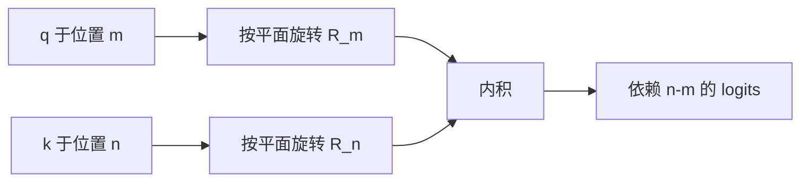

# RoPE

把位置编进查询与键的旋转，相对距离就会出现在内积里。

<footer>Su 等，RoFormer / RoPE，2021；期刊文本 2024</footer>

绝对位置把下标加到内容上，相对表把距离加到 logits 上。RoPE 第三条路：在点积之前旋转查询与键，让旋转群把两个绝对角度差成相对角度。内积里出现的是 $n-m$，不是 $n$ 或 $m$。Su 等人 2021 年的 RoFormer 把这套旋转写进 Transformer，2024 年的期刊文本将其固定为当前 Decoder-only 的默认位置几何。频率与基数如何服务长上下文，下一篇再切；这里只把旋转与内积写完。

## 问题

绝对位置把 $p_i$ 加到嵌入上，相对几何要靠网络自己从绝对名字里统计，长度一变就垮。Shaw 等（2018）把可学习的 $a_{i-j}$ 加进注意力 logits，相对是真的，但多一张距离表，距离桶的设计成为新超参。需要一种方案：不占位置表，不改注意力的 softmax 形式，却让 $q$ 与 $k$ 的内积只通过 $i-j$ 依赖位置。

RoPE（Rotary Position Embedding）的回答是：不要加向量，要**旋转平面**。每个位置对应一组二维旋转，施加在 $q$ 和 $k$ 的成对维度上。旋转群的性质自动把绝对角度差成相对角度。这是位置编码从「表示里的加法」转到「注意力几何里的乘法」。

RoPE 只旋转 Q 和 K，不旋转 V。值向量保持内容，位置只进入匹配，不进入加权和的被加项。

### 内积需要相对，不需要绝对名字

因果语言模型真正用到的，是「当前查询与过去某个键有多近、内容是否匹配」。绝对下标若只通过内积的差起作用，就可以从加法通道里拿掉。RoPE 针对的就是这个内积，而不是重建一个位置感知的词向量。

## 方法

把头的维度 $d$ 切成 $d/2$ 个二维平面。第 $i$ 个平面配频率 $\theta_i$，位置 $m$ 的旋转是

$$
R_{\theta_i, m} = \begin{pmatrix} \cos(m\theta_i) & -\sin(m\theta_i) \\ \sin(m\theta_i) & \cos(m\theta_i) \end{pmatrix}.
$$

查询、键在该平面上的坐标 $(q^{(i)}, k^{(i)})$ 分别左乘 $R_{\theta_i, m}$ 与 $R_{\theta_i, n}$。整头的 RoPE 是这些 $2\times 2$ 块的直和，记为 $R_m$。注意力 logits 变成

$$
(R_m q)^\top (R_n k) = q^\top R_m^\top R_n k = q^\top R_{n-m} k.
$$

最后一步用了旋转矩阵的正交性与加法：$R_m^\top R_n = R_{n-m}$。内积只依赖相对位移 $n-m$ 与内容 $q,k$，不依赖绝对的 $m$ 或 $n$。这就是 RoPE 的定义式，也是它被称为相对位置的原因——相对出现在匹配里，不是出现在嵌入加法里。

频率 $\theta_i = \mathrm{base}^{-2i/d}$，默认 $\mathrm{base}=10000$，与正弦 PE 同源。用法不同：这里角度乘在 QK 上，不把 $\sin/\cos$ 加到 token 上。基数与频谱的外推问题留给下一篇；本篇停在旋转与内积。

## 机制

### 为什么是旋转而不是加偏置

ALiBi 一类方法在 $q^\top k$ 上加 $-|i-j|$ 的偏置，相对性在 logits 的加法通道。RoPE 改的是 $q$ 和 $k$ 本身的坐标系：同一对内容向量，相对越远，各平面上的夹角越大（高频平面先转乱，低频平面仍对齐）。匹配分数随距离的衰减是几何的，随频率分档的，不是单一斜率的线性偏置。这让不同头、不同维度可以对应不同的「距离敏感度」，而不必再学一张 $a_{i-j}$ 表。

复数写法把一对维度看成 $q_m e^{i m \theta}$，内积取实部。与矩阵写法等价，实现里常用复数或两两配对的 fused kernel。

### 与正弦相加的差别

正弦 PE 也有 $e^{i \cdot pos \cdot \omega}$。把它加到 $x$ 上再线性映射成 $q,k$，相对位移 $T_k$ 必须穿过 $W_Q,W_K$ 才能到达内积，没有群同态保证。RoPE 把旋转放在 $W_Q x$ **之后**、点积**之前**，群同态直接作用在参与匹配的向量上。同一套频率，一个是希望，一个是恒等式。Su 等（2021/2024）强调的就是这步换位。

长上下文时恒等式仍然成立：$(R_m q)^\top(R_n k)$ 永远只含 $n-m$。会坏的是**未见过的距离**上，训练分布里的 $q,k$ 几何是否仍给出可用的分数——那是频率与基数的问题，不是恒等式失效。

## 边界与工程取舍

RoPE 几乎成为 Decoder-only 的默认：LLaMA、Qwen 等均采用。工程代价是实现必须按二维平面配对维度，量化、推测解码、KV 缓存都要在缓存 **RoPE 之前还是之后** 上做出选择。缓存旋转后的 $k$ 则省掉解码时的重复旋转，但改基数、插值、YaRN 一类测试期改频率时，必须能重新旋转，缓存策略要能作废。多头之间共享同一套 $\theta_i$ 是常规做法；若把头间频率再拆开，参数与 kernel 都会变，收益未被默认实现采用。

它不是万能相对方案。距离极大时高频平面的 $q,k$ 夹角已经均匀化，那些维度不再提供位置信息，只剩低频平面。这是频谱设计问题。RoPE 也不编码绝对位置：两个片段若相对结构相同，绝对起点不同，匹配可以相同。需要绝对坐标的任务（某些表格、固定槽位）可能要额外特征。把 RoPE 理解成「位置问题已经彻底解决」，会把长上下文里真正要调的 $\theta_i$ 与基数漏掉——那部分在下一篇，但边界在这里就已经可见：相对恒等式保的是形式，不保未见过的距离上的数值几何。

NoPE 证明因果掩码能泄露序。RoPE 仍被广泛使用，是因为它把序写成稳定、可调的几何，而不是让模型从掩码里自己摸。

与 Shaw 相对 PE 相比，RoPE 零位置参数、无距离桶截断；与 ALiBi 相比，它不在 logits 上加单调偏置，距离效应分频且与内容耦合（旋转的是内容向量，不是与内容无关的罚项）。耦合是能力也是复杂性：内容方向会影响「多远还配得上」。ALiBi 的斜率与内容无关，RoPE 的有效衰减随 $q,k$ 的方向变，这是两者在长程上不可互换的原因。

## 小结

RoPE（Su 等，2021；期刊表述 2024）对 Q、K 的成对维度做位置相关的二维旋转，使 $q_m^\top k_n$ 只通过旋转差依赖 $n-m$。相对距离出现在内积里，不出现在嵌入加法里，也不需要距离表。它替换的是绝对位置的契约；频率 $\theta_i$ 与基数如何服务长上下文，是下一篇的切口，不是本篇的展开。把 RoPE 只理解成「又一种 sin/cos」，会丢掉它真正改掉的那一步：旋转发生在线性映射之后、点积之前。
