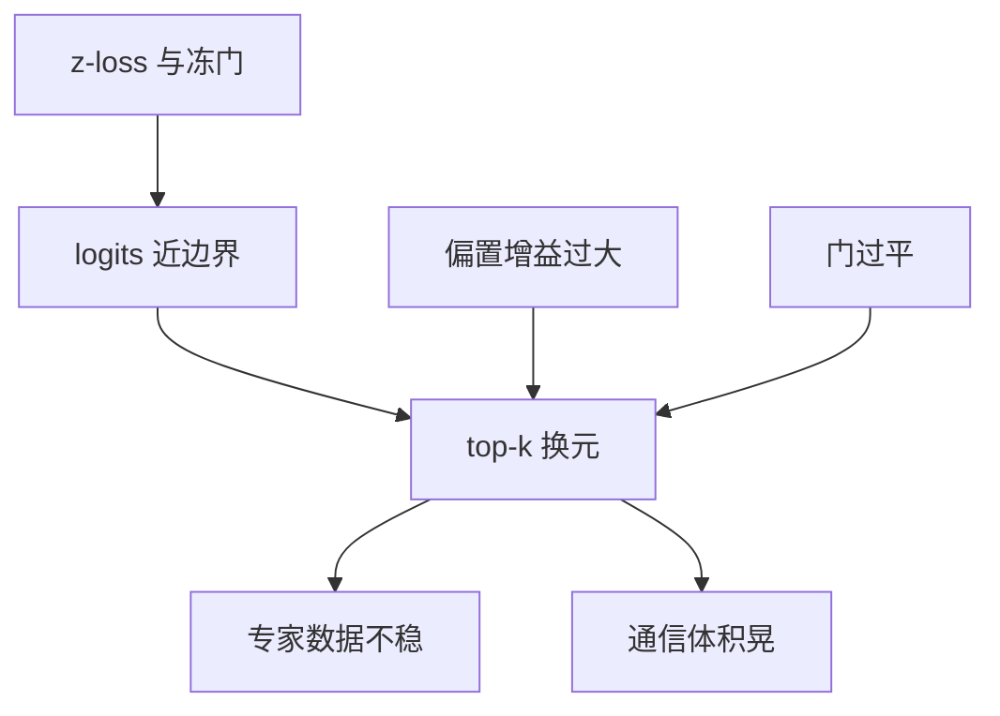

# 路由抖动

相邻训练步把同一 token 打到不同专家，负载直方图仍可均匀；All-to-All 的体积却在抖，专精也立不住。

<footer>—— Dai et al., StableMoE, ACL 2022；router z-loss 见 Zoph et al., ST-MoE, 2022</footer>

[上一课](/llm/moe-comm-compute-ratio)把通信-计算比写成一条设计约束，并留下缺口：$\rho$ 的**方差**。本课补路由抖动：离散 [top-$k$ 路由](/llm/moe-routing) 若在训练步之间来回翻，专家并行的字节随步变，缓冲与重叠都失效。[无辅助损失均衡](/llm/aux-loss-free-balancing) 的偏置步长过大，会把水位在专家之间倒来倒去，是抖动的控制器来源。[Soft MoE](/llm/soft-moe) 没有离散身份，抖不起来。后课注意力 MoE 会把抖动带进 KV 路径；本课先在 FFN 专家上定义。

## 问题

负载均衡只看占用均值。均值均匀可以来自「每个专家轮流过热」：token $x$ 在步 $t$ 走专家 3，步 $t{+}1$ 走专家 17，长期计数仍平。专精化要的条件占用在抖动下变成噪声；剪枝看到的「死专家」可能只是这一周还没轮到。系统侧，All-to-All 按峰值而不是按均值备缓冲，$\rho$ 的尾部决定能不能叠通信。

抖动与塌缩是同一根轴的两端。Chi 等人讨论的表示塌缩是太粘、塌成少数专家；抖动是太滑、边界上振荡。缺口是把两端分着测，并指向缓解（慢闭环、z-loss、sticky），而不是再加一个均衡损失名。

层间换专家不一定是病：不同层功能可以不同。病的是同一层、相似输入在训练步之间的身份翻面。Expert-choice 还有训推不一致的另一种抖，本课默认 token-choice。

## 方法

先测再治。固定探针序列，记录每层 top-$k$ 专家 ID 随步的 Jaccard / Hamming，以及占用 Gini。Gini 低且 Jaccard 低是抖；Gini 高是塌。把「步间抖」与「层间换」分开，后者可以是[层次 MoE](/llm/hierarchical-moe) 的设计。

治理由轻到重。减小偏置 $\gamma$、对负载做滑动平均；ST-MoE 的 router z-loss 把 logits 往零推，减小 softmax 对尺度的敏感；训练后期降门学习率或冻 $W_r$，StableMoE 把稳定路由蒸馏成几乎不更新的门。容量因子不要贴着 1：drop 会改下一批的路由目标，形成正反馈。哈希钉死一部分专家位，可降低可学习门的自由度。

推理冻 $b$、关 dropout 后抖动应下降。若仍高，说明门平坦、多名专家分数相近，需要更大的 logit 间隔，或接受随机性并做种子控制。

## 机制

top-$k$ 不连续。logits 在边界附近时，无穷小的 $b$ 更新就能换人。无辅助损失闭环把负载误差积分进 $b$，增益大会在目标均匀附近振荡。辅助损失过强则把门拉平，分数更近、更容易抖。两端都能制造抖动：一个来自控制器，一个来自过平的门。

softmax 在相近 logits 上导数大，小梯度就能交换第 $k$ 与第 $k{+}1$ 名。结果是看起来均衡很好（偏置在补偿），单条轨迹的专家身份却没有因果意义。干预跌点随检查点跳，剪枝不可复现。通信上峰值对均值的比决定是否按最坏 $k\cdot d$ 预分配；按均值设计重叠会偶发卡住。

混合精度与非确定归约会在边界 token 上换专家。需要确定性时，路由应在较高精度计算。门上的适配会直接买翻盘；专家 MLP 上的适配相对安全。

## 边界

早期训练需要探索，过早冻门等于哈希。完全 sticky 等于关掉适应，分布一移就过载。目标是把边界层变厚，不是禁止换专家。不要为了曲线好看把 z-loss 加到压过主损失。下一课若把注意力也做成 MoE，抖动会改变谁的 KV 被计算，FFN 上可容忍的抖在注意力上不可忍。粒度律把专家切得更窄，决策边界更密，抖动风险上升。

## 小结

- 抖动是步间离散 top-$k$ 翻盘，与塌缩同轴反向；须用 Jaccard 与 Gini 一起诊断。
- 慢闭环、z-loss、后期冻门、避免贴边 drop，比再堆辅助损失名更对症。
- $\rho$ 的尾部由抖动决定，重叠按均值设计会偶发失败。
- 推理应确定性；注意力 MoE 对抖更敏感。
- 出处：Dai et al., StableMoE, ACL 2022；Zoph et al., ST-MoE, 2022。
