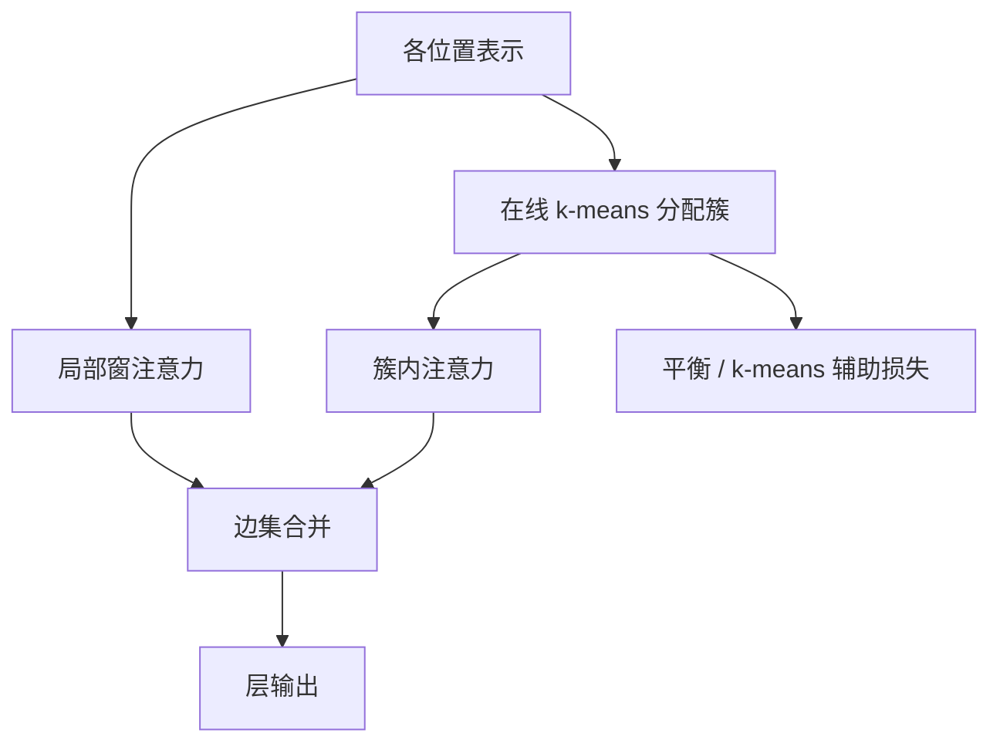

# Routing Transformer

用在线 k-means 把 token 分到簇，注意力只在簇内发生：稀疏边由内容学出来，而不是由随机哈希或固定窗单独决定。

<footer>—— Roy, Saffar, Vaswani & Grangier, Routing Transformer, TACL 2021</footer>

固定窗看不见远而相关的位置；随机哈希不保证簇中心对着语义。Roy、Saffar、Vaswani 与 Grangier 的 Routing Transformer 用 **k-means 路由**：每个位置的查询（或键）被分到最近的中心，同簇之内做注意力。局部窗常常仍保留，作为确定的近邻底盘。这与 [Reformer](/llm/reformer) 的 LSH、与 [MoE 路由](/llm/moe-routing) 的专家选择都容易撞名，但对象不同：这里路由的是 *token 与 token 谁能互相看见*，不是 token 走进哪一个 FFN 专家。本篇写 TACL 2021 原文的内容稀疏、在线聚类如何嵌入层内，以及离散分配的边界。

## 问题

内容稀疏的理想是：每个查询只对少数高点积键做 softmax，复杂度随簇大小而不是随 $n$ 二次增长。实现必须可微或准可微，必须在训练中更新「谁和谁一组」，必须避免所有 token 挤进同一个簇。LSH 用随机投影，不学习数据几何；确定窗不看内容。Routing Transformer 要的是第三条：簇中心是参数（或运行时均值），分配随表示演变。

序列还有局部性：相邻 token 几乎总该能看见彼此。纯聚类可能把相邻位置拆开（若它们的向量暂时不像），句法边丢失。原文因此把路由注意力与局部注意力组合，而不是宣称聚类单独足够。图像生成（像素序列）与字符/词级语言建模是它的主场，长度长、局部相关与内容相关同时存在。

### 按内容分桶而不是按哈希

k-means 最小化的是到中心的欧氏距离，注意力关心的是点积。二者在归一化、尺度一致时相关，但不是恒等：范数大的向量会主导欧氏最近邻。实践中常对路由用的向量做归一化或单独投影，使分簇几何与打分几何对齐。哈希桶没有这套可学习中心，也不能用重建损失把中心拉向数据。这是相对 Reformer 的核心差异，而不是「都是分桶所以一样」。

名字里的 routing 容易让人以为是 Switch Transformer。MoE 路由输出的是专家索引与门控权重，FFN 容量稀疏；这里输出的是注意力掩码，参数量仍是一份注意力投影。负载均衡的数学相似，语义层不同。

## 方法

每一层（或每一头）维护 $k$ 个中心。对当前位置的路由向量 $x_t$，分配

$$
c(t)=\arg\min_j \|x_t-\mu_j\|^2,
$$

注意力掩码允许 $t$ 看见 $\{s:c(s)=c(t)\}$ 内的位置（再交因果或局部约束）。中心用在线均值或指数滑动更新，并常附辅助损失，使分配接近 k-means 目标。Straight-Through 一类估计让离散 $\arg\min$ 的反向能更新产生 $x_t$ 的网络；中心本身更多靠均值更新而不是注意力主损失。簇大小用容量限制或平衡项约束，否则退化成少数大簇——大簇内部又变回二次。

局部注意力并行存在：每个位置再看见半径 $w$ 的邻居，即使它们不在同簇。总可见集是两套边的并。论文在 enwik8、WikiText-103、PG-19 与像素级 ImageNet/CIFAR 生成上展示长程建模，强调在可比预算下优于当时的局部或哈希基线。

### 在线 k-means 路由

在线是因为中心必须随 batch 更新，不能对整份语料做离线聚类再冻结。生成时中心取训练结束时的值，或继续用滑动均值；若推理时重跑 k-means 而不固定，同一前缀的掩码会抖。$k$ 决定平均簇大小 $\approx n/k$（均衡时），复杂度约 $k\cdot(n/k)^2=n^2/k$，相对满注意力省 $k$ 倍，不是对 $n$ 严格线性，除非 $k$ 随 $n$ 成比例增长。把 Routing Transformer 写成 $O(n)$ 时，必须写明 $k\propto n$ 或簇容量封顶的假设。

### 与 Reformer、MoE 路由的差别

Reformer：随机超平面，桶不可学习，常共享 Q/K。Routing：中心可随数据动，分配可训练。MoE：稀疏的是 FFN 专家，注意力通常仍稠密（或另说）。可以想象两者叠在同一模型里，但原文没有把注意力路由和专家路由做成同一套门。Vaswani 作为共同作者，也提示这是注意力家族内部的效率论文，不是翻译系统的新编码器–解码器槽位。

## 机制

聚类把空间划成 Voronoi 单元，注意力成为单元内的全连接。表示一变，单元边界就动，边是动态的。这比固定稀疏图更贴内容，也更难写成静态 CUDA 掩码：每个 batch 的 gather 索引不同。训练早期中心未分开，几乎全体进少数簇，必须靠平衡损失把路由「拉开」。后期若中心坍缩或死簇，有效 $k$ 下降，复杂度与表达力一起坏。应监控簇大小直方图，而不是只看 loss。

Straight-Through 让离散路由的梯度有偏。辅助 k-means 损失把表示拉向可分，可能与主任务冲突：为了好分簇而牺牲可分性之外的语义。权重两者要扫。局部窗是安全网：路由崩了，至少近邻还在，模型不会立刻变成袋模型。

因果路由时，未来 token 不能参与当前的中心更新，否则泄漏。用整段双向 k-means 再施因果注意力掩码，中心已经看过未来。语言模型设定必须规定：中心只由过去更新，还是使用滞后的全局中心。原文实验含 LM 与图像；复现要对齐这一条。

### 负载与 Straight-Through

容量封顶会丢边：挤不进簇的 token 只能走局部窗。这与 MoE 的 token drop 同类。评测若在丢边比例很高时仍报好分数，说明任务其实不需要那些远程边，路由的价值被高估。Straight-Through 在分配附近把梯度当成恒等，中心移动可能滞后于表示；出现振荡时，降低中心学习率或拉长滑动平均比盲目加大 $k$ 更有效。

## 边界与工程取舍

动态 gather 与不平衡簇让它在现代 GPU 上很难打过 Flash 稠密或规则滑窗。它没有成为 LLaMA 类模型的层规范。作为论文，它把「可学习的内容稀疏注意力」写进了 2021 年的版图，并在长字符与像素序列上给出证据；它不提供服务期 KV 的简单切片方案——簇随层、随时间变，缓存哪些键是开放问题。

$k$ 随任务变：太小，簇太大，二次回潮；太大，簇内样本不足，注意力统计差，中心也难估。图像像素网格的局部性极强，窗的贡献可能大于路由，消融必须把窗宽与 $k$ 拆开报。不要用本篇论证 MoE 的专家数选择，也不要用 Switch 的负载公式直接当注意力簇的充分条件——可以借鉴，不能等同。

PG-19 一类书籍级建模检验的是超长依赖是否还在；若路由只把文体相近的段落聚在一起，可能提高流畅度却不提高精确指代。应有针对性探针，而不是只报困惑度。

## 小结

- Routing Transformer 原文贡献是：用在线 k-means 做内容型注意力路由，并与局部窗并用，在长序列 LM 与图像生成上验证。
- 复杂度约为 $n^2/k$ 量级（均衡时），线性要靠 $k$ 或容量随 $n$ 增长。
- 与 Reformer 的差别是可学习中心 vs 随机哈希；与 MoE 的差别是稀疏的是注意力边不是 FFN 专家。
- 离散分配依赖平衡损失与 Straight-Through，死簇和超大簇都要监控。
- 因果下中心更新不得偷看未来；动态 gather 不利现代稠密内核。
- 未成为当代解码器默认层，引用应落在内容稀疏这一命题上。
- 出处：Roy, Saffar, Vaswani & Grangier, *Efficient Content-Based Sparse Attention with Routing Transformers*, TACL 2021。
