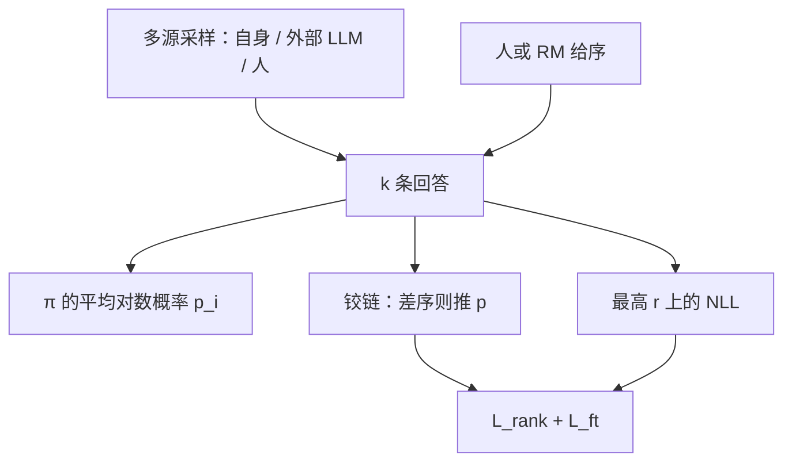

# RRHF

    
用长度归一化的条件对数概率给同一提示下的多条回答打分，让这些分数的序与人类或奖励模型的序一致，再在最高分回答上做监督微调。

    <footer>—— Yuan, Yuan, Tan, Wang, Huang, Huang，RRHF: Rank Responses to Align Language Models with Human Feedback without tears，NeurIPS 2023</footer>

InstructGPT 式 RLHF 在 PPO 阶段要同时驻留策略、价值、奖励、参照，超参多、实现重。Yuan、Yuan、Tan 等人提出 RRHF（Rank Responses to Align Language Models with Human Feedback）：训练前从多种来源采样 $k$ 条回答——可以是自己、ChatGPT、人类示范或数据集里的好/坏回复——用当前语言模型的平均对数概率打分，再用无间隔的排序损失把模型分数的序对齐到奖励模型或人给的序，并在最高奖励的那一条上加 NLL。它被作者写成 SFT 与奖励模型训练的延伸，而不是 PPO 的近似实现。本篇写 2023 年原文的损失、采样协议，以及「RRHF 是 Best-of-N 学习器」这一实验结论。

## 问题

PPO 对齐的工程税是明确的：token 级 MDP、GAE、clip、KL 惩罚、价值头，四份模型。超参稍偏，策略崩溃或奖励黑客。与此同时，Best-of-N 在推理时用奖励模型从 $N$ 条样本里挑最好的，简单且有效，却把 $N$ 倍解码留给每次服务。需要一种训练期目标：把「在已采样的集合里学会挑最好的、并压低更差的」写进生成器，推理时不必再采 $N$ 次。

第二条需求是异构样本。PPO 的 on-policy 约束让它主要吃自己刚生成的 $y$；实践里已经有 ChatGPT 回答、人类专家回答、数据集自带的 chosen/rejected。这些文本的绝对奖励不可比，但序往往可标注。用绝对 $R(x,y)$ 去喂 PPO 要处理尺度；用序只需知道谁比谁好。问题是：语言模型自己的长度平均对数概率，能否当这个可排序的分数，从而让一份权重同时充当生成器与打分器。

### 不必在训练环里采样

PPO 边训练边用当前 $\pi$ 采样，分布在动，所以要 KL 把策略拴在初始化附近，也要价值模型估计基线。RRHF 默认在训练前采样（除了原文里称为 OP 的在线变体），对比集合固定，KL 项退化掉，价值头也不需要——基线变成集合内部的相对比较。这把强化学习环收成离线排序。代价是覆盖被采样集合钉死：集合里没有的失败模式，排序损失看不见。

RRHF 的「1 到 2 个模型」指生成器本身，外加可选的代理奖励模型用来给样本打序。若序已经由人标好，训练图可以只有一份 LM。不要把它理解成推理时仍要跑 RM。

## 方法

对提示 $x$ 收集 $k$ 条回答 $\{y_i\}$，每条有标量 $r_i=R(x,y_i)$（人或 RM）。模型分数为长度平均对数概率

$$
p_i=\frac{1}{|y_i|}\sum_t\log\pi(y_{i,t}\mid x,y_{i,<t}).
$$

排序损失对所有 $r_i<r_j$ 的对施加

$$
\mathcal{L}_{\mathrm{rank}}=\sum_{r_i<r_j}\max(0,\,p_i-p_j).
$$

原文**不加**间隔 $\lambda_{ij}$：作者发现无 margin 已经够用，且调间隔耗时。另取 $i'=\arg\max_i r_i$，在 $y_{i'}$ 上做标准 SFT 的 NLL，总损失为两项不加权求和。权重放大 $\mathcal{L}_{\mathrm{rank}}$ 在预实验里更差。实现上相对 Alpaca 式 SFT 只多约三十行，这是 without tears 的操作性含义。

### 采样来源是一等公民

$\rho_i$ 可以是初始模型上的束搜索、diverse beam、nucleus，也可以是数据集提供的 chosen/rejected，或外部 LLM。原文在 Anthropic HH 上用代理 RM（Dahoas/gptj-rm-static）打分，以便和 PPO 公平比「优化同一 $R$」。设定包括：训练前 diverse beam（DP）、top-p（SP）、训练中在线采（OP）、迭代再采（IP），以及只用数据集提供对（P）。消融的主结论是：RRHF 的奖励接近采样集合里的**最大**奖励，表现强烈依赖样本质量——它在学 Best-of-N，而不是在学超出集合的探索。

### HH 与 Wombat 实验读法

Alpaca-7B 上，RRHF 的代理奖励可达到或超过同设定 PPO，人类 pairwise 评测相对数据集 chosen 与 PPO 不差。PPL 在已指令微调的 Alpaca 上变化不大，在未指令化的 LLaMA 上会飘，说明排序项不能替代「会说人话」的 SFT 初始化。Wombat 用 Alpaca 提示混 ChatGPT / InstructGPT / LLaMA / Alpaca 回答做异构排序，展示「教师回答可直接进集合」；这是蒸馏设定，不是从零对齐。IP-2（用上一轮 RRHF 再采再训）人类评测略强，说明离线集合可以迭代，但仍不是 PPO 那种逐步 on-policy。

## 机制

平均对数概率让同一模型可生成可打分：推理时取贪心或采样即生成，比较多条候选时用 $p_i$ 即当弱 RM。排序铰链不看 $r$ 的绝对尺度，只看对的方向，避免 RM 分数漂移。无间隔时，只要 $p_j>p_i$ 对已排对的 $(r_j>r_i)$ 就停止，噪声对一旦隔开就被忽略——与 [SLiC](/llm/slic) 同族，SLiC 往往加 $\delta$ 且更强调与解码分数一致。SFT 项保证集合里最好的那条被语言建模，防止纯排序把概率质量推到集合外的奇怪模式。

因为目标是拟合集合内 Best-of-N，采样越强（diverse、教师模型更好），上限越高；只用差样本，模型学会的「最好」仍然差。原文 Table 里 Best-of-4 的 RM 分数是 RRHF 的参照上限之一。在线 OP 更慢、更接近 PPO 的覆盖，但失去「训练只需一份模型」的简洁，作者把它当变体而非默认。

$\mathcal{L}_{\mathrm{rank}}$ 对所有反序对求和，集合一大，对的数目是 $O(k^2)$。$k$ 通常为 4–6。$k$ 很大时应对差距小的对降权，否则计算与噪声一起涨；原文没有做复杂的 listwise 归一，那是 [PRO](/llm/pro-rank) 的方向。

## 边界与工程取舍

RRHF 不探索集合外的 $y$，对 RM 漏洞同样忠诚：代理 RM 喜欢的模式会被平均对数概率抬高。人类评测与 RM 分数可能分叉，原文两者都报了。无间隔铰链对「略差」和「很差」一视同仁，全局 listwise 结构比 pairwise 铰链弱。长度归一减轻但未消灭长度黑客。截断到 192 token 的实验设定不能直接抄到长思维链。

与 PPO 比，实现与显存大幅下降；与后来的 DPO 比，RRHF 更早、更依赖显式 $R$ 来排 $k$ 条，而不是只吃一条 chosen/rejected 对。HH 的 chosen/rejected 可当作 $k=2$ 退化，但作者认为多样本质量是性能主因。不要把 NeurIPS 的「可比 PPO」读成 2024 年聊天榜上的普遍第一。

出处钉 Zheng Yuan、Hongyi Yuan（同等贡献），以及 Tan、Wang、Huang、Huang，阿里达摩院与清华，NeurIPS 2023，arXiv:2304.05302。代码 GanjinZero/RRHF。Wombat 是展示名，不是另一个算法。

### 何时不必上 RRHF

已经有干净成对、愿意放参照、要 BT 似然，用 DPO。要 listwise、对 $n$ 条一次性归一，用 PRO。只有二元不成对标签，用 KTO。推理时已经在做 Best-of-N 且延迟可接受，不一定要把 N 蒸馏进生成器。

## 小结

- RRHF 用平均对数概率排序多条异构回答，并在最高奖励回答上做 NLL，训练通常一份 LM。
- 排序铰链无间隔；性能上限贴近采样集合的 Best-of-N。
- 相对 PPO 省价值模型、参照 KL 与在线采样（默认离线）。
- 样本质量与来源比损失细节更决定结果。
- 与 SLiC 同属序列分数校准，和 DPO 的参照对数比不是同一推导。
- 出处：Yuan et al.，*RRHF: Rank Responses to Align Language Models with Human Feedback without tears*，NeurIPS 2023。
