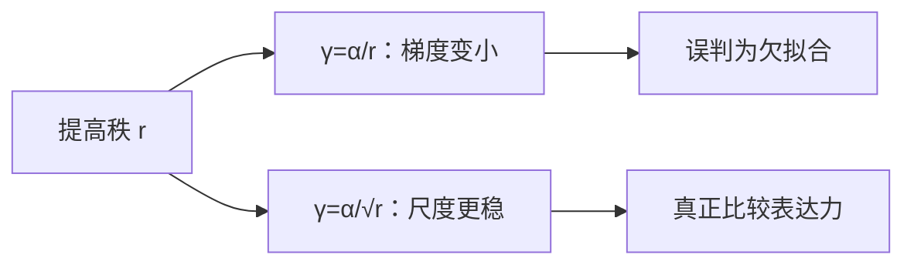

# rsLoRA

$\alpha/r$ 让秩越大、增量越小；改成 $\alpha/\sqrt{r}$，不同秩的梯度尺度才大致稳住，扫 $r$ 时不必每次重配学习率。

<footer>—— Kalajdzievski，A Rank Stabilization Scaling Factor for LoRA-like Fine-Tuning，2023</footer>

[SFT 工程](/llm/rft-data-loop)收到拒绝采样循环为止。本单元回到参数高效：[LoRA](/llm/lora) 原文把缩放写成 $\alpha/r$，并建议改 $r$ 时有效步长不必完全重调——实践里并不成立。Kalajdzievski 的 rsLoRA（rank-stabilized LoRA）把缩放改成 $1/\sqrt{r}$，针对的就是「加大秩反而学不动」。缺口从数据契约变成**低秩参数化的尺度**。后课 VeRA、GaLore 默认已理解这条修正。不重讲 [A 随机、B 为零](/llm/lora) 的初始化。

## 问题

LoRA 前向 $y=W_0x+\gamma BAx$。Hu 等人取 $\gamma=\alpha/r$。若 $A$ 的元素方差不随 $r$ 缩，积 $BA$ 的 Frobenius 尺度随 $r$ 涨，$\alpha/r$ 把它压回去，名义上保持 $\|\Delta W\|$ 量级。问题出在反向：对 $A$、$B$ 的梯度也含 $\gamma$。$r$ 增大时 $\gamma$ 变小，适配器参数收到的更新幅度下降，表现为「$r=64$ 还不如 $r=8$」——不是表达力不够，是优化被缩放掐死。

[上一课的学习率分叉](/llm/lora-vs-full-lr)已经警告 $\eta$ 与 $\alpha/r$ 耦合。rsLoRA 主张：与其每个 $r$ 重扫 $\eta$，不如换一个使梯度方差对 $r$ 更稳的 $\gamma$。

### 稳定的是秩方向上的尺度，不是损失曲面

这不是证明最优 $r$。它只让不同 $r$ 落在可比的有效学习率上，网格才有意义。仍可能 $r$ 过大过拟合、$r$ 过小欠拟合。

实现里常把 <code>use_rslora=True</code> 当作开关：缩放从 1/r 换成 1/√r。α 的习惯值不能原样迁移，需要按新 γ 重标一次。

## 方法

取 $\gamma=\alpha/\sqrt{r}$（或等价地把 $\alpha$ 吸收进学习率，只保留 $1/\sqrt{r}$）。其余与 LoRA 相同：插入哪些矩阵、$A$ 高斯、$B$ 零、训练不合并。从旧配方迁移：若原 $r=8$、$\gamma=\alpha/8$ 工作良好，切到 rsLoRA 后令 $\alpha'/\sqrt{8}\approx\alpha/8$，再以该点为中心扫 $r$。不要同时改开关与 $\eta$ 与 $\alpha$。

与 [AdaLoRA](/llm/adalora) 不同：rsLoRA 不动态分配秩，只改全局缩放。与 DoRA 不同：不拆幅度。它可以和它们叠，但本课单独成立。SFT 仍用[仅回复](/llm/response-only-loss)与同一[模板](/llm/chat-template)。

## 机制

粗略看 $BA$ 的一行：若 $A$ 行近似独立、方差为 $\sigma^2$，则 $r$ 项相加后标准差 $\sim\sigma\sqrt{r}$。除以 $r$ 得到 $\sim 1/\sqrt{r}$ 的衰减；除以 $\sqrt{r}$ 则前向尺度近似与 $r$ 无关。反向对因子的梯度再乘 $\gamma$，于是 $1/\sqrt{r}$ 使「每个秩一分量」分到的更新不随 $r$ 塌缩。这是方差启发式，不是 Transformer 的定理；宽层、不同初始化会偏离。

经验上，稳定缩放让你把 $r$ 当作容量旋钮：指令任务从 8 加到 32 应看到训练 NLL 下降或持平，而不是神秘上升。若仍上升，再查数据背诵与 $\eta$，而不是先怪 LoRA「不行」。

全参没有 γ。不要把 rsLoRA 的大学习率抄回全参——[学习率课](/llm/lora-vs-full-lr)仍然有效。

## 边界与工程取舍

极小 $r$（1–2）时 $1/r$ 与 $1/\sqrt{r}$ 差一截，迁移必须重标 $\alpha$。极大 $r$ 接近全参时，低秩假设本身弱，缩放争论次要。QLoRA 存 4-bit 基座，缩放仍作用在 16-bit 适配器上，rsLoRA 同样适用。合并推理时 $\gamma BA$ 一次加进 $W_0$，部署不保留「用哪种缩放」的区别，只保留学到的矩阵。

多适配器服务时，每个适配器自己的 $\gamma$ 在训练时已经乘进 $B,A$ 或单独存。合并多个适配器见后课[LoRA 合并与冲突](/llm/lora-merge-conflict)。

## 小结

- 原文 LoRA 的 $\alpha/r$ 会在大 $r$ 上压小适配器梯度。
- rsLoRA 用 $\alpha/\sqrt{r}$，使扫秩时有效步长更可比。
- 改开关必须重标 $\alpha$，不要与 $\eta$ 同时盲改。
- 它不分配层间秩，也不提高表达力上限，只稳住优化尺度。
- 全参与 LoRA 的 $\eta$ 分叉仍然成立。
- 出处：Kalajdzievski，Rank Stabilization Scaling Factor for LoRA-like Fine-Tuning，2023；基式见 Hu 等，LoRA，2021。
